# 🔍 Searching Algorithms — Complete Professional <div align="center">Guide</div>

<div align="center">


**Master efficient data retrieval techniques for optimal performance**

</div>

---

## 📑 Table of Contents

1. [Introduction](#introduction)
2. [Linear Search](#linear-search)
3. [Binary Search](#binary-search)
4. [Complexity Analysis](#complexity-analysis)
5. [Advanced Searching](#advanced-searching)
6. [Search Optimizations](#search-optimizations)
7. [Applications](#applications)
8. [Best Practices](#best-practices)

---

## Introduction

**Searching Algorithms** are fundamental techniques for finding specific elements within data structures. They form the backbone of information retrieval systems, databases, and countless applications where efficient data access is crucial.

<div align="center">

</div>

### Core Concept

```mermaid
flowchart TD
    A["🔍 Searching Algorithms"] --> B["Linear Search"]
    A --> C["Binary Search"]
    A --> D["Advanced Methods"]
    
    B --> E["Sequential scanning"]
    B --> F["Works on any array"]
    
    C --> G["Divide and conquer"]
    C --> H["Requires sorted array"]
    
    D --> I["Hash-based search"]
    D --> J["Tree-based search"]
    
    classDef default fill:#f9f9f9,stroke:#333,stroke-width:2px,color:#000
    classDef searching fill:#e3f2fd,stroke:#2196f3,stroke-width:2px,color:#000
    classDef linear fill:#fff3e0,stroke:#ff9800,stroke-width:2px,color:#000
    classDef binary fill:#e8f5e8,stroke:#4caf50,stroke-width:2px,color:#000
    classDef advanced fill:#f3e5f5,stroke:#9c27b0,stroke-width:2px,color:#000
    class A searching
    class B,E,F linear
    class C,G,H binary
    class D,I,J advanced
```



---

## Linear Search

<div align="center">

</div>

### Algorithm Process


### Implementation

```cpp
class LinearSearch {
public:
    // Basic linear search
    static int search(const vector<int>& arr, int target) {
        for (int i = 0; i < arr.size(); i++) {
            if (arr[i] == target) {
                return i;
            }
        }
        return -1; // Not found
    }
    
    // Linear search with early termination
    static int searchOptimized(vector<int>& arr, int target) {
        int n = arr.size();
        
        // Place target at the end as sentinel
        int last = arr[n - 1];
        arr[n - 1] = target;
        
        int i = 0;
        while (arr[i] != target) {
            i++;
        }
        
        // Restore original value
        arr[n - 1] = last;
        
        if (i < n - 1 || arr[n - 1] == target) {
            return i;
        }
        
        return -1;
    }
    
    // Find all occurrences
    static vector<int> findAll(const vector<int>& arr, int target) {
        vector<int> indices;
        
        for (int i = 0; i < arr.size(); i++) {
            if (arr[i] == target) {
                indices.push_back(i);
            }
        }
        
        return indices;
    }
    
    // Linear search in 2D array
    static pair<int, int> search2D(const vector<vector<int>>& matrix, int target) {
        for (int i = 0; i < matrix.size(); i++) {
            for (int j = 0; j < matrix[i].size(); j++) {
                if (matrix[i][j] == target) {
                    return {i, j};
                }
            }
        }
        return {-1, -1}; // Not found
    }
    
    // Generic linear search with custom comparator
    template<typename T, typename Compare>
    static int searchWithComparator(const vector<T>& arr, const T& target, Compare comp) {
        for (int i = 0; i < arr.size(); i++) {
            if (comp(arr[i], target)) {
                return i;
            }
        }
        return -1;
    }
};
```

---

## Binary Search

<div align="center">

</div>

### Algorithm Process


### Implementation

```cpp
class BinarySearch {
public:
    // Iterative binary search
    static int search(const vector<int>& arr, int target) {
        int left = 0;
        int right = arr.size() - 1;
        
        while (left <= right) {
            int mid = left + (right - left) / 2;
            
            if (arr[mid] == target) {
                return mid;
            } else if (arr[mid] < target) {
                left = mid + 1;
            } else {
                right = mid - 1;
            }
        }
        
        return -1; // Not found
    }
    
    // Recursive binary search
    static int searchRecursive(const vector<int>& arr, int target, int left, int right) {
        if (left > right) {
            return -1;
        }
        
        int mid = left + (right - left) / 2;
        
        if (arr[mid] == target) {
            return mid;
        } else if (arr[mid] < target) {
            return searchRecursive(arr, target, mid + 1, right);
        } else {
            return searchRecursive(arr, target, left, mid - 1);
        }
    }
    
    // Find first occurrence
    static int findFirst(const vector<int>& arr, int target) {
        int left = 0;
        int right = arr.size() - 1;
        int result = -1;
        
        while (left <= right) {
            int mid = left + (right - left) / 2;
            
            if (arr[mid] == target) {
                result = mid;
                right = mid - 1; // Continue searching left
            } else if (arr[mid] < target) {
                left = mid + 1;
            } else {
                right = mid - 1;
            }
        }
        
        return result;
    }
    
    // Find last occurrence
    static int findLast(const vector<int>& arr, int target) {
        int left = 0;
        int right = arr.size() - 1;
        int result = -1;
        
        while (left <= right) {
            int mid = left + (right - left) / 2;
            
            if (arr[mid] == target) {
                result = mid;
                left = mid + 1; // Continue searching right
            } else if (arr[mid] < target) {
                left = mid + 1;
            } else {
                right = mid - 1;
            }
        }
        
        return result;
    }
    
    // Lower bound (first element >= target)
    static int lowerBound(const vector<int>& arr, int target) {
        int left = 0;
        int right = arr.size();
        
        while (left < right) {
            int mid = left + (right - left) / 2;
            
            if (arr[mid] < target) {
                left = mid + 1;
            } else {
                right = mid;
            }
        }
        
        return left;
    }
    
    // Upper bound (first element > target)
    static int upperBound(const vector<int>& arr, int target) {
        int left = 0;
        int right = arr.size();
        
        while (left < right) {
            int mid = left + (right - left) / 2;
            
            if (arr[mid] <= target) {
                left = mid + 1;
            } else {
                right = mid;
            }
        }
        
        return left;
    }
    
    // Search in rotated sorted array
    static int searchRotated(const vector<int>& arr, int target) {
        int left = 0;
        int right = arr.size() - 1;
        
        while (left <= right) {
            int mid = left + (right - left) / 2;
            
            if (arr[mid] == target) {
                return mid;
            }
            
            // Left half is sorted
            if (arr[left] <= arr[mid]) {
                if (target >= arr[left] && target < arr[mid]) {
                    right = mid - 1;
                } else {
                    left = mid + 1;
                }
            }
            // Right half is sorted
            else {
                if (target > arr[mid] && target <= arr[right]) {
                    left = mid + 1;
                } else {
                    right = mid - 1;
                }
            }
        }
        
        return -1;
    }
};
```

---

## Complexity Analysis

<div align="center">

</div>

### Performance Comparison


### Complexity Table

| Algorithm | Best Case | Average Case | Worst Case | Space | Prerequisites |
|-----------|-----------|--------------|------------|-------|---------------|
| **Linear Search** | O(1) | O(n) | O(n) | O(1) | None |
| **Binary Search** | O(1) | O(log n) | O(log n) | O(1) | Sorted array |
| **Binary Search (Recursive)** | O(1) | O(log n) | O(log n) | O(log n) | Sorted array |

### Performance Analysis

```cpp
class SearchPerformance {
public:
    static void comparePerformance() {
        vector<int> sizes = {1000, 10000, 100000, 1000000};
        
        for (int size : sizes) {
            vector<int> arr(size);
            iota(arr.begin(), arr.end(), 1); // Fill with 1, 2, 3, ...
            
            int target = size; // Worst case - element at end
            
            // Linear search timing
            auto start = chrono::high_resolution_clock::now();
            LinearSearch::search(arr, target);
            auto end = chrono::high_resolution_clock::now();
            auto linearTime = chrono::duration_cast<chrono::microseconds>(end - start);
            
            // Binary search timing
            start = chrono::high_resolution_clock::now();
            BinarySearch::search(arr, target);
            end = chrono::high_resolution_clock::now();
            auto binaryTime = chrono::duration_cast<chrono::microseconds>(end - start);
            
            cout << "Size: " << size << endl;
            cout << "Linear: " << linearTime.count() << " μs" << endl;
            cout << "Binary: " << binaryTime.count() << " μs" << endl;
            cout << "Speedup: " << (double)linearTime.count() / binaryTime.count() << "x" << endl;
            cout << "---" << endl;
        }
    }
};
```

---

## Advanced Searching

### Exponential Search

```cpp
class AdvancedSearch {
public:
    // Exponential search
    static int exponentialSearch(const vector<int>& arr, int target) {
        if (arr[0] == target) {
            return 0;
        }
        
        int i = 1;
        while (i < arr.size() && arr[i] <= target) {
            i *= 2;
        }
        
        return BinarySearch::searchRecursive(arr, target, i / 2, min(i, (int)arr.size() - 1));
    }
    
    // Interpolation search
    static int interpolationSearch(const vector<int>& arr, int target) {
        int left = 0;
        int right = arr.size() - 1;
        
        while (left <= right && target >= arr[left] && target <= arr[right]) {
            if (left == right) {
                return arr[left] == target ? left : -1;
            }
            
            // Interpolation formula
            int pos = left + ((double)(target - arr[left]) / (arr[right] - arr[left])) * (right - left);
            
            if (arr[pos] == target) {
                return pos;
            } else if (arr[pos] < target) {
                left = pos + 1;
            } else {
                right = pos - 1;
            }
        }
        
        return -1;
    }
    
    // Ternary search
    static int ternarySearch(const vector<int>& arr, int target) {
        int left = 0;
        int right = arr.size() - 1;
        
        while (left <= right) {
            int mid1 = left + (right - left) / 3;
            int mid2 = right - (right - left) / 3;
            
            if (arr[mid1] == target) return mid1;
            if (arr[mid2] == target) return mid2;
            
            if (target < arr[mid1]) {
                right = mid1 - 1;
            } else if (target > arr[mid2]) {
                left = mid2 + 1;
            } else {
                left = mid1 + 1;
                right = mid2 - 1;
            }
        }
        
        return -1;
    }
    
    // Jump search
    static int jumpSearch(const vector<int>& arr, int target) {
        int n = arr.size();
        int step = sqrt(n);
        int prev = 0;
        
        // Find block where element may be present
        while (arr[min(step, n) - 1] < target) {
            prev = step;
            step += sqrt(n);
            if (prev >= n) {
                return -1;
            }
        }
        
        // Linear search in identified block
        while (arr[prev] < target) {
            prev++;
            if (prev == min(step, n)) {
                return -1;
            }
        }
        
        return arr[prev] == target ? prev : -1;
    }
};
```

---

## Search Optimizations

### Search Optimization Techniques


### Optimized Search Implementation

```cpp
class OptimizedSearch {
private:
    vector<int> data;
    unordered_map<int, int> hashIndex;
    bool isSorted;
    
public:
    OptimizedSearch(vector<int> arr) : data(arr), isSorted(false) {
        buildHashIndex();
    }
    
    void buildHashIndex() {
        hashIndex.clear();
        for (int i = 0; i < data.size(); i++) {
            hashIndex[data[i]] = i;
        }
    }
    
    void sortData() {
        if (!isSorted) {
            sort(data.begin(), data.end());
            isSorted = true;
            buildHashIndex(); // Rebuild after sorting
        }
    }
    
    // Adaptive search - chooses best algorithm
    int search(int target) {
        // For small arrays, use linear search
        if (data.size() < 50) {
            return LinearSearch::search(data, target);
        }
        
        // If hash index available, use it
        if (hashIndex.find(target) != hashIndex.end()) {
            return hashIndex[target];
        }
        
        // For large sorted arrays, use binary search
        if (isSorted) {
            return BinarySearch::search(data, target);
        }
        
        // Fallback to linear search
        return LinearSearch::search(data, target);
    }
    
    // Batch search optimization
    vector<int> batchSearch(const vector<int>& targets) {
        vector<int> results;
        results.reserve(targets.size());
        
        // Sort data once for multiple searches
        sortData();
        
        for (int target : targets) {
            results.push_back(BinarySearch::search(data, target));
        }
        
        return results;
    }
};
```

---

## Applications

### Real-World Applications


---

## Best Practices

### Algorithm Selection Guidelines


### Common Pitfalls and Solutions

```cpp
class SearchBestPractices {
public:
    // ❌ Integer overflow in binary search
    static int badBinarySearch(const vector<int>& arr, int target) {
        int left = 0, right = arr.size() - 1;
        
        while (left <= right) {
            int mid = (left + right) / 2; // Can overflow!
            
            if (arr[mid] == target) return mid;
            else if (arr[mid] < target) left = mid + 1;
            else right = mid - 1;
        }
        
        return -1;
    }
    
    // ✅ Overflow-safe binary search
    static int goodBinarySearch(const vector<int>& arr, int target) {
        int left = 0, right = arr.size() - 1;
        
        while (left <= right) {
            int mid = left + (right - left) / 2; // Safe from overflow
            
            if (arr[mid] == target) return mid;
            else if (arr[mid] < target) left = mid + 1;
            else right = mid - 1;
        }
        
        return -1;
    }
    
    // ✅ Input validation
    static int safeSearch(const vector<int>& arr, int target) {
        if (arr.empty()) return -1;
        
        // Check if array is sorted for binary search
        bool sorted = is_sorted(arr.begin(), arr.end());
        
        if (sorted && arr.size() > 50) {
            return BinarySearch::search(arr, target);
        } else {
            return LinearSearch::search(arr, target);
        }
    }
    
    // ✅ Generic search with custom comparator
    template<typename T, typename Compare>
    static int genericBinarySearch(const vector<T>& arr, const T& target, Compare comp) {
        int left = 0, right = arr.size() - 1;
        
        while (left <= right) {
            int mid = left + (right - left) / 2;
            
            if (arr[mid] == target) {
                return mid;
            } else if (comp(arr[mid], target)) {
                left = mid + 1;
            } else {
                right = mid - 1;
            }
        }
        
        return -1;
    }
};
```

---

## Summary

**Searching Algorithms** are essential for efficient data retrieval in computer science. Key insights:

### Essential Concepts
- **Linear Search**: Simple sequential scanning, works on any data
- **Binary Search**: Efficient divide-and-conquer approach for sorted data
- **Complexity Trade-offs**: O(n) vs O(log n) with different prerequisites
- **Algorithm Selection**: Choose based on data characteristics and usage patterns

### Core Applications
- **Database Systems**: Index lookups and query optimization
- **Search Engines**: Content retrieval and ranking
- **File Systems**: File location and directory traversal
- **Scientific Computing**: Data analysis and pattern matching

### Best Practices
- Use binary search for sorted data and frequent searches
- Consider linear search for small arrays or unsorted data
- Implement overflow-safe calculations in binary search
- Validate inputs and handle edge cases properly
- Choose algorithms based on data size and search frequency

> **Master's Insight**: The choice between linear and binary search depends on your data characteristics and usage patterns. Binary search's logarithmic complexity shines with large, sorted datasets, while linear search's simplicity makes it ideal for small or unsorted data.

---

<div align="center">

**🔍 Master Searching Algorithms • Optimize Data Retrieval • Build Efficient Systems**

*From Theory to Practice • Linear to Binary • Understanding to Mastery*

</div>