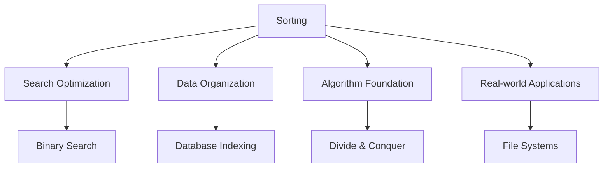
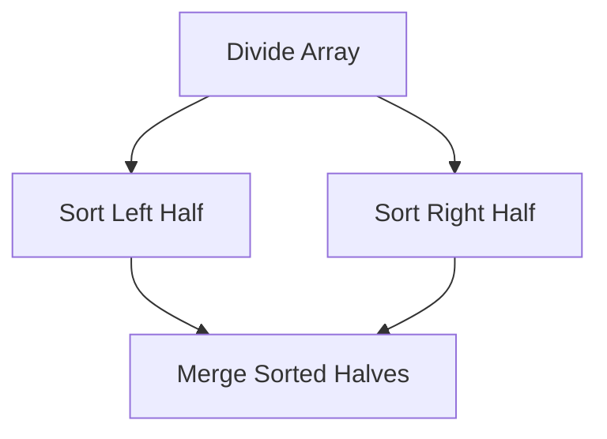

# 🔃 Sorting Algorithms — Complete Professional Guide

<div align="center">


*Master the art of organizing data through efficient sorting algorithms*

</div>

---

## 📑 Table of Contents

1. [Introduction](#-introduction)
2. [Simple Sorting](#-simple-sorting)
3. [Efficient Sorting](#-efficient-sorting)
4. [Specialized Sorting](#-specialized-sorting)
5. [Comparison Analysis](#-comparison-analysis)
6. [Stability & Adaptability](#-stability--adaptability)
7. [External Sorting](#-external-sorting)
8. [Best Practices](#-best-practices)

---

## 🎯 Introduction

**Sorting** is the process of arranging data in a particular order (ascending or descending). It's fundamental to computer science and serves as a prerequisite for many algorithms.

## 📊 Sorting Algorithm Gallery

<div align="center">


</div>

### 🌊 Sorting Algorithm Flow

```mermaid
graph TD
    A[Sorting Algorithms] --> B[Simple O(n²)]
    A --> C[Efficient O(n log n)]
    A --> D[Linear O(n+k)]
    
    B --> E[Bubble Sort]
    B --> F[Selection Sort]
    B --> G[Insertion Sort]
    
    C --> H[Merge Sort]
    C --> I[Quick Sort]
    C --> J[Heap Sort]
    
    D --> K[Counting Sort]
    D --> L[Radix Sort]
    D --> M[Bucket Sort]
```

### 🔑 Why Study Sorting?



### 📊 Sorting Algorithm Categories

| Category | Algorithms | Time Complexity | Space |
|:---------|:-----------|:----------------|:------|
| **Simple** | Bubble, Selection, Insertion | O(n²) | O(1) |
| **Efficient** | Merge, Quick, Heap | O(n log n) | O(n) or O(log n) |
| **Linear** | Counting, Radix, Bucket | O(n+k) | O(n+k) |

---

## 🔄 Simple Sorting

### 🎯 Bubble Sort


```cpp
void bubbleSort(vector<int>& arr) {
    int n = arr.size();
    
    for (int i = 0; i < n - 1; i++) {
        bool swapped = false;
        
        for (int j = 0; j < n - i - 1; j++) {
            if (arr[j] > arr[j + 1]) {
                swap(arr[j], arr[j + 1]);
                swapped = true;
            }
        }
        
        if (!swapped) break; // Optimization: early termination
    }
}
// Time: O(n²), Space: O(1), Stable: Yes
```

### 🎯 Selection Sort

```cpp
void selectionSort(vector<int>& arr) {
    int n = arr.size();
    
    for (int i = 0; i < n - 1; i++) {
        int minIndex = i;
        
        // Find minimum element in remaining array
        for (int j = i + 1; j < n; j++) {
            if (arr[j] < arr[minIndex]) {
                minIndex = j;
            }
        }
        
        if (minIndex != i) {
            swap(arr[i], arr[minIndex]);
        }
    }
}
// Time: O(n²), Space: O(1), Stable: No
```

### 🎯 Insertion Sort

```cpp
void insertionSort(vector<int>& arr) {
    for (int i = 1; i < arr.size(); i++) {
        int key = arr[i];
        int j = i - 1;
        
        // Move elements greater than key one position ahead
        while (j >= 0 && arr[j] > key) {
            arr[j + 1] = arr[j];
            j--;
        }
        
        arr[j + 1] = key;
    }
}
// Time: O(n²), Space: O(1), Stable: Yes
```

---

## ⚡ Efficient Sorting

### 🎯 Merge Sort



```cpp
class MergeSort {
public:
    void mergeSort(vector<int>& arr, int left, int right) {
        if (left < right) {
            int mid = left + (right - left) / 2;
            
            mergeSort(arr, left, mid);
            mergeSort(arr, mid + 1, right);
            merge(arr, left, mid, right);
        }
    }
    
private:
    void merge(vector<int>& arr, int left, int mid, int right) {
        vector<int> temp(right - left + 1);
        int i = left, j = mid + 1, k = 0;
        
        while (i <= mid && j <= right) {
            if (arr[i] <= arr[j]) {
                temp[k++] = arr[i++];
            } else {
                temp[k++] = arr[j++];
            }
        }
        
        while (i <= mid) temp[k++] = arr[i++];
        while (j <= right) temp[k++] = arr[j++];
        
        for (int i = 0; i < k; i++) {
            arr[left + i] = temp[i];
        }
    }
};
// Time: O(n log n), Space: O(n), Stable: Yes
```

### 🎯 Quick Sort

```cpp
class QuickSort {
public:
    void quickSort(vector<int>& arr, int low, int high) {
        if (low < high) {
            int pi = partition(arr, low, high);
            
            quickSort(arr, low, pi - 1);
            quickSort(arr, pi + 1, high);
        }
    }
    
private:
    int partition(vector<int>& arr, int low, int high) {
        int pivot = arr[high]; // Choose last element as pivot
        int i = low - 1;
        
        for (int j = low; j < high; j++) {
            if (arr[j] < pivot) {
                i++;
                swap(arr[i], arr[j]);
            }
        }
        
        swap(arr[i + 1], arr[high]);
        return i + 1;
    }
    
    // Randomized partition for better average case
    int randomizedPartition(vector<int>& arr, int low, int high) {
        int randomIndex = low + rand() % (high - low + 1);
        swap(arr[randomIndex], arr[high]);
        return partition(arr, low, high);
    }
};
// Time: O(n log n) avg, O(n²) worst, Space: O(log n), Stable: No
```

### 🎯 Heap Sort

```cpp
class HeapSort {
public:
    void heapSort(vector<int>& arr) {
        int n = arr.size();
        
        // Build max heap
        for (int i = n / 2 - 1; i >= 0; i--) {
            heapify(arr, n, i);
        }
        
        // Extract elements from heap
        for (int i = n - 1; i > 0; i--) {
            swap(arr[0], arr[i]);
            heapify(arr, i, 0);
        }
    }
    
private:
    void heapify(vector<int>& arr, int n, int i) {
        int largest = i;
        int left = 2 * i + 1;
        int right = 2 * i + 2;
        
        if (left < n && arr[left] > arr[largest]) {
            largest = left;
        }
        
        if (right < n && arr[right] > arr[largest]) {
            largest = right;
        }
        
        if (largest != i) {
            swap(arr[i], arr[largest]);
            heapify(arr, n, largest);
        }
    }
};
// Time: O(n log n), Space: O(1), Stable: No
```

---

## 🎯 Specialized Sorting

### 🎯 Counting Sort

```cpp
void countingSort(vector<int>& arr) {
    if (arr.empty()) return;
    
    int maxVal = *max_element(arr.begin(), arr.end());
    int minVal = *min_element(arr.begin(), arr.end());
    int range = maxVal - minVal + 1;
    
    vector<int> count(range, 0);
    vector<int> output(arr.size());
    
    // Count occurrences
    for (int num : arr) {
        count[num - minVal]++;
    }
    
    // Calculate cumulative count
    for (int i = 1; i < range; i++) {
        count[i] += count[i - 1];
    }
    
    // Build output array
    for (int i = arr.size() - 1; i >= 0; i--) {
        output[count[arr[i] - minVal] - 1] = arr[i];
        count[arr[i] - minVal]--;
    }
    
    arr = output;
}
// Time: O(n+k), Space: O(n+k), Stable: Yes
```

### 🎯 Radix Sort

```cpp
class RadixSort {
public:
    void radixSort(vector<int>& arr) {
        if (arr.empty()) return;
        
        int maxVal = *max_element(arr.begin(), arr.end());
        
        for (int exp = 1; maxVal / exp > 0; exp *= 10) {
            countingSortByDigit(arr, exp);
        }
    }
    
private:
    void countingSortByDigit(vector<int>& arr, int exp) {
        vector<int> output(arr.size());
        vector<int> count(10, 0);
        
        // Count occurrences of digits
        for (int num : arr) {
            count[(num / exp) % 10]++;
        }
        
        // Calculate cumulative count
        for (int i = 1; i < 10; i++) {
            count[i] += count[i - 1];
        }
        
        // Build output array
        for (int i = arr.size() - 1; i >= 0; i--) {
            int digit = (arr[i] / exp) % 10;
            output[count[digit] - 1] = arr[i];
            count[digit]--;
        }
        
        arr = output;
    }
};
// Time: O(d×(n+k)), Space: O(n+k), Stable: Yes
```

### 🎯 Bucket Sort

```cpp
void bucketSort(vector<float>& arr) {
    if (arr.empty()) return;
    
    int n = arr.size();
    vector<vector<float>> buckets(n);
    
    // Distribute elements into buckets
    for (float num : arr) {
        int bucketIndex = n * num; // Assuming values in [0, 1)
        buckets[bucketIndex].push_back(num);
    }
    
    // Sort individual buckets
    for (auto& bucket : buckets) {
        sort(bucket.begin(), bucket.end());
    }
    
    // Concatenate buckets
    int index = 0;
    for (const auto& bucket : buckets) {
        for (float num : bucket) {
            arr[index++] = num;
        }
    }
}
// Time: O(n+k) avg, O(n²) worst, Space: O(n+k), Stable: Yes
```

---

## 📊 Comparison Analysis

### 🎯 Performance Comparison

```mermaid
graph TD
    A[Sorting Algorithms] --> B[Time Complexity]
    A --> C[Space Complexity]
    A --> D[Stability]
    
    B --> E[Best: O(n) - Bubble optimized]
    B --> F[Average: O(n log n) - Merge, Heap]
    B --> G[Worst: O(n²) - Bubble, Selection]
    
    C --> H[O(1) - Heap, Selection]
    C --> I[O(n) - Merge]
    C --> J[O(log n) - Quick]
```

### 📊 Algorithm Selection Guide

| Use Case | Algorithm | Reason |
|:---------|:----------|:-------|
| **Small arrays (n < 50)** | Insertion Sort | Simple, low overhead |
| **Nearly sorted data** | Insertion Sort | O(n) best case |
| **Guaranteed O(n log n)** | Merge Sort | Consistent performance |
| **In-place sorting** | Heap Sort | O(1) space |
| **Average case performance** | Quick Sort | Fastest in practice |
| **Integer data, small range** | Counting Sort | Linear time |
| **Stability required** | Merge Sort | Maintains relative order |

---

## 🎯 Stability & Adaptability

### 🔧 Stable vs Unstable

```cpp
// Example showing stability importance
struct Student {
    string name;
    int grade;
    int rollNumber;
};

// Stable sort maintains relative order of equal elements
bool compareByGrade(const Student& a, const Student& b) {
    return a.grade < b.grade;
}

void demonstrateStability() {
    vector<Student> students = {
        {"Alice", 85, 1},
        {"Bob", 90, 2},
        {"Charlie", 85, 3}
    };
    
    // Stable sort: Alice comes before Charlie (both have grade 85)
    stable_sort(students.begin(), students.end(), compareByGrade);
    
    // Unstable sort might change relative order of Alice and Charlie
    sort(students.begin(), students.end(), compareByGrade);
}
```

### 🔧 Adaptive Algorithms

```cpp
// Insertion sort is adaptive - performs better on nearly sorted data
void adaptiveInsertionSort(vector<int>& arr) {
    for (int i = 1; i < arr.size(); i++) {
        int key = arr[i];
        int j = i - 1;
        
        // Early termination if element is in correct position
        if (arr[j] <= key) continue;
        
        while (j >= 0 && arr[j] > key) {
            arr[j + 1] = arr[j];
            j--;
        }
        
        arr[j + 1] = key;
    }
}
```

---

## 🏆 Best Practices

### ✅ Do's

```cpp
// 1. Choose appropriate algorithm based on data characteristics
template<typename T>
void smartSort(vector<T>& arr) {
    if (arr.size() < 50) {
        insertionSort(arr);
    } else if (is_integral_v<T> && getRange(arr) < arr.size()) {
        countingSort(arr);
    } else {
        sort(arr.begin(), arr.end()); // Introsort (hybrid)
    }
}

// 2. Use iterative versions for large datasets to avoid stack overflow
void iterativeQuickSort(vector<int>& arr) {
    stack<pair<int, int>> stk;
    stk.push({0, arr.size() - 1});
    
    while (!stk.empty()) {
        auto [low, high] = stk.top();
        stk.pop();
        
        if (low < high) {
            int pi = partition(arr, low, high);
            stk.push({low, pi - 1});
            stk.push({pi + 1, high});
        }
    }
}

// 3. Handle edge cases
template<typename T>
void safeSortWrapper(vector<T>& arr) {
    if (arr.empty() || arr.size() == 1) return;
    
    // Check for all equal elements
    if (all_of(arr.begin(), arr.end(), 
               [&](const T& x) { return x == arr[0]; })) {
        return;
    }
    
    sort(arr.begin(), arr.end());
}
```

### ❌ Don'ts

```cpp
// Don't: Use bubble sort for large datasets
// Don't: Ignore stability requirements
// Don't: Use recursive algorithms for very large arrays without tail optimization
// Don't: Forget to handle duplicate elements properly
```

---

## 🎓 Summary

Sorting algorithms are fundamental to computer science. Master these concepts:

✅ **Simple Sorts**: Bubble, Selection, Insertion for small datasets  
✅ **Efficient Sorts**: Merge, Quick, Heap for general purpose  
✅ **Linear Sorts**: Counting, Radix, Bucket for special cases  
✅ **Algorithm Selection**: Choose based on data characteristics  
✅ **Stability**: Understand when relative order matters  
✅ **Optimization**: Apply appropriate optimizations for your use case  

**Next Steps**: Study advanced sorting techniques like external sorting and parallel sorting algorithms.

---

<div align="center">

**🔃 Order from Chaos**

*Sorting: The foundation of efficient data processing*

</div>