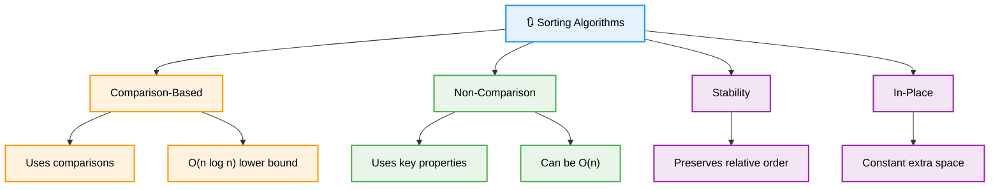
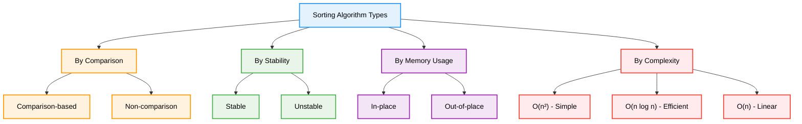
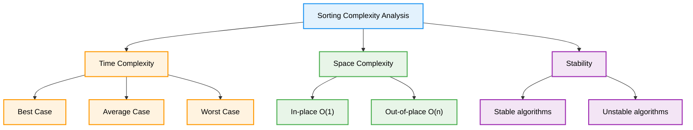
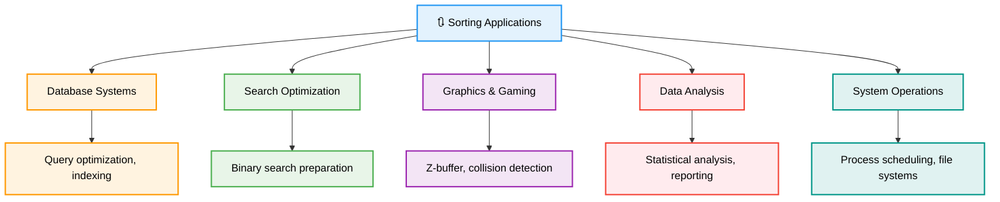
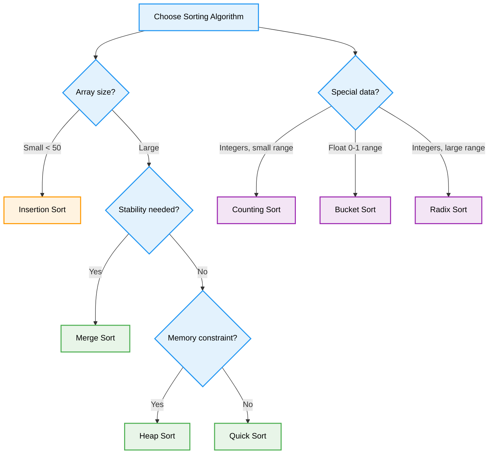

# 🔃 Sorting Algorithms — Complete Professional <div align="center">Guide</div>

<div align="center">


**Master efficient data organization techniques for optimal performance**

</div>

---

## 📑 Table of Contents

1. [Introduction](#introduction)
2. [Types of Sorting](#types-of-sorting)
3. [Simple Sorting Algorithms](#simple-sorting-algorithms)
4. [Efficient Sorting Algorithms](#efficient-sorting-algorithms)
5. [Specialized Sorting](#specialized-sorting)
6. [Complexity Analysis](#complexity-analysis)
7. [Applications](#applications)
8. [Best Practices](#best-practices)

---

## Introduction

**Sorting Algorithms** are fundamental techniques for arranging data in a specific order. They form the backbone of many computer science applications, from database operations to search optimization, making them essential for efficient data processing.

<div align="center">

</div>

### Core Concept



---

## Types of Sorting

<div align="center">

</div>

### Classification



---

## Simple Sorting Algorithms

### Bubble Sort

```cpp
class SimpleSorting {
public:
    // Bubble Sort - O(n²)
    static void bubbleSort(vector<int>& arr) {
        int n = arr.size();
        
        for (int i = 0; i < n - 1; i++) {
            bool swapped = false;
            
            for (int j = 0; j < n - i - 1; j++) {
                if (arr[j] > arr[j + 1]) {
                    swap(arr[j], arr[j + 1]);
                    swapped = true;
                }
            }
            
            if (!swapped) break; // Already sorted
        }
    }
    
    // Selection Sort - O(n²)
    static void selectionSort(vector<int>& arr) {
        int n = arr.size();
        
        for (int i = 0; i < n - 1; i++) {
            int minIdx = i;
            
            for (int j = i + 1; j < n; j++) {
                if (arr[j] < arr[minIdx]) {
                    minIdx = j;
                }
            }
            
            if (minIdx != i) {
                swap(arr[i], arr[minIdx]);
            }
        }
    }
    
    // Insertion Sort - O(n²)
    static void insertionSort(vector<int>& arr) {
        int n = arr.size();
        
        for (int i = 1; i < n; i++) {
            int key = arr[i];
            int j = i - 1;
            
            while (j >= 0 && arr[j] > key) {
                arr[j + 1] = arr[j];
                j--;
            }
            
            arr[j + 1] = key;
        }
    }
};
```

---

## Efficient Sorting Algorithms

### Merge Sort

```cpp
class EfficientSorting {
public:
    // Merge Sort - O(n log n)
    static void mergeSort(vector<int>& arr, int left, int right) {
        if (left < right) {
            int mid = left + (right - left) / 2;
            
            mergeSort(arr, left, mid);
            mergeSort(arr, mid + 1, right);
            merge(arr, left, mid, right);
        }
    }
    
private:
    static void merge(vector<int>& arr, int left, int mid, int right) {
        int n1 = mid - left + 1;
        int n2 = right - mid;
        
        vector<int> leftArr(n1), rightArr(n2);
        
        for (int i = 0; i < n1; i++)
            leftArr[i] = arr[left + i];
        for (int j = 0; j < n2; j++)
            rightArr[j] = arr[mid + 1 + j];
        
        int i = 0, j = 0, k = left;
        
        while (i < n1 && j < n2) {
            if (leftArr[i] <= rightArr[j]) {
                arr[k] = leftArr[i];
                i++;
            } else {
                arr[k] = rightArr[j];
                j++;
            }
            k++;
        }
        
        while (i < n1) {
            arr[k] = leftArr[i];
            i++;
            k++;
        }
        
        while (j < n2) {
            arr[k] = rightArr[j];
            j++;
            k++;
        }
    }
    
public:
    // Quick Sort - O(n log n) average
    static void quickSort(vector<int>& arr, int low, int high) {
        if (low < high) {
            int pi = partition(arr, low, high);
            
            quickSort(arr, low, pi - 1);
            quickSort(arr, pi + 1, high);
        }
    }
    
private:
    static int partition(vector<int>& arr, int low, int high) {
        int pivot = arr[high];
        int i = low - 1;
        
        for (int j = low; j < high; j++) {
            if (arr[j] < pivot) {
                i++;
                swap(arr[i], arr[j]);
            }
        }
        
        swap(arr[i + 1], arr[high]);
        return i + 1;
    }
    
public:
    // Heap Sort - O(n log n)
    static void heapSort(vector<int>& arr) {
        int n = arr.size();
        
        // Build max heap
        for (int i = n / 2 - 1; i >= 0; i--) {
            heapify(arr, n, i);
        }
        
        // Extract elements one by one
        for (int i = n - 1; i > 0; i--) {
            swap(arr[0], arr[i]);
            heapify(arr, i, 0);
        }
    }
    
private:
    static void heapify(vector<int>& arr, int n, int i) {
        int largest = i;
        int left = 2 * i + 1;
        int right = 2 * i + 2;
        
        if (left < n && arr[left] > arr[largest])
            largest = left;
        
        if (right < n && arr[right] > arr[largest])
            largest = right;
        
        if (largest != i) {
            swap(arr[i], arr[largest]);
            heapify(arr, n, largest);
        }
    }
};
```

---

## Specialized Sorting

### Non-Comparison Sorting

```cpp
class SpecializedSorting {
public:
    // Counting Sort - O(n + k)
    static void countingSort(vector<int>& arr) {
        if (arr.empty()) return;
        
        int maxVal = *max_element(arr.begin(), arr.end());
        int minVal = *min_element(arr.begin(), arr.end());
        int range = maxVal - minVal + 1;
        
        vector<int> count(range, 0);
        vector<int> output(arr.size());
        
        // Count occurrences
        for (int num : arr) {
            count[num - minVal]++;
        }
        
        // Cumulative count
        for (int i = 1; i < range; i++) {
            count[i] += count[i - 1];
        }
        
        // Build output array
        for (int i = arr.size() - 1; i >= 0; i--) {
            output[count[arr[i] - minVal] - 1] = arr[i];
            count[arr[i] - minVal]--;
        }
        
        arr = output;
    }
    
    // Radix Sort - O(d * (n + k))
    static void radixSort(vector<int>& arr) {
        if (arr.empty()) return;
        
        int maxVal = *max_element(arr.begin(), arr.end());
        
        for (int exp = 1; maxVal / exp > 0; exp *= 10) {
            countingSortByDigit(arr, exp);
        }
    }
    
private:
    static void countingSortByDigit(vector<int>& arr, int exp) {
        vector<int> output(arr.size());
        vector<int> count(10, 0);
        
        // Count occurrences of digits
        for (int num : arr) {
            count[(num / exp) % 10]++;
        }
        
        // Cumulative count
        for (int i = 1; i < 10; i++) {
            count[i] += count[i - 1];
        }
        
        // Build output array
        for (int i = arr.size() - 1; i >= 0; i--) {
            output[count[(arr[i] / exp) % 10] - 1] = arr[i];
            count[(arr[i] / exp) % 10]--;
        }
        
        arr = output;
    }
    
public:
    // Bucket Sort - O(n + k)
    static void bucketSort(vector<float>& arr) {
        if (arr.empty()) return;
        
        int n = arr.size();
        vector<vector<float>> buckets(n);
        
        // Put elements into buckets
        for (float num : arr) {
            int bucketIdx = n * num;
            buckets[bucketIdx].push_back(num);
        }
        
        // Sort individual buckets
        for (auto& bucket : buckets) {
            sort(bucket.begin(), bucket.end());
        }
        
        // Concatenate buckets
        int idx = 0;
        for (const auto& bucket : buckets) {
            for (float num : bucket) {
                arr[idx++] = num;
            }
        }
    }
};
```

---

## Complexity Analysis

<div align="center">

</div>

### Complexity Comparison



### Comprehensive Comparison Table

| Algorithm | Best Case | Average Case | Worst Case | Space | Stable | In-Place |
|-----------|-----------|--------------|------------|-------|--------|----------|
| **Bubble Sort** | O(n) | O(n²) | O(n²) | O(1) | ✅ | ✅ |
| **Selection Sort** | O(n²) | O(n²) | O(n²) | O(1) | ❌ | ✅ |
| **Insertion Sort** | O(n) | O(n²) | O(n²) | O(1) | ✅ | ✅ |
| **Merge Sort** | O(n log n) | O(n log n) | O(n log n) | O(n) | ✅ | ❌ |
| **Quick Sort** | O(n log n) | O(n log n) | O(n²) | O(log n) | ❌ | ✅ |
| **Heap Sort** | O(n log n) | O(n log n) | O(n log n) | O(1) | ❌ | ✅ |
| **Counting Sort** | O(n + k) | O(n + k) | O(n + k) | O(k) | ✅ | ❌ |
| **Radix Sort** | O(d(n + k)) | O(d(n + k)) | O(d(n + k)) | O(n + k) | ✅ | ❌ |
| **Bucket Sort** | O(n + k) | O(n + k) | O(n²) | O(n) | ✅ | ❌ |

---

## Applications

### Real-World Applications



### Practical Implementation

```cpp
class SortingApplications {
public:
    // Adaptive sorting - chooses best algorithm
    static void adaptiveSort(vector<int>& arr) {
        int n = arr.size();
        
        if (n <= 1) return;
        
        // For small arrays, use insertion sort
        if (n < 50) {
            SimpleSorting::insertionSort(arr);
            return;
        }
        
        // Check if nearly sorted
        if (isNearlySorted(arr)) {
            SimpleSorting::insertionSort(arr);
            return;
        }
        
        // For large arrays, use quicksort
        EfficientSorting::quickSort(arr, 0, n - 1);
    }
    
    // Sort with custom comparator
    template<typename T, typename Compare>
    static void customSort(vector<T>& arr, Compare comp) {
        sort(arr.begin(), arr.end(), comp);
    }
    
    // Stable sort when order matters
    static void stableSort(vector<pair<int, string>>& arr) {
        stable_sort(arr.begin(), arr.end(), 
                   [](const pair<int, string>& a, const pair<int, string>& b) {
                       return a.first < b.first;
                   });
    }
    
    // Partial sort - only sort first k elements
    static void partialSort(vector<int>& arr, int k) {
        partial_sort(arr.begin(), arr.begin() + k, arr.end());
    }
    
private:
    static bool isNearlySorted(const vector<int>& arr) {
        int inversions = 0;
        for (int i = 0; i < arr.size() - 1; i++) {
            if (arr[i] > arr[i + 1]) {
                inversions++;
                if (inversions > arr.size() / 10) {
                    return false;
                }
            }
        }
        return true;
    }
};
```

---

## Best Practices

### Algorithm Selection Guidelines



### Common Pitfalls and Solutions

```cpp
class SortingBestPractices {
public:
    // ❌ Not handling edge cases
    static void badSort(vector<int>& arr) {
        // Missing empty array check
        EfficientSorting::quickSort(arr, 0, arr.size() - 1);
    }
    
    // ✅ Proper edge case handling
    static void goodSort(vector<int>& arr) {
        if (arr.size() <= 1) return;
        EfficientSorting::quickSort(arr, 0, arr.size() - 1);
    }
    
    // ❌ Using wrong algorithm for the use case
    static void inefficientChoice(vector<int>& arr) {
        // Using bubble sort for large arrays
        SimpleSorting::bubbleSort(arr); // O(n²) - very slow
    }
    
    // ✅ Algorithm selection based on requirements
    static void efficientChoice(vector<int>& arr, bool needsStability) {
        if (arr.size() < 50) {
            SimpleSorting::insertionSort(arr);
        } else if (needsStability) {
            EfficientSorting::mergeSort(arr, 0, arr.size() - 1);
        } else {
            EfficientSorting::quickSort(arr, 0, arr.size() - 1);
        }
    }
    
    // ✅ Using STL algorithms when appropriate
    static void useSTL(vector<int>& arr) {
        // STL sort is highly optimized (typically introsort)
        sort(arr.begin(), arr.end());
        
        // For stability
        stable_sort(arr.begin(), arr.end());
        
        // For partial sorting
        partial_sort(arr.begin(), arr.begin() + 10, arr.end());
    }
    
    // ✅ Custom comparators
    static void customComparison() {
        vector<string> words = {"apple", "pie", "a", "longer"};
        
        // Sort by length
        sort(words.begin(), words.end(), 
             [](const string& a, const string& b) {
                 return a.length() < b.length();
             });
    }
};
```

---

## Summary

**Sorting Algorithms** are fundamental for organizing data efficiently. Key insights:

### Essential Concepts
- **Comparison vs Non-Comparison**: Different approaches with different complexity bounds
- **Stability**: Preserving relative order of equal elements
- **In-Place vs Out-of-Place**: Memory usage considerations
- **Adaptive**: Performance varies based on input characteristics

### Core Algorithms
- **Simple Sorts**: Bubble, Selection, Insertion - O(n²) but good for small data
- **Efficient Sorts**: Merge, Quick, Heap - O(n log n) for large datasets
- **Specialized Sorts**: Counting, Radix, Bucket - O(n) for specific data types
- **Hybrid Approaches**: Combining algorithms for optimal performance

### Best Practices
- Choose algorithms based on data size and characteristics
- Consider stability requirements for your application
- Use STL algorithms when possible - they're highly optimized
- Handle edge cases properly (empty arrays, single elements)
- Profile performance for your specific use case

> **Master's Insight**: The best sorting algorithm depends on your specific requirements: data size, stability needs, memory constraints, and input characteristics. Modern implementations often use hybrid approaches that adapt to the data.

---

<div align="center">

**🔃 Master Sorting Algorithms • Organize Data Efficiently • Build Optimal Solutions**

*From Theory to Practice • Simple to Complex • Understanding to Mastery*

</div>