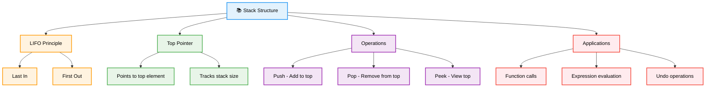
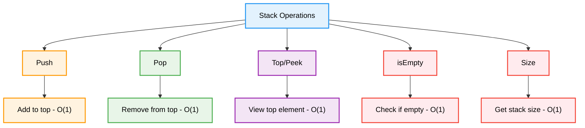
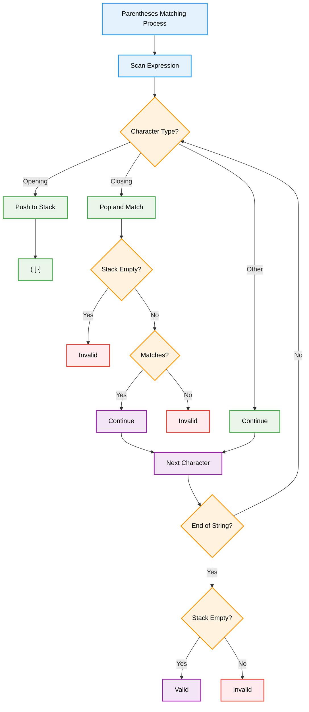
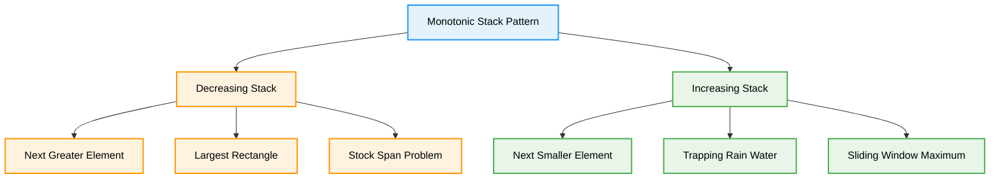
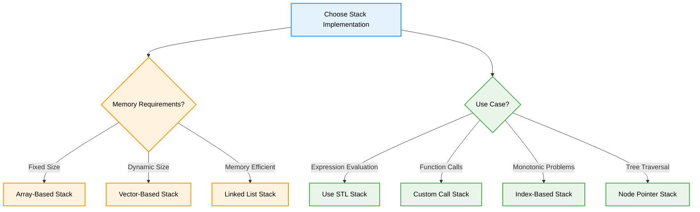

# 📚 Stacks — Complete Professional <div align="center">Guide</div>

<div align="center">


**Master Last-In-First-Out data structure for efficient operations**

</div>

---

## 📑 Table of Contents

1. [Introduction](#introduction)
2. [Core Operations](#core-operations)
3. [Implementation Guide](#implementation-guide)
4. [Applications](#applications)
5. [Advanced Techniques](#advanced-techniques)
6. [Best Practices](#best-practices)

---

## Introduction

**Stacks** are fundamental linear data structures that follow the Last-In-First-Out (LIFO) principle. Elements are added and removed from the same end called the "top", making stacks essential for managing function calls, expression evaluation, and undo operations.

<div align="center">

</div>

### Core Concept



---

## Core Operations

### Stack Operations Flow

<div align="center">

</div>

### Operation Complexity



### Visual Stack Process

| Operation | Before | After | Description |
|-----------|--------|-------|-------------|
| **Push(5)** | `[1,2,3]` | `[1,2,3,5]` | Add 5 to top |
| **Pop()** | `[1,2,3,5]` | `[1,2,3]` | Remove top element |
| **Peek()** | `[1,2,3]` | `[1,2,3]` | Return 3 (no change) |
| **isEmpty()** | `[]` | `[]` | Return true |

---

## Implementation Guide

### Array-Based Implementation

```cpp
class ArrayStack {
private:
    vector<int> data;
    int topIndex;
    int capacity;
    
public:
    ArrayStack(int size = 100) : capacity(size), topIndex(-1) {
        data.resize(capacity);
    }
    
    // Push operation - O(1)
    void push(int val) {
        if (topIndex >= capacity - 1) {
            throw overflow_error("Stack overflow");
        }
        data[++topIndex] = val;
    }
    
    // Pop operation - O(1)
    void pop() {
        if (isEmpty()) {
            throw underflow_error("Stack underflow");
        }
        topIndex--;
    }
    
    // Top/Peek operation - O(1)
    int top() {
        if (isEmpty()) {
            throw underflow_error("Stack is empty");
        }
        return data[topIndex];
    }
    
    // Utility operations - O(1)
    bool isEmpty() {
        return topIndex == -1;
    }
    
    int size() {
        return topIndex + 1;
    }
    
    bool isFull() {
        return topIndex == capacity - 1;
    }
};
```

### Dynamic Stack Implementation

```cpp
class DynamicStack {
private:
    vector<int> data;
    
public:
    // Push with automatic resizing - Amortized O(1)
    void push(int val) {
        data.push_back(val);
    }
    
    // Pop operation - O(1)
    void pop() {
        if (empty()) {
            throw underflow_error("Stack underflow");
        }
        data.pop_back();
    }
    
    // Top operation - O(1)
    int top() {
        if (empty()) {
            throw underflow_error("Stack is empty");
        }
        return data.back();
    }
    
    // Utility operations
    bool empty() {
        return data.empty();
    }
    
    int size() {
        return data.size();
    }
};
```

### Linked List Implementation

```cpp
class LinkedStack {
private:
    struct Node {
        int data;
        Node* next;
        Node(int val) : data(val), next(nullptr) {}
    };
    
    Node* topNode;
    int stackSize;
    
public:
    LinkedStack() : topNode(nullptr), stackSize(0) {}
    
    ~LinkedStack() {
        while (!empty()) {
            pop();
        }
    }
    
    // Push operation - O(1)
    void push(int val) {
        Node* newNode = new Node(val);
        newNode->next = topNode;
        topNode = newNode;
        stackSize++;
    }
    
    // Pop operation - O(1)
    void pop() {
        if (empty()) {
            throw underflow_error("Stack underflow");
        }
        
        Node* temp = topNode;
        topNode = topNode->next;
        delete temp;
        stackSize--;
    }
    
    // Top operation - O(1)
    int top() {
        if (empty()) {
            throw underflow_error("Stack is empty");
        }
        return topNode->data;
    }
    
    // Utility operations
    bool empty() {
        return topNode == nullptr;
    }
    
    int size() {
        return stackSize;
    }
};
```

---

## Applications

### Expression Evaluation


### Parentheses Matching



```cpp
class ExpressionEvaluator {
public:
    // Balanced parentheses checker
    bool isValidParentheses(string s) {
        stack<char> stk;
        unordered_map<char, char> pairs = {{')', '('}, {']', '['}, {'}', '{'}};
        
        for (char c : s) {
            if (c == '(' || c == '[' || c == '{') {
                stk.push(c);
            } else if (c == ')' || c == ']' || c == '}') {
                if (stk.empty() || stk.top() != pairs[c]) {
                    return false;
                }
                stk.pop();
            }
        }
        
        return stk.empty();
    }
    
    // Postfix expression evaluation
    int evaluatePostfix(vector<string>& tokens) {
        stack<int> stk;
        
        for (string token : tokens) {
            if (isOperator(token)) {
                int b = stk.top(); stk.pop();
                int a = stk.top(); stk.pop();
                
                int result = performOperation(a, b, token);
                stk.push(result);
            } else {
                stk.push(stoi(token));
            }
        }
        
        return stk.top();
    }
    
    // Infix to postfix conversion
    string infixToPostfix(string infix) {
        stack<char> stk;
        string postfix = "";
        
        for (char c : infix) {
            if (isalnum(c)) {
                postfix += c;
            } else if (c == '(') {
                stk.push(c);
            } else if (c == ')') {
                while (!stk.empty() && stk.top() != '(') {
                    postfix += stk.top();
                    stk.pop();
                }
                stk.pop(); // Remove '('
            } else if (isOperator(string(1, c))) {
                while (!stk.empty() && precedence(stk.top()) >= precedence(c)) {
                    postfix += stk.top();
                    stk.pop();
                }
                stk.push(c);
            }
        }
        
        while (!stk.empty()) {
            postfix += stk.top();
            stk.pop();
        }
        
        return postfix;
    }
    
private:
    bool isOperator(string token) {
        return token == "+" || token == "-" || token == "*" || token == "/";
    }
    
    int performOperation(int a, int b, string op) {
        if (op == "+") return a + b;
        if (op == "-") return a - b;
        if (op == "*") return a * b;
        if (op == "/") return a / b;
        return 0;
    }
    
    int precedence(char op) {
        if (op == '+' || op == '-') return 1;
        if (op == '*' || op == '/') return 2;
        return 0;
    }
};
```

### Function Call Management


```cpp
class FunctionCallStack {
public:
    struct CallFrame {
        string functionName;
        unordered_map<string, int> localVariables;
        int returnAddress;
        
        CallFrame(string name, int addr) : functionName(name), returnAddress(addr) {}
    };
    
private:
    stack<CallFrame> callStack;
    
public:
    // Function call simulation
    void callFunction(string functionName, int returnAddress) {
        CallFrame frame(functionName, returnAddress);
        callStack.push(frame);
        cout << "Called: " << functionName << endl;
    }
    
    void returnFromFunction() {
        if (callStack.empty()) {
            throw runtime_error("No function to return from");
        }
        
        CallFrame frame = callStack.top();
        callStack.pop();
        cout << "Returned from: " << frame.functionName << endl;
    }
    
    void setLocalVariable(string varName, int value) {
        if (callStack.empty()) {
            throw runtime_error("No active function");
        }
        
        callStack.top().localVariables[varName] = value;
    }
    
    int getLocalVariable(string varName) {
        if (callStack.empty()) {
            throw runtime_error("No active function");
        }
        
        auto& vars = callStack.top().localVariables;
        if (vars.find(varName) == vars.end()) {
            throw runtime_error("Variable not found");
        }
        
        return vars[varName];
    }
    
    void printCallStack() {
        stack<CallFrame> temp = callStack;
        cout << "Call Stack (top to bottom):" << endl;
        
        while (!temp.empty()) {
            cout << "- " << temp.top().functionName << endl;
            temp.pop();
        }
    }
};
```

---

## Advanced Techniques

### Monotonic Stack


### Next Greater Element Pattern



```cpp
class MonotonicStack {
public:
    // Next greater element to the right
    vector<int> nextGreaterElement(vector<int>& nums) {
        vector<int> result(nums.size(), -1);
        stack<int> stk; // Store indices
        
        for (int i = 0; i < nums.size(); i++) {
            // Maintain decreasing stack
            while (!stk.empty() && nums[i] > nums[stk.top()]) {
                result[stk.top()] = nums[i];
                stk.pop();
            }
            stk.push(i);
        }
        
        return result;
    }
    
    // Largest rectangle in histogram
    int largestRectangleArea(vector<int>& heights) {
        stack<int> stk;
        int maxArea = 0;
        
        for (int i = 0; i <= heights.size(); i++) {
            int h = (i == heights.size()) ? 0 : heights[i];
            
            while (!stk.empty() && h < heights[stk.top()]) {
                int height = heights[stk.top()];
                stk.pop();
                
                int width = stk.empty() ? i : i - stk.top() - 1;
                maxArea = max(maxArea, height * width);
            }
            
            stk.push(i);
        }
        
        return maxArea;
    }
    
    // Stock span problem
    vector<int> calculateSpan(vector<int>& prices) {
        vector<int> span(prices.size());
        stack<int> stk;
        
        for (int i = 0; i < prices.size(); i++) {
            // Pop elements smaller than current price
            while (!stk.empty() && prices[stk.top()] <= prices[i]) {
                stk.pop();
            }
            
            // Calculate span
            span[i] = stk.empty() ? i + 1 : i - stk.top();
            stk.push(i);
        }
        
        return span;
    }
    
    // Trapping rain water
    int trapRainWater(vector<int>& height) {
        stack<int> stk;
        int water = 0;
        
        for (int i = 0; i < height.size(); i++) {
            while (!stk.empty() && height[i] > height[stk.top()]) {
                int bottom = stk.top();
                stk.pop();
                
                if (stk.empty()) break;
                
                int distance = i - stk.top() - 1;
                int boundedHeight = min(height[i], height[stk.top()]) - height[bottom];
                water += distance * boundedHeight;
            }
            stk.push(i);
        }
        
        return water;
    }
};
```

### Stack-Based Tree Traversal

```cpp
class StackTreeTraversal {
public:
    struct TreeNode {
        int val;
        TreeNode* left;
        TreeNode* right;
        TreeNode(int x) : val(x), left(nullptr), right(nullptr) {}
    };
    
    // Iterative inorder traversal
    vector<int> inorderTraversal(TreeNode* root) {
        vector<int> result;
        stack<TreeNode*> stk;
        TreeNode* current = root;
        
        while (current || !stk.empty()) {
            // Go to leftmost node
            while (current) {
                stk.push(current);
                current = current->left;
            }
            
            // Process current node
            current = stk.top();
            stk.pop();
            result.push_back(current->val);
            
            // Move to right subtree
            current = current->right;
        }
        
        return result;
    }
    
    // Iterative preorder traversal
    vector<int> preorderTraversal(TreeNode* root) {
        vector<int> result;
        if (!root) return result;
        
        stack<TreeNode*> stk;
        stk.push(root);
        
        while (!stk.empty()) {
            TreeNode* node = stk.top();
            stk.pop();
            
            result.push_back(node->val);
            
            // Push right first, then left (for correct order)
            if (node->right) stk.push(node->right);
            if (node->left) stk.push(node->left);
        }
        
        return result;
    }
    
    // Iterative postorder traversal
    vector<int> postorderTraversal(TreeNode* root) {
        vector<int> result;
        if (!root) return result;
        
        stack<TreeNode*> stk;
        TreeNode* lastVisited = nullptr;
        TreeNode* current = root;
        
        while (current || !stk.empty()) {
            if (current) {
                stk.push(current);
                current = current->left;
            } else {
                TreeNode* peekNode = stk.top();
                
                // If right child exists and hasn't been processed yet
                if (peekNode->right && lastVisited != peekNode->right) {
                    current = peekNode->right;
                } else {
                    result.push_back(peekNode->val);
                    lastVisited = stk.top();
                    stk.pop();
                }
            }
        }
        
        return result;
    }
};
```

---

## Best Practices

### Algorithm Selection Guidelines



### Common Pitfalls and Solutions

```cpp
class StackBestPractices {
public:
    // ❌ Not checking if stack is empty before operations
    int unsafeOperation(stack<int>& stk) {
        return stk.top(); // Can throw exception if empty
    }
    
    // ✅ Always check before accessing
    int safeOperation(stack<int>& stk) {
        if (stk.empty()) {
            throw underflow_error("Stack is empty");
        }
        return stk.top();
    }
    
    // ❌ Memory leak in linked list implementation
    void badDestructor() {
        // Not properly cleaning up nodes
    }
    
    // ✅ Proper cleanup
    void goodDestructor(Node*& head) {
        while (head) {
            Node* temp = head;
            head = head->next;
            delete temp;
        }
    }
    
    // ✅ Using RAII for automatic cleanup
    class SafeStack {
    private:
        vector<int> data;
    public:
        // Automatic cleanup when object goes out of scope
        ~SafeStack() = default;
        
        void push(int val) { data.push_back(val); }
        void pop() { 
            if (!data.empty()) data.pop_back(); 
        }
        int top() { 
            if (data.empty()) throw underflow_error("Empty stack");
            return data.back(); 
        }
        bool empty() { return data.empty(); }
    };
    
    // ✅ Exception safety
    void exceptionSafeOperations(stack<int>& stk) {
        try {
            while (!stk.empty()) {
                int value = stk.top();
                stk.pop();
                // Process value safely
                processValue(value);
            }
        } catch (const exception& e) {
            // Handle exceptions appropriately
            cerr << "Error: " << e.what() << endl;
        }
    }
    
private:
    void processValue(int value) {
        // Safe value processing
    }
};
```

### Performance Optimization Tips

| Technique | Description | When to Use |
|-----------|-------------|-------------|
| **Reserve Capacity** | Pre-allocate vector space | Known maximum size |
| **Move Semantics** | Use std::move for large objects | Complex data types |
| **Stack Pooling** | Reuse stack objects | Frequent creation/destruction |
| **Iterative over Recursive** | Replace recursion with stack | Deep recursion scenarios |

---

## Summary

**Stacks** are essential LIFO data structures with wide-ranging applications. Key insights:

### Essential Concepts
- **LIFO Principle**: Last-In-First-Out access pattern
- **O(1) Operations**: All basic operations are constant time
- **Memory Efficiency**: Minimal overhead for basic operations
- **Versatile Applications**: From expression evaluation to function calls

### Core Applications
- **Expression Evaluation**: Parentheses matching, postfix evaluation
- **Function Call Management**: Call stack, local variables, return addresses
- **Monotonic Stack**: Next greater/smaller element problems
- **Tree Traversal**: Iterative implementation of recursive algorithms

### Best Practices
- Always check for empty stack before operations
- Choose appropriate implementation based on requirements
- Use exception handling for robust error management
- Consider STL stack for most general-purpose applications

> **Master's Insight**: Stacks transform recursive thinking into iterative solutions, making complex problems manageable while maintaining the natural flow of LIFO operations.

---

<div align="center">

**📚 Master Stack Operations • Build LIFO Solutions • Stack Up Your Skills**

*From Theory to Practice • Simple to Complex • Understanding to Mastery*

</div>