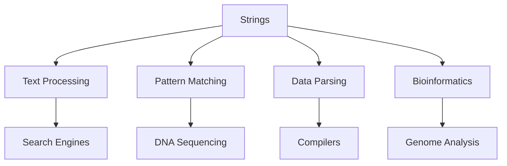

# 🔤 Strings — Complete Professional Guide

<div align="center">


*Master text processing and string manipulation algorithms*

</div>

---

## 📑 Table of Contents

1. [Introduction](#-introduction)
2. [String Fundamentals](#-string-fundamentals)
3. [Pattern Matching](#-pattern-matching)
4. [String Manipulation](#-string-manipulation)
5. [Advanced Algorithms](#-advanced-algorithms)
6. [String Hashing](#-string-hashing)
7. [Common Patterns](#-common-patterns)
8. [Best Practices](#-best-practices)

---

## 🎯 Introduction

**Strings** are sequences of characters that form the backbone of text processing, pattern matching, and data parsing in computer science.

### 🔑 Why Study Strings?



### 🎆 String Algorithm Flow

```mermaid
graph TD
    A[String Algorithms] --> B[Pattern Matching]
    A --> C[String Manipulation]
    A --> D[String Hashing]
    
    B --> E[Naive O(nm)]
    B --> F[KMP O(n+m)]
    B --> G[Rabin-Karp O(n+m)]
    
    C --> H[LCS]
    C --> I[Edit Distance]
    C --> J[Palindromes]
    
    D --> K[Rolling Hash]
    D --> L[Polynomial Hash]
    D --> M[Substring Problems]
```

### 📊 String Operations Complexity

| Operation | Array | String | Optimized |
|:----------|:------|:-------|:----------|
| **Access** | O(1) | O(1) | O(1) |
| **Search** | O(n) | O(n×m) | O(n+m) KMP |
| **Insert** | O(n) | O(n) | O(1) amortized |
| **Concatenation** | O(n) | O(n+m) | O(1) rope |

---

## 🏗️ String Fundamentals

### 🎯 String Representation

```cpp
// C++ String Implementations
class StringBasics {
public:
    // C-style strings
    void cStyleStrings() {
        char str1[] = "Hello";           // Stack allocation
        char* str2 = "World";            // String literal
        char str3[100];                  // Fixed size buffer
        strcpy(str3, "Dynamic");         // Copy string
    }
    
    // C++ std::string
    void cppStrings() {
        string str1 = "Hello";           // Constructor
        string str2("World");            // Direct initialization
        string str3(10, 'A');            // Fill constructor
        string str4(str1, 1, 3);         // Substring constructor
    }
    
    // String operations
    void stringOperations() {
        string s = "Hello World";
        
        // Access
        char ch = s[0];                  // Direct access
        char ch2 = s.at(0);              // Bounds-checked access
        
        // Modification
        s[0] = 'h';                      // Direct modification
        s.append(" !");                  // Append
        s.insert(5, ",");                // Insert at position
        s.erase(5, 1);                   // Erase substring
        
        // Information
        size_t len = s.length();         // Length
        bool empty = s.empty();          // Check if empty
        size_t pos = s.find("World");    // Find substring
    }
};
```

### 🔧 String Utilities

```cpp
class StringUtils {
public:
    // Convert to lowercase
    string toLowerCase(string s) {
        transform(s.begin(), s.end(), s.begin(), ::tolower);
        return s;
    }
    
    // Convert to uppercase
    string toUpperCase(string s) {
        transform(s.begin(), s.end(), s.begin(), ::toupper);
        return s;
    }
    
    // Reverse string
    string reverse(string s) {
        reverse(s.begin(), s.end());
        return s;
    }
    
    // Check if palindrome
    bool isPalindrome(const string& s) {
        int left = 0, right = s.length() - 1;
        
        while (left < right) {
            if (s[left] != s[right]) {
                return false;
            }
            left++;
            right--;
        }
        
        return true;
    }
    
    // Remove whitespace
    string trim(string s) {
        // Remove leading whitespace
        s.erase(s.begin(), find_if(s.begin(), s.end(), [](unsigned char ch) {
            return !isspace(ch);
        }));
        
        // Remove trailing whitespace
        s.erase(find_if(s.rbegin(), s.rend(), [](unsigned char ch) {
            return !isspace(ch);
        }).base(), s.end());
        
        return s;
    }
};
```

---

## 🔍 Pattern Matching

### 🎯 Naive Pattern Matching

```cpp
class NaivePatternMatching {
public:
    vector<int> search(const string& text, const string& pattern) {
        vector<int> matches;
        int n = text.length();
        int m = pattern.length();
        
        for (int i = 0; i <= n - m; i++) {
            int j = 0;
            
            while (j < m && text[i + j] == pattern[j]) {
                j++;
            }
            
            if (j == m) {
                matches.push_back(i);
            }
        }
        
        return matches;
    }
};
// Time: O(n×m), Space: O(1)
```

### 🎯 KMP Algorithm


```cpp
class KMPAlgorithm {
public:
    vector<int> search(const string& text, const string& pattern) {
        vector<int> matches;
        vector<int> lps = computeLPS(pattern);
        
        int i = 0; // Index for text
        int j = 0; // Index for pattern
        
        while (i < text.length()) {
            if (text[i] == pattern[j]) {
                i++;
                j++;
            }
            
            if (j == pattern.length()) {
                matches.push_back(i - j);
                j = lps[j - 1];
            } else if (i < text.length() && text[i] != pattern[j]) {
                if (j != 0) {
                    j = lps[j - 1];
                } else {
                    i++;
                }
            }
        }
        
        return matches;
    }
    
private:
    vector<int> computeLPS(const string& pattern) {
        int m = pattern.length();
        vector<int> lps(m, 0);
        int len = 0;
        int i = 1;
        
        while (i < m) {
            if (pattern[i] == pattern[len]) {
                len++;
                lps[i] = len;
                i++;
            } else {
                if (len != 0) {
                    len = lps[len - 1];
                } else {
                    lps[i] = 0;
                    i++;
                }
            }
        }
        
        return lps;
    }
};
// Time: O(n+m), Space: O(m)
```

### 🎯 Rabin-Karp Algorithm

```cpp
class RabinKarp {
private:
    static const int PRIME = 101;
    
public:
    vector<int> search(const string& text, const string& pattern) {
        vector<int> matches;
        int n = text.length();
        int m = pattern.length();
        
        if (m > n) return matches;
        
        long long patternHash = 0;
        long long textHash = 0;
        long long h = 1;
        
        // Calculate h = pow(256, m-1) % PRIME
        for (int i = 0; i < m - 1; i++) {
            h = (h * 256) % PRIME;
        }
        
        // Calculate hash for pattern and first window
        for (int i = 0; i < m; i++) {
            patternHash = (256 * patternHash + pattern[i]) % PRIME;
            textHash = (256 * textHash + text[i]) % PRIME;
        }
        
        // Slide pattern over text
        for (int i = 0; i <= n - m; i++) {
            if (patternHash == textHash) {
                // Check character by character
                bool match = true;
                for (int j = 0; j < m; j++) {
                    if (text[i + j] != pattern[j]) {
                        match = false;
                        break;
                    }
                }
                
                if (match) {
                    matches.push_back(i);
                }
            }
            
            // Calculate hash for next window
            if (i < n - m) {
                textHash = (256 * (textHash - text[i] * h) + text[i + m]) % PRIME;
                
                if (textHash < 0) {
                    textHash += PRIME;
                }
            }
        }
        
        return matches;
    }
};
// Time: O(n+m) average, O(n×m) worst, Space: O(1)
```

---

## ✂️ String Manipulation

### 🎯 String Transformation

```cpp
class StringTransformation {
public:
    // Longest Common Subsequence
    int longestCommonSubsequence(const string& text1, const string& text2) {
        int m = text1.length(), n = text2.length();
        vector<vector<int>> dp(m + 1, vector<int>(n + 1, 0));
        
        for (int i = 1; i <= m; i++) {
            for (int j = 1; j <= n; j++) {
                if (text1[i-1] == text2[j-1]) {
                    dp[i][j] = 1 + dp[i-1][j-1];
                } else {
                    dp[i][j] = max(dp[i-1][j], dp[i][j-1]);
                }
            }
        }
        
        return dp[m][n];
    }
    
    // Edit Distance (Levenshtein Distance)
    int editDistance(const string& word1, const string& word2) {
        int m = word1.length(), n = word2.length();
        vector<vector<int>> dp(m + 1, vector<int>(n + 1));
        
        // Initialize base cases
        for (int i = 0; i <= m; i++) dp[i][0] = i;
        for (int j = 0; j <= n; j++) dp[0][j] = j;
        
        for (int i = 1; i <= m; i++) {
            for (int j = 1; j <= n; j++) {
                if (word1[i-1] == word2[j-1]) {
                    dp[i][j] = dp[i-1][j-1];
                } else {
                    dp[i][j] = 1 + min({
                        dp[i-1][j],    // Delete
                        dp[i][j-1],    // Insert
                        dp[i-1][j-1]   // Replace
                    });
                }
            }
        }
        
        return dp[m][n];
    }
    
    // Longest Palindromic Substring
    string longestPalindrome(const string& s) {
        if (s.empty()) return "";
        
        int start = 0, maxLen = 1;
        
        for (int i = 0; i < s.length(); i++) {
            // Check for odd length palindromes
            int len1 = expandAroundCenter(s, i, i);
            // Check for even length palindromes
            int len2 = expandAroundCenter(s, i, i + 1);
            
            int len = max(len1, len2);
            if (len > maxLen) {
                maxLen = len;
                start = i - (len - 1) / 2;
            }
        }
        
        return s.substr(start, maxLen);
    }
    
private:
    int expandAroundCenter(const string& s, int left, int right) {
        while (left >= 0 && right < s.length() && s[left] == s[right]) {
            left--;
            right++;
        }
        return right - left - 1;
    }
};
```

### 🎯 String Parsing

```cpp
class StringParser {
public:
    // Split string by delimiter
    vector<string> split(const string& str, char delimiter) {
        vector<string> tokens;
        stringstream ss(str);
        string token;
        
        while (getline(ss, token, delimiter)) {
            tokens.push_back(token);
        }
        
        return tokens;
    }
    
    // Join strings with delimiter
    string join(const vector<string>& strings, const string& delimiter) {
        if (strings.empty()) return "";
        
        string result = strings[0];
        for (size_t i = 1; i < strings.size(); i++) {
            result += delimiter + strings[i];
        }
        
        return result;
    }
    
    // Replace all occurrences
    string replaceAll(string str, const string& from, const string& to) {
        size_t pos = 0;
        while ((pos = str.find(from, pos)) != string::npos) {
            str.replace(pos, from.length(), to);
            pos += to.length();
        }
        return str;
    }
    
    // Check if string is numeric
    bool isNumeric(const string& str) {
        if (str.empty()) return false;
        
        size_t start = 0;
        if (str[0] == '+' || str[0] == '-') {
            start = 1;
            if (str.length() == 1) return false;
        }
        
        bool hasDecimal = false;
        for (size_t i = start; i < str.length(); i++) {
            if (str[i] == '.') {
                if (hasDecimal) return false;
                hasDecimal = true;
            } else if (!isdigit(str[i])) {
                return false;
            }
        }
        
        return true;
    }
};
```

---

## 🔐 String Hashing

### 🎯 Rolling Hash

```cpp
class RollingHash {
private:
    static const long long BASE = 256;
    static const long long MOD = 1e9 + 7;
    
public:
    // Compute hash of string
    long long computeHash(const string& s) {
        long long hash = 0;
        long long pow = 1;
        
        for (char c : s) {
            hash = (hash + (c * pow) % MOD) % MOD;
            pow = (pow * BASE) % MOD;
        }
        
        return hash;
    }
    
    // Find all substrings of given length with same hash
    vector<string> findDuplicateSubstrings(const string& s, int len) {
        if (len > s.length()) return {};
        
        unordered_map<long long, vector<int>> hashMap;
        long long hash = 0;
        long long pow = 1;
        
        // Compute hash for first window
        for (int i = 0; i < len; i++) {
            hash = (hash + (s[i] * pow) % MOD) % MOD;
            if (i < len - 1) pow = (pow * BASE) % MOD;
        }
        
        hashMap[hash].push_back(0);
        
        // Rolling hash for remaining windows
        for (int i = len; i < s.length(); i++) {
            // Remove leftmost character
            hash = (hash - s[i - len] + MOD) % MOD;
            hash = (hash * modInverse(BASE)) % MOD;
            
            // Add rightmost character
            hash = (hash + (s[i] * pow) % MOD) % MOD;
            
            hashMap[hash].push_back(i - len + 1);
        }
        
        vector<string> duplicates;
        for (const auto& pair : hashMap) {
            if (pair.second.size() > 1) {
                duplicates.push_back(s.substr(pair.second[0], len));
            }
        }
        
        return duplicates;
    }
    
private:
    long long modInverse(long long a) {
        return power(a, MOD - 2);
    }
    
    long long power(long long base, long long exp) {
        long long result = 1;
        while (exp > 0) {
            if (exp % 2 == 1) {
                result = (result * base) % MOD;
            }
            base = (base * base) % MOD;
            exp /= 2;
        }
        return result;
    }
};
```

---

## 🎨 Common Patterns

### 🎯 Two Pointers Technique

```cpp
class StringTwoPointers {
public:
    // Valid Palindrome
    bool isPalindrome(string s) {
        int left = 0, right = s.length() - 1;
        
        while (left < right) {
            while (left < right && !isalnum(s[left])) left++;
            while (left < right && !isalnum(s[right])) right--;
            
            if (tolower(s[left]) != tolower(s[right])) {
                return false;
            }
            
            left++;
            right--;
        }
        
        return true;
    }
    
    // Reverse Words in String
    string reverseWords(string s) {
        // Remove extra spaces
        int i = 0, j = 0;
        while (j < s.length()) {
            while (j < s.length() && s[j] == ' ') j++;
            while (j < s.length() && s[j] != ' ') s[i++] = s[j++];
            while (j < s.length() && s[j] == ' ') j++;
            if (j < s.length()) s[i++] = ' ';
        }
        
        s.resize(i);
        
        // Reverse entire string
        reverse(s.begin(), s.end());
        
        // Reverse each word
        int start = 0;
        for (int end = 0; end <= s.length(); end++) {
            if (end == s.length() || s[end] == ' ') {
                reverse(s.begin() + start, s.begin() + end);
                start = end + 1;
            }
        }
        
        return s;
    }
};
```

### 🎯 Sliding Window

```cpp
class StringSlidingWindow {
public:
    // Longest Substring Without Repeating Characters
    int lengthOfLongestSubstring(const string& s) {
        unordered_set<char> window;
        int left = 0, maxLen = 0;
        
        for (int right = 0; right < s.length(); right++) {
            while (window.count(s[right])) {
                window.erase(s[left]);
                left++;
            }
            
            window.insert(s[right]);
            maxLen = max(maxLen, right - left + 1);
        }
        
        return maxLen;
    }
    
    // Minimum Window Substring
    string minWindow(const string& s, const string& t) {
        if (s.length() < t.length()) return "";
        
        unordered_map<char, int> target, window;
        for (char c : t) target[c]++;
        
        int left = 0, minLen = INT_MAX, minStart = 0;
        int formed = 0, required = target.size();
        
        for (int right = 0; right < s.length(); right++) {
            char c = s[right];
            window[c]++;
            
            if (target.count(c) && window[c] == target[c]) {
                formed++;
            }
            
            while (formed == required) {
                if (right - left + 1 < minLen) {
                    minLen = right - left + 1;
                    minStart = left;
                }
                
                char leftChar = s[left];
                window[leftChar]--;
                if (target.count(leftChar) && window[leftChar] < target[leftChar]) {
                    formed--;
                }
                left++;
            }
        }
        
        return minLen == INT_MAX ? "" : s.substr(minStart, minLen);
    }
};
```

---

## 🏆 Best Practices

### ✅ Do's

```cpp
// 1. Use appropriate string class
class StringBestPractices {
public:
    // Use string_view for read-only operations (C++17)
    bool startsWith(string_view str, string_view prefix) {
        return str.substr(0, prefix.length()) == prefix;
    }
    
    // Use reserve for known size
    string efficientConcatenation(const vector<string>& strings) {
        size_t totalSize = 0;
        for (const auto& s : strings) {
            totalSize += s.length();
        }
        
        string result;
        result.reserve(totalSize);
        
        for (const auto& s : strings) {
            result += s;
        }
        
        return result;
    }
    
    // Use const references to avoid copying
    int countOccurrences(const string& text, const string& pattern) {
        int count = 0;
        size_t pos = 0;
        
        while ((pos = text.find(pattern, pos)) != string::npos) {
            count++;
            pos += pattern.length();
        }
        
        return count;
    }
};
```

### ❌ Don'ts

```cpp
// Don't: Use C-style strings unnecessarily
// char* str = "Hello"; // Prefer std::string

// Don't: Ignore null terminator in C-style strings
// Don't: Use string concatenation in loops without reserve
// Don't: Compare strings character by character when built-in comparison exists
```

---

## 🎓 Summary

String algorithms are essential for text processing. Master these concepts:

✅ **String Basics**: Understanding representation and basic operations  
✅ **Pattern Matching**: KMP, Rabin-Karp for efficient searching  
✅ **String Manipulation**: LCS, edit distance, palindromes  
✅ **Hashing**: Rolling hash for substring problems  
✅ **Common Patterns**: Two pointers, sliding window techniques  
✅ **Optimization**: Choose appropriate algorithms and data structures  

**Next Steps**: Study advanced string structures like suffix arrays and tries.

---

<div align="center">

**🔤 Master the Language of Text**

*From simple searches to complex transformations, strings power communication*

</div>