# Topological DP — Complete Professional <div align="center">Guide</div>

<div align="center">


**Master Dynamic Programming on Directed Acyclic Graphs**

</div>

---

## Table of Contents

1. [Introduction](#introduction)
2. [Core Concepts](#core-concepts)
3. [Algorithm Framework](#algorithm-framework)
4. [Common DP Types](#common-dp-types)
5. [Implementation Examples](#implementation-examples)
6. [Interview Problems](#interview-problems)
7. [Best Practices](#best-practices)

---

## Introduction

**Topological DP** is a powerful technique that combines Dynamic Programming with Directed Acyclic Graphs (DAGs) using Topological Sorting to ensure optimal substructure and dependency resolution. This approach is essential for solving complex optimization problems on graphs.

<div align="center">

</div>

### Core Concept

```mermaid
flowchart TD
    A["📌 Topological DP"] --> B["DAG Structure"]
    A --> C["Topological Order"]
    A --> D["DP State Definition"]
    A --> E["Dependency Resolution"]
    
    B --> F["Directed edges"]
    B --> G["No cycles"]
    B --> H["Finite vertices"]
    
    C --> I["Process dependencies first"]
    C --> J["Kahn's algorithm"]
    C --> K["DFS-based sorting"]
    
    D --> L["State at each node"]
    D --> M["Base cases"]
    D --> N["Transition function"]
    
    E --> O["Correct processing order"]
    E --> P["Optimal substructure"]
    E --> Q["Memoization benefits"]
    
    classDef default fill:#f9f9f9,stroke:#333,stroke-width:2px,color:#000
    classDef topodp fill:#e3f2fd,stroke:#2196f3,stroke-width:2px,color:#000
    classDef structure fill:#fff3e0,stroke:#ff9800,stroke-width:2px,color:#000
    classDef order fill:#e8f5e8,stroke:#4caf50,stroke-width:2px,color:#000
    classDef state fill:#f3e5f5,stroke:#9c27b0,stroke-width:2px,color:#000
    classDef dependency fill:#ffebee,stroke:#f44336,stroke-width:2px,color:#000
    class A topodp
    class B,F,G,H structure
    class C,I,J,K order
    class D,L,M,N state
    class E,O,P,Q dependency
```



---

## Core Concepts

### Algorithm Requirements

<div align="center">

</div>

### Essential Requirements


### Core Algorithm Template

```cpp
class TopologicalDP {
public:
    vector<int> topologicalSort(vector<vector<int>>& graph) {
        int n = graph.size();
        vector<int> indegree(n, 0);
        
        for (int u = 0; u < n; u++) {
            for (int v : graph[u]) {
                indegree[v]++;
            }
        }
        
        queue<int> q;
        for (int i = 0; i < n; i++) {
            if (indegree[i] == 0) {
                q.push(i);
            }
        }
        
        vector<int> topoOrder;
        while (!q.empty()) {
            int u = q.front();
            q.pop();
            topoOrder.push_back(u);
            
            for (int v : graph[u]) {
                indegree[v]--;
                if (indegree[v] == 0) {
                    q.push(v);
                }
            }
        }
        
        return topoOrder.size() == n ? topoOrder : vector<int>();
    }
};
```

---

## Algorithm Framework

### Topological Sorting Applications

<div align="center">

</div>

### Step-by-Step Process


---

## Common DP Types

### Problem Categories


---

## Implementation Examples

### Core Algorithms

```cpp
class TopologicalDPSolver {
public:
    // Longest path in DAG
    int longestPath(vector<vector<pair<int, int>>>& graph, int source) {
        int n = graph.size();
        vector<int> dp(n, INT_MIN);
        dp[source] = 0;
        
        vector<int> topoOrder = topologicalSort(graph);
        
        for (int u : topoOrder) {
            if (dp[u] != INT_MIN) {
                for (auto& edge : graph[u]) {
                    int v = edge.first;
                    int weight = edge.second;
                    dp[v] = max(dp[v], dp[u] + weight);
                }
            }
        }
        
        return *max_element(dp.begin(), dp.end());
    }
    
    // Count paths in DAG
    long long countPaths(vector<vector<int>>& graph, int source, int target) {
        int n = graph.size();
        vector<long long> dp(n, 0);
        dp[source] = 1;
        
        vector<int> topoOrder = topologicalSort(graph);
        
        for (int u : topoOrder) {
            for (int v : graph[u]) {
                dp[v] += dp[u];
            }
        }
        
        return dp[target];
    }
    
private:
    vector<int> topologicalSort(vector<vector<pair<int, int>>>& graph) {
        int n = graph.size();
        vector<int> indegree(n, 0);
        
        for (int u = 0; u < n; u++) {
            for (auto& edge : graph[u]) {
                indegree[edge.first]++;
            }
        }
        
        queue<int> q;
        for (int i = 0; i < n; i++) {
            if (indegree[i] == 0) {
                q.push(i);
            }
        }
        
        vector<int> topoOrder;
        while (!q.empty()) {
            int u = q.front();
            q.pop();
            topoOrder.push_back(u);
            
            for (auto& edge : graph[u]) {
                indegree[edge.first]--;
                if (indegree[edge.first] == 0) {
                    q.push(edge.first);
                }
            }
        }
        
        return topoOrder;
    }
};
```

---

## Interview Problems

### Common Problem Patterns

```cpp
class InterviewProblems {
public:
    // Course Schedule II
    vector<int> findOrder(int numCourses, vector<vector<int>>& prerequisites) {
        vector<vector<int>> graph(numCourses);
        vector<int> indegree(numCourses, 0);
        
        for (auto& prereq : prerequisites) {
            graph[prereq[1]].push_back(prereq[0]);
            indegree[prereq[0]]++;
        }
        
        queue<int> q;
        for (int i = 0; i < numCourses; i++) {
            if (indegree[i] == 0) {
                q.push(i);
            }
        }
        
        vector<int> order;
        while (!q.empty()) {
            int course = q.front();
            q.pop();
            order.push_back(course);
            
            for (int next : graph[course]) {
                indegree[next]--;
                if (indegree[next] == 0) {
                    q.push(next);
                }
            }
        }
        
        return order.size() == numCourses ? order : vector<int>();
    }
    
    // Parallel Courses
    int minimumSemesters(int n, vector<vector<int>>& relations) {
        vector<vector<int>> graph(n + 1);
        vector<int> indegree(n + 1, 0);
        
        for (auto& relation : relations) {
            graph[relation[0]].push_back(relation[1]);
            indegree[relation[1]]++;
        }
        
        queue<int> q;
        for (int i = 1; i <= n; i++) {
            if (indegree[i] == 0) {
                q.push(i);
            }
        }
        
        int semesters = 0;
        int studied = 0;
        
        while (!q.empty()) {
            int size = q.size();
            semesters++;
            
            for (int i = 0; i < size; i++) {
                int course = q.front();
                q.pop();
                studied++;
                
                for (int next : graph[course]) {
                    indegree[next]--;
                    if (indegree[next] == 0) {
                        q.push(next);
                    }
                }
            }
        }
        
        return studied == n ? semesters : -1;
    }
};
```

---

## Best Practices

### Algorithm Selection Guidelines


### Common Pitfalls and Solutions

```cpp
class BestPractices {
public:
    // ✅ Always validate DAG
    bool isDAG(vector<vector<int>>& graph) {
        int n = graph.size();
        vector<int> color(n, 0);
        
        function<bool(int)> dfs = [&](int u) {
            color[u] = 1;
            for (int v : graph[u]) {
                if (color[v] == 1) return false;
                if (color[v] == 0 && !dfs(v)) return false;
            }
            color[u] = 2;
            return true;
        };
        
        for (int i = 0; i < n; i++) {
            if (color[i] == 0 && !dfs(i)) {
                return false;
            }
        }
        return true;
    }
    
    // ✅ Handle unreachable nodes
    vector<int> robustDP(vector<vector<pair<int, int>>>& graph, int source) {
        int n = graph.size();
        vector<int> dp(n, INT_MIN);
        dp[source] = 0;
        
        vector<int> topoOrder = topologicalSort(graph);
        
        for (int u : topoOrder) {
            if (dp[u] != INT_MIN) {
                for (auto& edge : graph[u]) {
                    int v = edge.first;
                    int weight = edge.second;
                    dp[v] = max(dp[v], dp[u] + weight);
                }
            }
        }
        
        return dp;
    }
};
```

---

## Summary

**Topological DP** combines the power of dynamic programming with graph theory to solve complex optimization problems on DAGs. Key insights:

### Essential Concepts
- **DAG Requirement**: Directed Acyclic Graphs are mandatory for topological ordering
- **Dependency Resolution**: Topological sort ensures correct processing order
- **State Definition**: Clear DP state definition at each vertex
- **Optimal Substructure**: Problems must exhibit optimal substructure property

### Core Applications
- **Path Optimization**: Longest and shortest path problems in DAGs
- **Counting Problems**: Number of paths, ways to reach destinations
- **Scheduling**: Course scheduling, task dependencies, project planning
- **Resource Allocation**: Optimal resource distribution with dependencies

### Best Practices
- Always validate that the graph is a DAG before applying topological DP
- Choose appropriate topological sorting algorithm based on graph properties
- Handle unreachable nodes and edge cases properly
- Consider space optimization for large sparse graphs
- Use memoization when subproblems overlap

> **Master's Insight**: Topological DP transforms complex dependency problems into manageable sequential computations. The key is recognizing when dependencies form a DAG structure and leveraging topological ordering for optimal solution computation.

---

<div align="center">

**📌 Master Topological DP • Solve Dependency Problems • Optimize Graph Computations**

*From Theory to Practice • Dependencies to Solutions • Understanding to Mastery*

</div>