# 📌 Topological DP — Complete Professional Guide

<div align="center">


**Master Dynamic Programming on Directed Acyclic Graphs**

</div>

---

## 📑 Table of Contents

1. [Introduction](#-introduction)
2. [Core Concepts](#-core-concepts)
3. [Algorithm Framework](#-algorithm-framework)
4. [Common DP Types](#-common-dp-types)
5. [Implementation Examples](#-implementation-examples)
6. [Interview Problems](#-interview-problems)
7. [Best Practices](#-best-practices)

---

## 🎯 Introduction

<div align="center">

</div>

**Topological DP** is a technique where Dynamic Programming is applied on a Directed Acyclic Graph (DAG) using Topological Sorting to ensure states are computed before they are needed.

### 🔑 Why Topological Order?

```mermaid
flowchart TD
    A["🎯 DP Dependencies"] --> B["Current state depends on previous states"]
    A --> C["Topological order guarantees correct processing"]
    
    B --> D["If edge u → v exists"]
    D --> E["u must be processed before v"]
    
    C --> F["No cycles allowed"]
    C --> G["DAG structure required"]
    
    style A fill:#e3f2fd
    style E fill:#c8e6c9
    style G fill:#fff3e0
```



### 🔧 When to Use Topological DP

```mermaid
flowchart TD
    A["Problem Analysis"] --> B{"Is it a Graph?"}
    B -->|No| C["Not Topological DP"]
    B -->|Yes| D{"Is it Directed?"}
    
    D -->|No| E["Consider other approaches"]
    D -->|Yes| F{"Has Cycles?"}
    
    F -->|Yes| G["Cannot use Topological DP"]
    F -->|No| H{"DP Dependencies exist?"}
    
    H -->|No| I["Use regular graph algorithms"]
    H -->|Yes| J["✅ Use Topological DP"]
    
    style J fill:#c8e6c9
    style G fill:#ffcdd2
```



---

## 🧩 Core Concepts

### 🎯 Essential Requirements

```mermaid
flowchart TD
    A["📌 Topological DP Requirements"] --> B["📊 DAG Structure"]
    A --> C["🔄 Topological Order"]
    A --> D["💡 DP State Definition"]
    A --> E["🔗 State Transitions"]
    
    B --> F["Directed Graph"]
    B --> G["No Cycles"]
    B --> H["Finite vertices"]
    
    C --> I["Process dependencies first"]
    C --> J["Kahn's or DFS-based"]
    
    D --> K["dp[node] = optimal value at node"]
    D --> L["Base cases defined"]
    
    E --> M["dp[v] = f(dp[u], edge(u,v))"]
    E --> N["Relaxation-based updates"]
    
    style A fill:#e3f2fd
    style B fill:#c8e6c9
    style C fill:#fff3e0
    style D fill:#fce4ec
    style E fill:#f3e5f5
```



### 💻 Core Algorithm Template

```cpp
class TopologicalDP {
public:
    vector<int> topologicalSort(vector<vector<int>>& graph) {
        int n = graph.size();
        vector<int> indegree(n, 0);
        
        // Calculate indegrees
        for (int u = 0; u < n; u++) {
            for (int v : graph[u]) {
                indegree[v]++;
            }
        }
        
        queue<int> q;
        for (int i = 0; i < n; i++) {
            if (indegree[i] == 0) {
                q.push(i);
            }
        }
        
        vector<int> topoOrder;
        while (!q.empty()) {
            int u = q.front();
            q.pop();
            topoOrder.push_back(u);
            
            for (int v : graph[u]) {
                indegree[v]--;
                if (indegree[v] == 0) {
                    q.push(v);
                }
            }
        }
        
        return topoOrder.size() == n ? topoOrder : vector<int>();
    }
    
    // Generic DP on DAG template
    vector<int> dpOnDAG(vector<vector<pair<int, int>>>& graph, int source) {
        int n = graph.size();
        vector<int> dp(n, INT_MIN);
        dp[source] = 0;
        
        vector<int> topoOrder = getTopologicalOrder(graph);
        
        for (int u : topoOrder) {
            if (dp[u] != INT_MIN) {
                for (auto& edge : graph[u]) {
                    int v = edge.first;
                    int weight = edge.second;
                    dp[v] = max(dp[v], dp[u] + weight);
                }
            }
        }
        
        return dp;
    }
};
```

---

## 🎯 Common DP Types

<div align="center">

</div>

### 🔧 DP Problem Categories

```mermaid
flowchart TD
    A["📌 Topological DP Types"] --> B["🛣️ Path Problems"]
    A --> C["🔢 Counting Problems"]
    A --> D["📊 Optimization Problems"]
    A --> E["🔗 Dependency Problems"]
    
    B --> F["Longest Path in DAG"]
    B --> G["Shortest Path in DAG"]
    B --> H["Path with constraints"]
    
    C --> I["Number of paths"]
    C --> J["Ways to reach destination"]
    C --> K["Path counting variants"]
    
    D --> L["Maximum/Minimum cost"]
    D --> M["Resource optimization"]
    D --> N["Weighted problems"]
    
    E --> O["Course scheduling"]
    E --> P["Task dependencies"]
    E --> Q["Build systems"]
    
    style A fill:#e3f2fd
    style B fill:#c8e6c9
    style C fill:#fff3e0
    style D fill:#fce4ec
    style E fill:#f3e5f5
```



### 💻 Implementation Examples

#### 1️⃣ Longest Path in DAG

```cpp
class LongestPathDAG {
public:
    int longestPath(vector<vector<pair<int, int>>>& graph, int source) {
        int n = graph.size();
        vector<int> dp(n, INT_MIN);
        dp[source] = 0;
        
        vector<int> topoOrder = topologicalSort(graph);
        
        for (int u : topoOrder) {
            if (dp[u] != INT_MIN) {
                for (auto& edge : graph[u]) {
                    int v = edge.first;
                    int weight = edge.second;
                    dp[v] = max(dp[v], dp[u] + weight);
                }
            }
        }
        
        return *max_element(dp.begin(), dp.end());
    }
};
```

#### 2️⃣ Shortest Path in DAG

```cpp
class ShortestPathDAG {
public:
    vector<int> shortestPath(vector<vector<pair<int, int>>>& graph, int source) {
        int n = graph.size();
        vector<int> dp(n, INT_MAX);
        dp[source] = 0;
        
        vector<int> topoOrder = topologicalSort(graph);
        
        for (int u : topoOrder) {
            if (dp[u] != INT_MAX) {
                for (auto& edge : graph[u]) {
                    int v = edge.first;
                    int weight = edge.second;
                    dp[v] = min(dp[v], dp[u] + weight);
                }
            }
        }
        
        return dp;
    }
};
```

#### 3️⃣ Counting Paths in DAG

```cpp
class CountPathsDAG {
public:
    long long countPaths(vector<vector<int>>& graph, int source, int target) {
        int n = graph.size();
        vector<long long> dp(n, 0);
        dp[source] = 1;
        
        vector<int> topoOrder = topologicalSort(graph);
        
        for (int u : topoOrder) {
            for (int v : graph[u]) {
                dp[v] += dp[u];
            }
        }
        
        return dp[target];
    }
};
```

---

## 🎯 Algorithm Framework

<div align="center">

</div>

### 🔧 Step-by-Step Process

```mermaid
flowchart TD
    A["📌 Topological DP Algorithm"] --> B["Step 1: Validate DAG"]
    B --> C["Step 2: Topological Sort"]
    C --> D["Step 3: Initialize DP"]
    D --> E["Step 4: Process in Topo Order"]
    E --> F["Step 5: Return Result"]
    
    B --> G["Check for cycles"]
    G --> H["Ensure directed graph"]
    
    C --> I["Kahn's Algorithm (BFS)"]
    C --> J["DFS-based approach"]
    
    D --> K["Set base cases"]
    D --> L["Initialize other states"]
    
    E --> M["For each node u in order"]
    M --> N["Update all neighbors v"]
    N --> O["dp[v] = f(dp[u], edge)"]
    
    style A fill:#e3f2fd
    style F fill:#c8e6c9
```



### 💻 Complete Implementation

```cpp
class TopologicalDPSolver {
private:
    vector<vector<pair<int, int>>> graph;
    int n;
    
public:
    TopologicalDPSolver(int vertices) : n(vertices) {
        graph.resize(n);
    }
    
    void addEdge(int u, int v, int weight = 1) {
        graph[u].push_back({v, weight});
    }
    
    vector<int> topologicalSort() {
        vector<int> indegree(n, 0);
        
        for (int u = 0; u < n; u++) {
            for (auto& edge : graph[u]) {
                indegree[edge.first]++;
            }
        }
        
        queue<int> q;
        for (int i = 0; i < n; i++) {
            if (indegree[i] == 0) {
                q.push(i);
            }
        }
        
        vector<int> topoOrder;
        while (!q.empty()) {
            int u = q.front();
            q.pop();
            topoOrder.push_back(u);
            
            for (auto& edge : graph[u]) {
                int v = edge.first;
                indegree[v]--;
                if (indegree[v] == 0) {
                    q.push(v);
                }
            }
        }
        
        return topoOrder.size() == n ? topoOrder : vector<int>();
    }
    
    // Longest path from source
    int longestPath(int source) {
        vector<int> dp(n, INT_MIN);
        dp[source] = 0;
        
        vector<int> topoOrder = topologicalSort();
        if (topoOrder.empty()) return -1; // Cycle detected
        
        for (int u : topoOrder) {
            if (dp[u] != INT_MIN) {
                for (auto& edge : graph[u]) {
                    int v = edge.first;
                    int weight = edge.second;
                    dp[v] = max(dp[v], dp[u] + weight);
                }
            }
        }
        
        return *max_element(dp.begin(), dp.end());
    }
    
    // Count all paths from source to target
    long long countPaths(int source, int target) {
        vector<long long> dp(n, 0);
        dp[source] = 1;
        
        vector<int> topoOrder = topologicalSort();
        if (topoOrder.empty()) return 0;
        
        for (int u : topoOrder) {
            for (auto& edge : graph[u]) {
                int v = edge.first;
                dp[v] += dp[u];
            }
        }
        
        return dp[target];
    }
};
```

---

## 🏆 Interview Problems

### ✅ Common Problem Types

```mermaid
flowchart TD
    A["📌 Interview Problems"] --> B["🎓 Course Schedule"]
    A --> C["📋 Job Scheduling"]
    A --> D["🔗 Longest Chain"]
    A --> E["🏗️ Build Systems"]
    
    B --> F["Course Schedule II"]
    B --> G["Parallel Courses"]
    B --> H["Course Prerequisites"]
    
    C --> I["Task Dependencies"]
    C --> J["Project Scheduling"]
    C --> K["Resource Allocation"]
    
    D --> L["Longest Increasing Path"]
    D --> M["Chain of Pairs"]
    D --> N["Sequence Problems"]
    
    E --> O["Build Order"]
    E --> P["Dependency Resolution"]
    E --> Q["Package Management"]
    
    style A fill:#e3f2fd
    style B fill:#c8e6c9
    style C fill:#fff3e0
    style D fill:#fce4ec
    style E fill:#f3e5f5
```



### 💻 Sample Problems

#### Problem 1: Course Schedule II

```cpp
class CourseSchedule {
public:
    vector<int> findOrder(int numCourses, vector<vector<int>>& prerequisites) {
        vector<vector<int>> graph(numCourses);
        vector<int> indegree(numCourses, 0);
        
        // Build graph
        for (auto& prereq : prerequisites) {
            int course = prereq[0];
            int pre = prereq[1];
            graph[pre].push_back(course);
            indegree[course]++;
        }
        
        // Topological sort
        queue<int> q;
        for (int i = 0; i < numCourses; i++) {
            if (indegree[i] == 0) {
                q.push(i);
            }
        }
        
        vector<int> order;
        while (!q.empty()) {
            int course = q.front();
            q.pop();
            order.push_back(course);
            
            for (int next : graph[course]) {
                indegree[next]--;
                if (indegree[next] == 0) {
                    q.push(next);
                }
            }
        }
        
        return order.size() == numCourses ? order : vector<int>();
    }
};
```

#### Problem 2: Longest Path in Matrix

```cpp
class LongestPathMatrix {
public:
    int longestIncreasingPath(vector<vector<int>>& matrix) {
        if (matrix.empty()) return 0;
        
        int m = matrix.size(), n = matrix[0].size();
        vector<vector<int>> dp(m, vector<int>(n, 0));
        
        function<int(int, int)> dfs = [&](int i, int j) -> int {
            if (dp[i][j] != 0) return dp[i][j];
            
            dp[i][j] = 1;
            vector<pair<int, int>> dirs = {{0,1}, {1,0}, {0,-1}, {-1,0}};
            
            for (auto& dir : dirs) {
                int x = i + dir.first;
                int y = j + dir.second;
                
                if (x >= 0 && x < m && y >= 0 && y < n && 
                    matrix[x][y] > matrix[i][j]) {
                    dp[i][j] = max(dp[i][j], 1 + dfs(x, y));
                }
            }
            
            return dp[i][j];
        };
        
        int maxPath = 0;
        for (int i = 0; i < m; i++) {
            for (int j = 0; j < n; j++) {
                maxPath = max(maxPath, dfs(i, j));
            }
        }
        
        return maxPath;
    }
};
```

---

## 💪 Best Practices

### ✅ Do's

```cpp
// 1. Always validate DAG structure
bool isDAG(vector<vector<int>>& graph) {
    vector<int> topoOrder = topologicalSort(graph);
    return topoOrder.size() == graph.size();
}

// 2. Handle base cases properly
void initializeDP(vector<int>& dp, int source, int defaultValue) {
    fill(dp.begin(), dp.end(), defaultValue);
    dp[source] = 0; // or appropriate base value
}

// 3. Use appropriate data types
class SafeTopologicalDP {
private:
    vector<long long> dp; // Prevent overflow
    
public:
    long long solve(vector<vector<pair<int, int>>>& graph, int source) {
        // Implementation with overflow protection
        return 0;
    }
};
```

### ❌ Don'ts

```cpp
// Don't: Forget to check for cycles
// Don't: Use on undirected graphs
// Don't: Ignore integer overflow in counting problems
// Don't: Process nodes in wrong order
```

### 📊 Complexity Analysis

| Operation | Time Complexity | Space Complexity |
|-----------|----------------|------------------|
| **Topological Sort** | O(V + E) | O(V) |
| **DP Processing** | O(V + E) | O(V) |
| **Total** | O(V + E) | O(V) |

---

## 🎓 Summary

Topological DP combines graph theory with dynamic programming:

✅ **DAG Required**: Only works on Directed Acyclic Graphs  
✅ **Dependency Order**: Topological sort ensures correct processing  
✅ **Efficient**: O(V + E) time complexity  
✅ **Versatile**: Handles paths, counting, and optimization problems  
✅ **Interview Favorite**: Common in system design and scheduling problems  

**Key Insight**: "Topological DP = DP + Graph Traversal with dependency resolution"

---

<div align="center">

**📌 Master Dependencies, Master Solutions**

*Where graph structure meets optimal subproblems*

</div>