# Topological Sort — Complete Professional <div align="center">Guide</div>

<div align="center">


**Master dependency resolution and task scheduling through linear ordering of directed acyclic graphs**

</div>

---

## Table of Contents

1. [Introduction](#introduction)
2. [Core Concepts](#core-concepts)
3. [Kahn's Algorithm](#kahns-algorithm)
4. [DFS-Based Approach](#dfs-based-approach)
5. [Applications](#applications)
6. [Interview Problems](#interview-problems)
7. [Best Practices](#best-practices)

---

## Introduction

**Topological Sort** is a linear ordering of vertices in a Directed Acyclic Graph (DAG) such that for every directed edge u → v, vertex u appears before vertex v in the ordering. This fundamental algorithm is essential for dependency resolution and task scheduling.

<div align="center">

</div>

### Core Concept

```mermaid
flowchart TD
    A["🔄 Topological Sort"] --> B["DAG Requirement"]
    A --> C["Linear Ordering"]
    A --> D["Dependency Resolution"]
    A --> E["Algorithm Types"]
    
    B --> F["Directed graph"]
    B --> G["No cycles"]
    B --> H["Finite vertices"]
    
    C --> I["u → v implies u before v"]
    C --> J["Multiple valid orderings"]
    C --> K["Respects dependencies"]
    
    D --> L["Course prerequisites"]
    D --> M["Build systems"]
    D --> N["Task scheduling"]
    
    E --> O["Kahn's Algorithm (BFS)"]
    E --> P["DFS-based approach"]
    E --> Q["Both O(V + E)"]
    
    classDef default fill:#f9f9f9,stroke:#333,stroke-width:2px,color:#000
    classDef topo fill:#e3f2fd,stroke:#2196f3,stroke-width:2px,color:#000
    classDef dag fill:#fff3e0,stroke:#ff9800,stroke-width:2px,color:#000
    classDef ordering fill:#e8f5e8,stroke:#4caf50,stroke-width:2px,color:#000
    classDef resolution fill:#f3e5f5,stroke:#9c27b0,stroke-width:2px,color:#000
    classDef algorithms fill:#ffebee,stroke:#f44336,stroke-width:2px,color:#000
    class A topo
    class B,F,G,H dag
    class C,I,J,K ordering
    class D,L,M,N resolution
    class E,O,P,Q algorithms
```



---

## Core Concepts

### Essential Requirements


### Key Properties

| Property | Description | Importance |
|----------|-------------|------------|
| **DAG Only** | Works only on Directed Acyclic Graphs | ✅ Critical |
| **Linear Order** | Produces sequence respecting dependencies | ✅ Essential |
| **Multiple Solutions** | May have multiple valid orderings | ⚠️ Consider |
| **Cycle Detection** | Can detect if topological sort is possible | ✅ Useful |

---

## Kahn's Algorithm

### BFS-Based Approach


### Implementation

```cpp
class KahnsAlgorithm {
public:
    vector<int> topologicalSort(int V, vector<vector<int>>& adj) {
        // Calculate in-degrees
        vector<int> indegree(V, 0);
        for (int u = 0; u < V; u++) {
            for (int v : adj[u]) {
                indegree[v]++;
            }
        }
        
        // Initialize queue with zero in-degree vertices
        queue<int> q;
        for (int i = 0; i < V; i++) {
            if (indegree[i] == 0) {
                q.push(i);
            }
        }
        
        // Process vertices
        vector<int> topoOrder;
        while (!q.empty()) {
            int u = q.front();
            q.pop();
            topoOrder.push_back(u);
            
            // Update neighbors
            for (int v : adj[u]) {
                indegree[v]--;
                if (indegree[v] == 0) {
                    q.push(v);
                }
            }
        }
        
        // Check for cycles
        return topoOrder.size() == V ? topoOrder : vector<int>();
    }
};
```

---

## DFS-Based Approach

### Recursive Implementation


### Implementation

```cpp
class DFSTopologicalSort {
private:
    void dfs(int u, vector<vector<int>>& adj, vector<bool>& visited, stack<int>& topoStack) {
        visited[u] = true;
        
        // Visit all neighbors first
        for (int v : adj[u]) {
            if (!visited[v]) {
                dfs(v, adj, visited, topoStack);
            }
        }
        
        // Add to stack after visiting all neighbors
        topoStack.push(u);
    }
    
public:
    vector<int> topologicalSort(int V, vector<vector<int>>& adj) {
        vector<bool> visited(V, false);
        stack<int> topoStack;
        
        // Perform DFS on all unvisited vertices
        for (int i = 0; i < V; i++) {
            if (!visited[i]) {
                dfs(i, adj, visited, topoStack);
            }
        }
        
        // Pop from stack to get topological order
        vector<int> result;
        while (!topoStack.empty()) {
            result.push_back(topoStack.top());
            topoStack.pop();
        }
        
        return result;
    }
};
```

---

## Applications

### Real-World Use Cases

```cpp
class TopologicalSortApplications {
public:
    // Course Schedule II
    vector<int> findOrder(int numCourses, vector<vector<int>>& prerequisites) {
        vector<vector<int>> adj(numCourses);
        vector<int> indegree(numCourses, 0);
        
        // Build graph
        for (auto& prereq : prerequisites) {
            adj[prereq[1]].push_back(prereq[0]);
            indegree[prereq[0]]++;
        }
        
        // Kahn's algorithm
        queue<int> q;
        for (int i = 0; i < numCourses; i++) {
            if (indegree[i] == 0) {
                q.push(i);
            }
        }
        
        vector<int> order;
        while (!q.empty()) {
            int course = q.front();
            q.pop();
            order.push_back(course);
            
            for (int next : adj[course]) {
                if (--indegree[next] == 0) {
                    q.push(next);
                }
            }
        }
        
        return order.size() == numCourses ? order : vector<int>();
    }
    
    // Task Scheduling with Dependencies
    bool canFinish(int numTasks, vector<vector<int>>& dependencies) {
        vector<vector<int>> adj(numTasks);
        vector<int> indegree(numTasks, 0);
        
        for (auto& dep : dependencies) {
            adj[dep[1]].push_back(dep[0]);
            indegree[dep[0]]++;
        }
        
        queue<int> q;
        for (int i = 0; i < numTasks; i++) {
            if (indegree[i] == 0) {
                q.push(i);
            }
        }
        
        int completed = 0;
        while (!q.empty()) {
            int task = q.front();
            q.pop();
            completed++;
            
            for (int next : adj[task]) {
                if (--indegree[next] == 0) {
                    q.push(next);
                }
            }
        }
        
        return completed == numTasks;
    }
};
```

### Application Areas


---

## Interview Problems

### Common Problem Patterns

```cpp
class InterviewProblems {
public:
    // Alien Dictionary
    string alienOrder(vector<string>& words) {
        unordered_map<char, unordered_set<char>> graph;
        unordered_map<char, int> indegree;
        
        // Initialize indegree for all characters
        for (string& word : words) {
            for (char c : word) {
                indegree[c] = 0;
            }
        }
        
        // Build graph from adjacent words
        for (int i = 0; i < words.size() - 1; i++) {
            string word1 = words[i], word2 = words[i + 1];
            
            // Check for invalid case
            if (word1.length() > word2.length() && 
                word1.substr(0, word2.length()) == word2) {
                return "";
            }
            
            // Find first different character
            for (int j = 0; j < min(word1.length(), word2.length()); j++) {
                if (word1[j] != word2[j]) {
                    if (graph[word1[j]].find(word2[j]) == graph[word1[j]].end()) {
                        graph[word1[j]].insert(word2[j]);
                        indegree[word2[j]]++;
                    }
                    break;
                }
            }
        }
        
        // Topological sort
        queue<char> q;
        for (auto& p : indegree) {
            if (p.second == 0) {
                q.push(p.first);
            }
        }
        
        string result;
        while (!q.empty()) {
            char c = q.front();
            q.pop();
            result += c;
            
            for (char next : graph[c]) {
                if (--indegree[next] == 0) {
                    q.push(next);
                }
            }
        }
        
        return result.length() == indegree.size() ? result : "";
    }
    
    // Minimum Height Trees
    vector<int> findMinHeightTrees(int n, vector<vector<int>>& edges) {
        if (n == 1) return {0};
        
        vector<vector<int>> graph(n);
        vector<int> degree(n, 0);
        
        for (auto& edge : edges) {
            graph[edge[0]].push_back(edge[1]);
            graph[edge[1]].push_back(edge[0]);
            degree[edge[0]]++;
            degree[edge[1]]++;
        }
        
        queue<int> leaves;
        for (int i = 0; i < n; i++) {
            if (degree[i] == 1) {
                leaves.push(i);
            }
        }
        
        int remaining = n;
        while (remaining > 2) {
            int leafCount = leaves.size();
            remaining -= leafCount;
            
            for (int i = 0; i < leafCount; i++) {
                int leaf = leaves.front();
                leaves.pop();
                
                for (int neighbor : graph[leaf]) {
                    degree[neighbor]--;
                    if (degree[neighbor] == 1) {
                        leaves.push(neighbor);
                    }
                }
            }
        }
        
        vector<int> result;
        while (!leaves.empty()) {
            result.push_back(leaves.front());
            leaves.pop();
        }
        
        return result;
    }
};
```

---

## Best Practices

### Algorithm Selection Guidelines


### Common Pitfalls and Solutions

```cpp
class BestPractices {
public:
    // ✅ Always check for cycles
    bool isValidTopologicalSort(int V, vector<vector<int>>& adj) {
        vector<int> result = topologicalSort(V, adj);
        return result.size() == V; // If size < V, cycle exists
    }
    
    // ✅ Handle disconnected components
    vector<int> robustTopologicalSort(int V, vector<vector<int>>& adj) {
        vector<int> indegree(V, 0);
        for (int u = 0; u < V; u++) {
            for (int v : adj[u]) {
                indegree[v]++;
            }
        }
        
        queue<int> q;
        for (int i = 0; i < V; i++) {
            if (indegree[i] == 0) {
                q.push(i);
            }
        }
        
        vector<int> result;
        while (!q.empty()) {
            int u = q.front();
            q.pop();
            result.push_back(u);
            
            for (int v : adj[u]) {
                indegree[v]--;
                if (indegree[v] == 0) {
                    q.push(v);
                }
            }
        }
        
        return result;
    }
    
    // ✅ Lexicographically smallest ordering
    vector<int> lexicographicallySmallest(int V, vector<vector<int>>& adj) {
        vector<int> indegree(V, 0);
        for (int u = 0; u < V; u++) {
            for (int v : adj[u]) {
                indegree[v]++;
            }
        }
        
        // Use min-heap instead of queue
        priority_queue<int, vector<int>, greater<int>> pq;
        for (int i = 0; i < V; i++) {
            if (indegree[i] == 0) {
                pq.push(i);
            }
        }
        
        vector<int> result;
        while (!pq.empty()) {
            int u = pq.top();
            pq.pop();
            result.push_back(u);
            
            for (int v : adj[u]) {
                if (--indegree[v] == 0) {
                    pq.push(v);
                }
            }
        }
        
        return result;
    }
};
```

### Performance Optimization Tips

| Technique | Description | When to Use |
|-----------|-------------|-------------|
| **Early Termination** | Stop when cycle detected | Cycle detection focus |
| **Priority Queue** | For lexicographical ordering | Specific ordering needed |
| **Space Optimization** | Use DFS for memory constraints | Limited memory |
| **Batch Processing** | Process multiple graphs together | Multiple instances |

---

## Summary

**Topological Sort** is essential for dependency resolution and ordering problems in directed acyclic graphs. Key insights:

### Essential Concepts
- **DAG Requirement**: Only works on Directed Acyclic Graphs
- **Linear Ordering**: Produces sequence respecting all dependencies
- **Multiple Solutions**: May have multiple valid topological orderings
- **Cycle Detection**: Can identify when topological sort is impossible

### Core Algorithms
- **Kahn's Algorithm**: BFS-based approach with in-degree tracking
- **DFS Approach**: Recursive traversal with post-order processing
- **Both O(V + E)**: Linear time complexity for both approaches
- **Cycle Detection**: Built-in for Kahn's, requires extra logic for DFS

### Best Practices
- Always validate that the graph is a DAG before sorting
- Choose Kahn's algorithm when cycle detection is important
- Use DFS approach for simpler implementation
- Consider lexicographical ordering when multiple solutions exist
- Handle disconnected components properly

> **Master's Insight**: Topological sort transforms dependency problems into linear sequences. The key is recognizing when dependencies form a DAG and choosing the right algorithm based on your specific requirements.

---

<div align="center">

**🔄 Master Topological Sort • Resolve Dependencies • Order Tasks Efficiently**

*From Theory to Practice • Dependencies to Solutions • Understanding to Mastery*

</div>