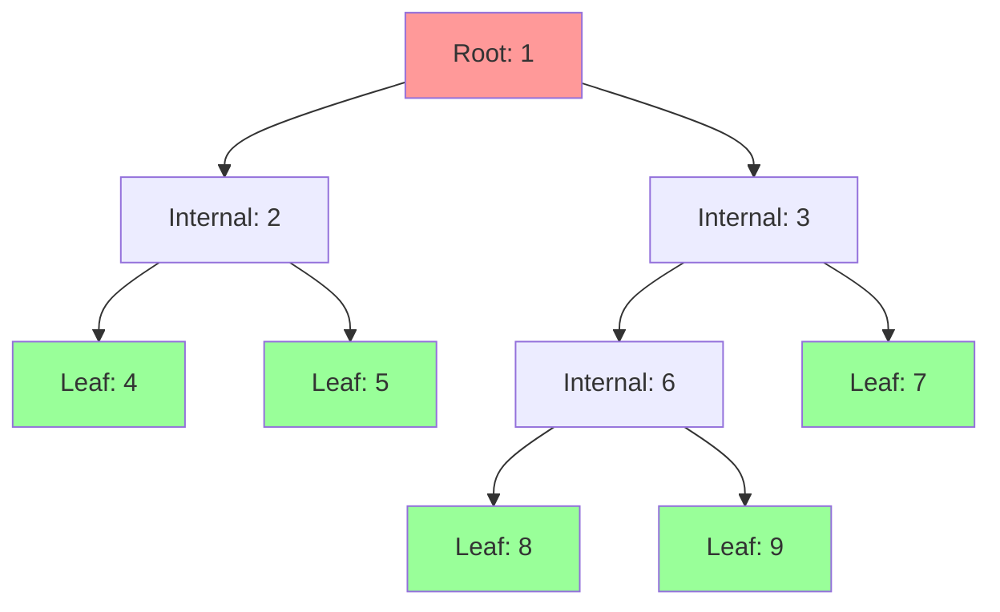
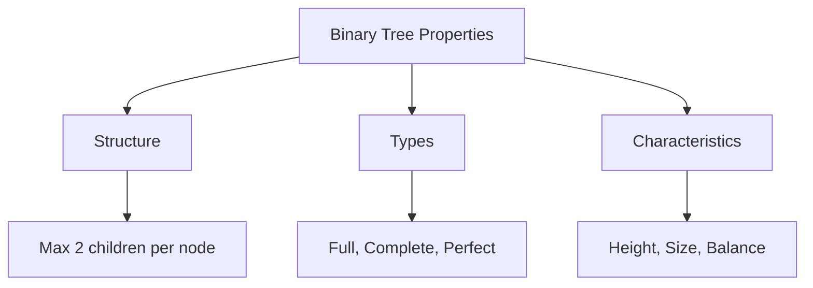
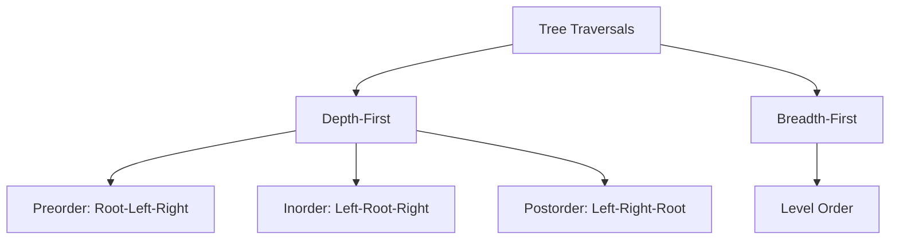
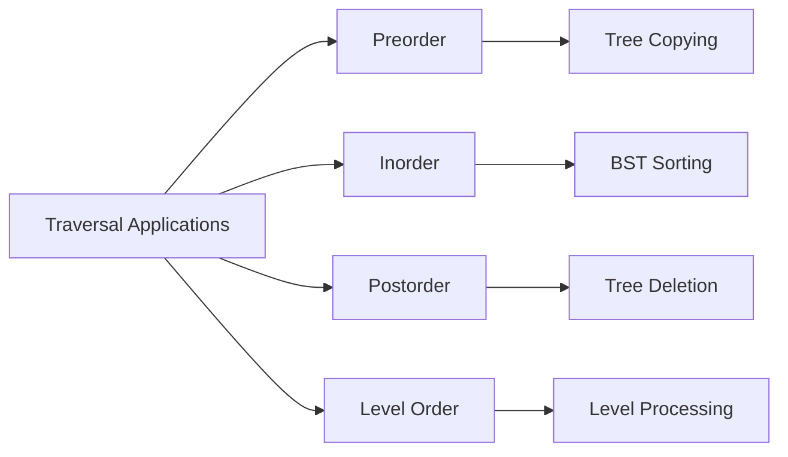
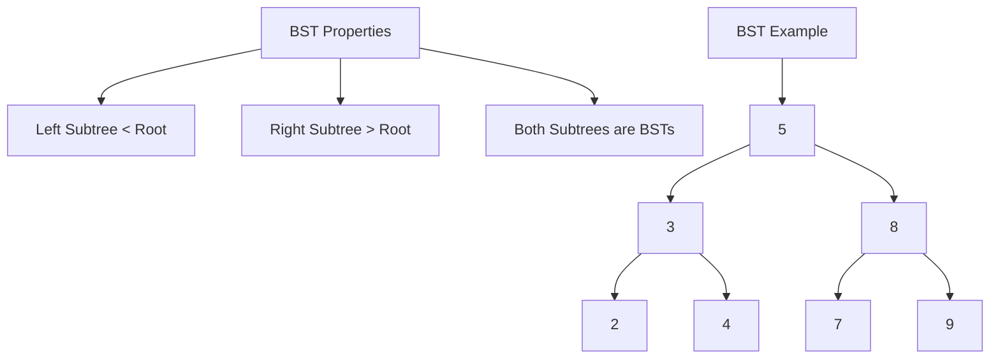
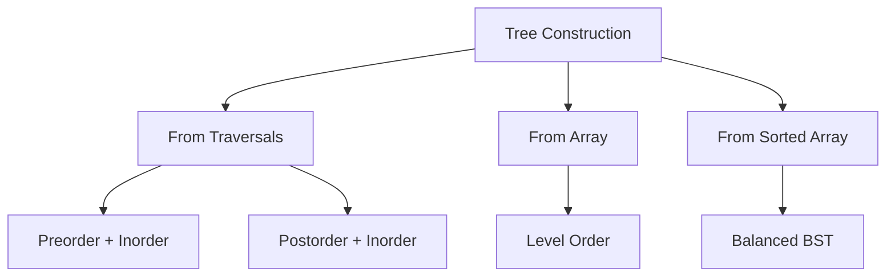
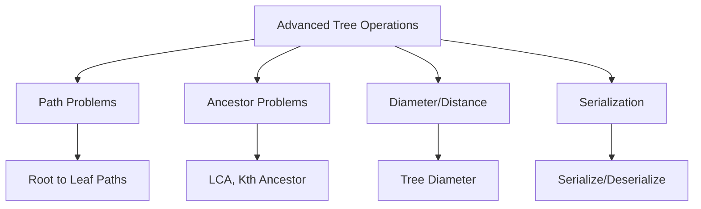

# 🌳 Trees — Complete Professional Guide

<div align="center">


*Master hierarchical data structures and tree algorithms for efficient data organization*

</div>

---

## 📑 Table of Contents

1. [Introduction](#-introduction)
2. [Tree Fundamentals](#-tree-fundamentals)
3. [Binary Trees](#-binary-trees)
4. [Tree Traversals](#-tree-traversals)
5. [Binary Search Trees](#-binary-search-trees)
6. [Tree Construction](#-tree-construction)
7. [Advanced Operations](#-advanced-operations)
8. [Tree Algorithms](#-tree-algorithms)
9. [Special Trees](#-special-trees)
10. [Best Practices](#-best-practices)

---

## 🎯 Introduction

**Trees** are hierarchical data structures consisting of nodes connected by edges, with one node designated as the root. They provide efficient organization and retrieval of data with natural hierarchical relationships.

### 🔑 Why Study Trees?

```mermaid
graph TD
    A[Trees] --> B[Hierarchical Organization]
    A --> C[Efficient Search]
    A --> D[Dynamic Structure]
    A --> E[Natural Representation]
    
    B --> F[File Systems]
    C --> G[O(log n) Operations]
    D --> H[Insert/Delete Flexibility]
    E --> I[Decision Trees, Parsing]
```

### 📊 Tree vs Other Structures

| Structure | Search | Insert | Delete | Space |
|:----------|:-------|:-------|:-------|:------|
| **Array** | O(n) | O(n) | O(n) | O(n) |
| **Linked List** | O(n) | O(1) | O(1) | O(n) |
| **BST (Balanced)** | O(log n) | O(log n) | O(log n) | O(n) |
| **Hash Table** | O(1) avg | O(1) avg | O(1) avg | O(n) |

---

## 🏗️ Tree Fundamentals

### 🎯 Basic Terminology



### 🔧 Key Definitions

| Term | Definition | Example |
|:-----|:-----------|:--------|
| **Root** | Top node with no parent | Node 1 |
| **Leaf** | Node with no children | Nodes 4,5,7,8,9 |
| **Internal Node** | Node with at least one child | Nodes 2,3,6 |
| **Height** | Longest path from node to leaf | Height of tree = 3 |
| **Depth** | Distance from root to node | Depth of node 8 = 3 |
| **Degree** | Number of children | Degree of node 3 = 2 |

### 💻 Tree Node Implementation

```cpp
// Basic Tree Node
struct TreeNode {
    int val;
    TreeNode* left;
    TreeNode* right;
    
    TreeNode() : val(0), left(nullptr), right(nullptr) {}
    TreeNode(int x) : val(x), left(nullptr), right(nullptr) {}
    TreeNode(int x, TreeNode* left, TreeNode* right) 
        : val(x), left(left), right(right) {}
};

// Generic Tree Node
template<typename T>
struct GenericTreeNode {
    T data;
    vector<GenericTreeNode*> children;
    
    GenericTreeNode(T value) : data(value) {}
    
    void addChild(GenericTreeNode* child) {
        children.push_back(child);
    }
};

// Tree with Parent Pointer
struct TreeNodeWithParent {
    int val;
    TreeNodeWithParent* left;
    TreeNodeWithParent* right;
    TreeNodeWithParent* parent;
    
    TreeNodeWithParent(int x) : val(x), left(nullptr), 
                               right(nullptr), parent(nullptr) {}
};
```

---

## 🌲 Binary Trees

### 🎯 Binary Tree Properties



### 🔧 Binary Tree Types

#### 1. Full Binary Tree
```
Every node has 0 or 2 children

        1
       / \
      2   3
     / \ / \
    4  5 6  7
```

#### 2. Complete Binary Tree
```
All levels filled except possibly last,
last level filled left to right

        1
       / \
      2   3
     / \ /
    4  5 6
```

#### 3. Perfect Binary Tree
```
All internal nodes have 2 children,
all leaves at same level

        1
       / \
      2   3
     / \ / \
    4  5 6  7
```

### 💻 Binary Tree Operations

#### Basic Properties
```cpp
class BinaryTreeOperations {
public:
    // Calculate height of tree
    int height(TreeNode* root) {
        if (!root) return -1;  // Height of empty tree is -1
        
        return 1 + max(height(root->left), height(root->right));
    }
    
    // Count total nodes
    int size(TreeNode* root) {
        if (!root) return 0;
        
        return 1 + size(root->left) + size(root->right);
    }
    
    // Check if tree is balanced
    bool isBalanced(TreeNode* root) {
        return checkBalance(root) != -1;
    }
    
private:
    int checkBalance(TreeNode* root) {
        if (!root) return 0;
        
        int leftHeight = checkBalance(root->left);
        if (leftHeight == -1) return -1;
        
        int rightHeight = checkBalance(root->right);
        if (rightHeight == -1) return -1;
        
        if (abs(leftHeight - rightHeight) > 1) return -1;
        
        return 1 + max(leftHeight, rightHeight);
    }
};
```

---

## 🔄 Tree Traversals

### 🎯 Traversal Methods



### 💻 Traversal Implementations

#### 1. Recursive Traversals
```cpp
class TreeTraversals {
public:
    // Preorder: Root -> Left -> Right
    void preorder(TreeNode* root, vector<int>& result) {
        if (!root) return;
        
        result.push_back(root->val);    // Visit root
        preorder(root->left, result);   // Traverse left
        preorder(root->right, result);  // Traverse right
    }
    
    // Inorder: Left -> Root -> Right
    void inorder(TreeNode* root, vector<int>& result) {
        if (!root) return;
        
        inorder(root->left, result);    // Traverse left
        result.push_back(root->val);    // Visit root
        inorder(root->right, result);   // Traverse right
    }
    
    // Postorder: Left -> Right -> Root
    void postorder(TreeNode* root, vector<int>& result) {
        if (!root) return;
        
        postorder(root->left, result);  // Traverse left
        postorder(root->right, result); // Traverse right
        result.push_back(root->val);    // Visit root
    }
};
```

#### 2. Iterative Traversals
```cpp
class IterativeTraversals {
public:
    // Iterative Preorder
    vector<int> preorderIterative(TreeNode* root) {
        vector<int> result;
        if (!root) return result;
        
        stack<TreeNode*> stk;
        stk.push(root);
        
        while (!stk.empty()) {
            TreeNode* node = stk.top();
            stk.pop();
            
            result.push_back(node->val);
            
            // Push right first, then left (stack is LIFO)
            if (node->right) stk.push(node->right);
            if (node->left) stk.push(node->left);
        }
        
        return result;
    }
    
    // Iterative Inorder
    vector<int> inorderIterative(TreeNode* root) {
        vector<int> result;
        stack<TreeNode*> stk;
        TreeNode* current = root;
        
        while (current || !stk.empty()) {
            // Go to leftmost node
            while (current) {
                stk.push(current);
                current = current->left;
            }
            
            // Process current node
            current = stk.top();
            stk.pop();
            result.push_back(current->val);
            
            // Move to right subtree
            current = current->right;
        }
        
        return result;
    }
    
    // Level Order Traversal
    vector<vector<int>> levelOrder(TreeNode* root) {
        vector<vector<int>> result;
        if (!root) return result;
        
        queue<TreeNode*> q;
        q.push(root);
        
        while (!q.empty()) {
            int levelSize = q.size();
            vector<int> currentLevel;
            
            for (int i = 0; i < levelSize; i++) {
                TreeNode* node = q.front();
                q.pop();
                
                currentLevel.push_back(node->val);
                
                if (node->left) q.push(node->left);
                if (node->right) q.push(node->right);
            }
            
            result.push_back(currentLevel);
        }
        
        return result;
    }
};
```

### 🎯 Traversal Applications



---

## 🔍 Binary Search Trees

### 🎯 BST Properties



### 💻 BST Implementation

```cpp
class BST {
private:
    TreeNode* root;
    
    TreeNode* insertHelper(TreeNode* node, int val) {
        if (!node) return new TreeNode(val);
        
        if (val < node->val) {
            node->left = insertHelper(node->left, val);
        } else if (val > node->val) {
            node->right = insertHelper(node->right, val);
        }
        // Duplicate values not allowed
        
        return node;
    }
    
    TreeNode* deleteHelper(TreeNode* node, int val) {
        if (!node) return nullptr;
        
        if (val < node->val) {
            node->left = deleteHelper(node->left, val);
        } else if (val > node->val) {
            node->right = deleteHelper(node->right, val);
        } else {
            // Node to be deleted found
            if (!node->left) {
                TreeNode* temp = node->right;
                delete node;
                return temp;
            } else if (!node->right) {
                TreeNode* temp = node->left;
                delete node;
                return temp;
            }
            
            // Node with two children
            TreeNode* successor = findMin(node->right);
            node->val = successor->val;
            node->right = deleteHelper(node->right, successor->val);
        }
        
        return node;
    }
    
    TreeNode* findMin(TreeNode* node) {
        while (node->left) {
            node = node->left;
        }
        return node;
    }
    
    bool searchHelper(TreeNode* node, int val) {
        if (!node) return false;
        
        if (val == node->val) return true;
        
        if (val < node->val) {
            return searchHelper(node->left, val);
        } else {
            return searchHelper(node->right, val);
        }
    }
    
public:
    BST() : root(nullptr) {}
    
    void insert(int val) {
        root = insertHelper(root, val);
    }
    
    void remove(int val) {
        root = deleteHelper(root, val);
    }
    
    bool search(int val) {
        return searchHelper(root, val);
    }
    
    // Get sorted array (inorder traversal)
    vector<int> getSorted() {
        vector<int> result;
        inorderTraversal(root, result);
        return result;
    }
    
private:
    void inorderTraversal(TreeNode* node, vector<int>& result) {
        if (!node) return;
        
        inorderTraversal(node->left, result);
        result.push_back(node->val);
        inorderTraversal(node->right, result);
    }
};
```

### 🎯 BST Validation

```cpp
class BSTValidator {
public:
    bool isValidBST(TreeNode* root) {
        return validate(root, LONG_MIN, LONG_MAX);
    }
    
private:
    bool validate(TreeNode* node, long minVal, long maxVal) {
        if (!node) return true;
        
        if (node->val <= minVal || node->val >= maxVal) {
            return false;
        }
        
        return validate(node->left, minVal, node->val) &&
               validate(node->right, node->val, maxVal);
    }
};
```

---

## 🏗️ Tree Construction

### 🎯 Construction Methods



### 💻 Construction Implementations

#### 1. Build Tree from Preorder and Inorder
```cpp
class TreeBuilder {
public:
    TreeNode* buildTree(vector<int>& preorder, vector<int>& inorder) {
        unordered_map<int, int> inorderMap;
        
        // Build map for O(1) lookup
        for (int i = 0; i < inorder.size(); i++) {
            inorderMap[inorder[i]] = i;
        }
        
        return buildHelper(preorder, 0, preorder.size() - 1,
                          inorder, 0, inorder.size() - 1,
                          inorderMap);
    }
    
private:
    TreeNode* buildHelper(vector<int>& preorder, int preStart, int preEnd,
                         vector<int>& inorder, int inStart, int inEnd,
                         unordered_map<int, int>& inorderMap) {
        if (preStart > preEnd || inStart > inEnd) {
            return nullptr;
        }
        
        // Root is first element in preorder
        int rootVal = preorder[preStart];
        TreeNode* root = new TreeNode(rootVal);
        
        // Find root position in inorder
        int rootIndex = inorderMap[rootVal];
        int leftSize = rootIndex - inStart;
        
        // Build left and right subtrees
        root->left = buildHelper(preorder, preStart + 1, preStart + leftSize,
                                inorder, inStart, rootIndex - 1,
                                inorderMap);
        
        root->right = buildHelper(preorder, preStart + leftSize + 1, preEnd,
                                 inorder, rootIndex + 1, inEnd,
                                 inorderMap);
        
        return root;
    }
};
```

#### 2. Build Balanced BST from Sorted Array
```cpp
TreeNode* sortedArrayToBST(vector<int>& nums) {
    return buildBST(nums, 0, nums.size() - 1);
}

TreeNode* buildBST(vector<int>& nums, int left, int right) {
    if (left > right) return nullptr;
    
    int mid = left + (right - left) / 2;
    TreeNode* root = new TreeNode(nums[mid]);
    
    root->left = buildBST(nums, left, mid - 1);
    root->right = buildBST(nums, mid + 1, right);
    
    return root;
}
```

---

## 🚀 Advanced Operations

### 🎯 Tree Algorithms



### 💻 Advanced Implementations

#### 1. Lowest Common Ancestor
```cpp
class LCAFinder {
public:
    TreeNode* lowestCommonAncestor(TreeNode* root, TreeNode* p, TreeNode* q) {
        if (!root || root == p || root == q) {
            return root;
        }
        
        TreeNode* left = lowestCommonAncestor(root->left, p, q);
        TreeNode* right = lowestCommonAncestor(root->right, p, q);
        
        if (left && right) return root;  // LCA found
        
        return left ? left : right;  // Return non-null child
    }
    
    // LCA in BST (more efficient)
    TreeNode* lowestCommonAncestorBST(TreeNode* root, TreeNode* p, TreeNode* q) {
        if (!root) return nullptr;
        
        if (p->val < root->val && q->val < root->val) {
            return lowestCommonAncestorBST(root->left, p, q);
        }
        
        if (p->val > root->val && q->val > root->val) {
            return lowestCommonAncestorBST(root->right, p, q);
        }
        
        return root;  // Split point found
    }
};
```

#### 2. Tree Diameter
```cpp
class TreeDiameter {
private:
    int maxDiameter = 0;
    
public:
    int diameterOfBinaryTree(TreeNode* root) {
        maxDiameter = 0;
        calculateHeight(root);
        return maxDiameter;
    }
    
private:
    int calculateHeight(TreeNode* node) {
        if (!node) return 0;
        
        int leftHeight = calculateHeight(node->left);
        int rightHeight = calculateHeight(node->right);
        
        // Update diameter (path through current node)
        maxDiameter = max(maxDiameter, leftHeight + rightHeight);
        
        return 1 + max(leftHeight, rightHeight);
    }
};
```

#### 3. Path Sum Problems
```cpp
class PathSumSolver {
public:
    // Path Sum I: Root to leaf with target sum
    bool hasPathSum(TreeNode* root, int targetSum) {
        if (!root) return false;
        
        if (!root->left && !root->right) {
            return root->val == targetSum;
        }
        
        int remaining = targetSum - root->val;
        return hasPathSum(root->left, remaining) || 
               hasPathSum(root->right, remaining);
    }
    
    // Path Sum II: All root-to-leaf paths with target sum
    vector<vector<int>> pathSum(TreeNode* root, int targetSum) {
        vector<vector<int>> result;
        vector<int> currentPath;
        findPaths(root, targetSum, currentPath, result);
        return result;
    }
    
    // Path Sum III: Any path with target sum
    int pathSumIII(TreeNode* root, int targetSum) {
        if (!root) return 0;
        
        return pathFromNode(root, targetSum) +
               pathSumIII(root->left, targetSum) +
               pathSumIII(root->right, targetSum);
    }
    
private:
    void findPaths(TreeNode* node, int targetSum, 
                   vector<int>& currentPath, 
                   vector<vector<int>>& result) {
        if (!node) return;
        
        currentPath.push_back(node->val);
        
        if (!node->left && !node->right && node->val == targetSum) {
            result.push_back(currentPath);
        } else {
            findPaths(node->left, targetSum - node->val, currentPath, result);
            findPaths(node->right, targetSum - node->val, currentPath, result);
        }
        
        currentPath.pop_back();  // Backtrack
    }
    
    int pathFromNode(TreeNode* node, long targetSum) {
        if (!node) return 0;
        
        int count = 0;
        if (node->val == targetSum) count++;
        
        count += pathFromNode(node->left, targetSum - node->val);
        count += pathFromNode(node->right, targetSum - node->val);
        
        return count;
    }
};
```

---

## 🏆 Best Practices

### ✅ Do's

```cpp
// 1. Always check for null pointers
int safeGetValue(TreeNode* node) {
    if (!node) {
        throw invalid_argument("Node is null");
    }
    return node->val;
}

// 2. Use proper memory management
class TreeManager {
public:
    ~TreeManager() {
        deleteTree(root);
    }
    
private:
    void deleteTree(TreeNode* node) {
        if (!node) return;
        
        deleteTree(node->left);
        deleteTree(node->right);
        delete node;
    }
};

// 3. Handle edge cases
bool isSymmetric(TreeNode* root) {
    if (!root) return true;  // Empty tree is symmetric
    return isMirror(root->left, root->right);
}

// 4. Use iterative solutions for deep trees
vector<int> inorderIterative(TreeNode* root) {
    vector<int> result;
    stack<TreeNode*> stk;
    TreeNode* current = root;
    
    while (current || !stk.empty()) {
        while (current) {
            stk.push(current);
            current = current->left;
        }
        
        current = stk.top();
        stk.pop();
        result.push_back(current->val);
        current = current->right;
    }
    
    return result;
}
```

### ❌ Don'ts

```cpp
// Don't: Forget to handle null nodes
// if (node->left->val > target) // May crash

// Don't: Create memory leaks
// TreeNode* node = new TreeNode(5);
// // ... use node but never delete

// Don't: Use recursion for very deep trees
// May cause stack overflow for unbalanced trees

// Don't: Modify tree during traversal without care
// Can lead to undefined behavior
```

---

## 🎓 Summary

Trees are fundamental hierarchical data structures. Master these concepts:

✅ **Tree Terminology**: Root, leaf, height, depth, degree  
✅ **Binary Trees**: Full, complete, perfect tree types  
✅ **Traversals**: Preorder, inorder, postorder, level order  
✅ **BST Operations**: Insert, delete, search with O(log n) complexity  
✅ **Tree Construction**: Build from traversals and arrays  
✅ **Advanced Algorithms**: LCA, diameter, path problems  

**Next Steps**: Study balanced trees (AVL, Red-Black) and specialized trees (Trie, Segment Tree).

---

<div align="center">

**🌳 Grow Your Tree Knowledge**

*From roots to leaves, master every branch of tree algorithms*

</div>