# Trees — Complete Professional <div align="center">Guide</div>

<div align="center">


**Master hierarchical data structures and tree algorithms for efficient data organization**

</div>

---

## Table of Contents

1. [Introduction](#introduction)
2. [Tree Fundamentals](#tree-fundamentals)
3. [Binary Trees](#binary-trees)
4. [Tree Traversals](#tree-traversals)
5. [Binary Search Trees](#binary-search-trees)
6. [Advanced Operations](#advanced-operations)
7. [Best Practices](#best-practices)

---

## Introduction

**Trees** are hierarchical data structures consisting of nodes connected by edges, with one node designated as the root. They provide efficient organization and retrieval of data with natural hierarchical relationships, making them fundamental to computer science.

<div align="center">

</div>

### Core Concept

```mermaid
flowchart TD
    A["🌳 Trees"] --> B["Hierarchical Structure"]
    A --> C["Node Relationships"]
    A --> D["Tree Properties"]
    A --> E["Applications"]
    
    B --> F["Root at top"]
    B --> G["Parent-child links"]
    B --> H["No cycles"]
    
    C --> I["Parent nodes"]
    C --> J["Child nodes"]
    C --> K["Leaf nodes"]
    
    D --> L["Height and depth"]
    D --> M["Degree of nodes"]
    D --> N["Tree types"]
    
    E --> O["File systems"]
    E --> P["Decision trees"]
    E --> Q["Database indexing"]
    
    classDef default fill:#f9f9f9,stroke:#333,stroke-width:2px,color:#000
    classDef trees fill:#e3f2fd,stroke:#2196f3,stroke-width:2px,color:#000
    classDef structure fill:#fff3e0,stroke:#ff9800,stroke-width:2px,color:#000
    classDef relationships fill:#e8f5e8,stroke:#4caf50,stroke-width:2px,color:#000
    classDef properties fill:#f3e5f5,stroke:#9c27b0,stroke-width:2px,color:#000
    classDef applications fill:#ffebee,stroke:#f44336,stroke-width:2px,color:#000
    class A trees
    class B,F,G,H structure
    class C,I,J,K relationships
    class D,L,M,N properties
    class E,O,P,Q applications
```



---

## Tree Fundamentals

### Basic Terminology


### Tree Node Implementation

```cpp
// Basic Binary Tree Node
struct TreeNode {
    int val;
    TreeNode* left;
    TreeNode* right;
    
    TreeNode() : val(0), left(nullptr), right(nullptr) {}
    TreeNode(int x) : val(x), left(nullptr), right(nullptr) {}
    TreeNode(int x, TreeNode* left, TreeNode* right) 
        : val(x), left(left), right(right) {}
};

// Generic Tree Node
template<typename T>
struct GenericTreeNode {
    T data;
    vector<GenericTreeNode*> children;
    
    GenericTreeNode(T value) : data(value) {}
    
    void addChild(GenericTreeNode* child) {
        children.push_back(child);
    }
};
```

### Key Properties

| Term | Definition | Example |
|------|------------|---------|
| **Root** | Top node with no parent | Node at the top |
| **Leaf** | Node with no children | Terminal nodes |
| **Height** | Longest path from node to leaf | Maximum depth |
| **Depth** | Distance from root to node | Level of node |
| **Degree** | Number of children | Branching factor |

---

## Binary Trees

### Binary Tree Types

```mermaid
flowchart TD
    A["Binary Tree Types"] --> B["Full Binary Tree"]
    A --> C["Complete Binary Tree"]
    A --> D["Perfect Binary Tree"]
    A --> E["Balanced Binary Tree"]
    
    B --> F["Every node has 0 or 2 children"]
    C --> G["All levels filled except last"]
    D --> H["All internal nodes have 2 children"]
    E --> I["Height difference ≤ 1"]
    
    classDef default fill:#f9f9f9,stroke:#333,stroke-width:2px,color:#000
    classDef types fill:#e3f2fd,stroke:#2196f3,stroke-width:2px,color:#000
    classDef full fill:#fff3e0,stroke:#ff9800,stroke-width:2px,color:#000
    classDef complete fill:#e8f5e8,stroke:#4caf50,stroke-width:2px,color:#000
    classDef perfect fill:#f3e5f5,stroke:#9c27b0,stroke-width:2px,color:#000
    classDef balanced fill:#ffebee,stroke:#f44336,stroke-width:2px,color:#000
    class A types
    class B,F full
    class C,G complete
    class D,H perfect
    class E,I balanced
```



### Basic Operations

```cpp
class BinaryTreeOperations {
public:
    // Calculate height of tree
    int height(TreeNode* root) {
        if (!root) return -1;
        return 1 + max(height(root->left), height(root->right));
    }
    
    // Count total nodes
    int size(TreeNode* root) {
        if (!root) return 0;
        return 1 + size(root->left) + size(root->right);
    }
    
    // Check if tree is balanced
    bool isBalanced(TreeNode* root) {
        return checkBalance(root) != -1;
    }
    
private:
    int checkBalance(TreeNode* root) {
        if (!root) return 0;
        
        int leftHeight = checkBalance(root->left);
        if (leftHeight == -1) return -1;
        
        int rightHeight = checkBalance(root->right);
        if (rightHeight == -1) return -1;
        
        if (abs(leftHeight - rightHeight) > 1) return -1;
        
        return 1 + max(leftHeight, rightHeight);
    }
};
```

---

## Tree Traversals

### Traversal Methods


### Traversal Implementations

```cpp
class TreeTraversals {
public:
    // Recursive Traversals
    void preorder(TreeNode* root, vector<int>& result) {
        if (!root) return;
        result.push_back(root->val);
        preorder(root->left, result);
        preorder(root->right, result);
    }
    
    void inorder(TreeNode* root, vector<int>& result) {
        if (!root) return;
        inorder(root->left, result);
        result.push_back(root->val);
        inorder(root->right, result);
    }
    
    void postorder(TreeNode* root, vector<int>& result) {
        if (!root) return;
        postorder(root->left, result);
        postorder(root->right, result);
        result.push_back(root->val);
    }
    
    // Iterative Level Order
    vector<vector<int>> levelOrder(TreeNode* root) {
        vector<vector<int>> result;
        if (!root) return result;
        
        queue<TreeNode*> q;
        q.push(root);
        
        while (!q.empty()) {
            int levelSize = q.size();
            vector<int> currentLevel;
            
            for (int i = 0; i < levelSize; i++) {
                TreeNode* node = q.front();
                q.pop();
                
                currentLevel.push_back(node->val);
                
                if (node->left) q.push(node->left);
                if (node->right) q.push(node->right);
            }
            
            result.push_back(currentLevel);
        }
        
        return result;
    }
};
```

---

## Binary Search Trees

### BST Properties and Operations


### BST Implementation

```cpp
class BST {
private:
    TreeNode* root;
    
    TreeNode* insertHelper(TreeNode* node, int val) {
        if (!node) return new TreeNode(val);
        
        if (val < node->val) {
            node->left = insertHelper(node->left, val);
        } else if (val > node->val) {
            node->right = insertHelper(node->right, val);
        }
        
        return node;
    }
    
    TreeNode* deleteHelper(TreeNode* node, int val) {
        if (!node) return nullptr;
        
        if (val < node->val) {
            node->left = deleteHelper(node->left, val);
        } else if (val > node->val) {
            node->right = deleteHelper(node->right, val);
        } else {
            // Node to be deleted found
            if (!node->left) {
                TreeNode* temp = node->right;
                delete node;
                return temp;
            } else if (!node->right) {
                TreeNode* temp = node->left;
                delete node;
                return temp;
            }
            
            // Node with two children
            TreeNode* successor = findMin(node->right);
            node->val = successor->val;
            node->right = deleteHelper(node->right, successor->val);
        }
        
        return node;
    }
    
    TreeNode* findMin(TreeNode* node) {
        while (node->left) {
            node = node->left;
        }
        return node;
    }
    
public:
    BST() : root(nullptr) {}
    
    void insert(int val) {
        root = insertHelper(root, val);
    }
    
    void remove(int val) {
        root = deleteHelper(root, val);
    }
    
    bool search(int val) {
        TreeNode* current = root;
        while (current) {
            if (val == current->val) return true;
            else if (val < current->val) current = current->left;
            else current = current->right;
        }
        return false;
    }
};
```

---

## Advanced Operations

### Common Tree Algorithms

```cpp
class AdvancedTreeOperations {
public:
    // Lowest Common Ancestor
    TreeNode* lowestCommonAncestor(TreeNode* root, TreeNode* p, TreeNode* q) {
        if (!root || root == p || root == q) {
            return root;
        }
        
        TreeNode* left = lowestCommonAncestor(root->left, p, q);
        TreeNode* right = lowestCommonAncestor(root->right, p, q);
        
        if (left && right) return root;
        return left ? left : right;
    }
    
    // Tree Diameter
    int diameterOfBinaryTree(TreeNode* root) {
        int maxDiameter = 0;
        calculateHeight(root, maxDiameter);
        return maxDiameter;
    }
    
    // Path Sum
    bool hasPathSum(TreeNode* root, int targetSum) {
        if (!root) return false;
        
        if (!root->left && !root->right) {
            return root->val == targetSum;
        }
        
        int remaining = targetSum - root->val;
        return hasPathSum(root->left, remaining) || 
               hasPathSum(root->right, remaining);
    }
    
    // Build Tree from Sorted Array
    TreeNode* sortedArrayToBST(vector<int>& nums) {
        return buildBST(nums, 0, nums.size() - 1);
    }
    
private:
    int calculateHeight(TreeNode* node, int& maxDiameter) {
        if (!node) return 0;
        
        int leftHeight = calculateHeight(node->left, maxDiameter);
        int rightHeight = calculateHeight(node->right, maxDiameter);
        
        maxDiameter = max(maxDiameter, leftHeight + rightHeight);
        
        return 1 + max(leftHeight, rightHeight);
    }
    
    TreeNode* buildBST(vector<int>& nums, int left, int right) {
        if (left > right) return nullptr;
        
        int mid = left + (right - left) / 2;
        TreeNode* root = new TreeNode(nums[mid]);
        
        root->left = buildBST(nums, left, mid - 1);
        root->right = buildBST(nums, mid + 1, right);
        
        return root;
    }
};
```

### Tree Validation

```cpp
class TreeValidator {
public:
    // Validate BST
    bool isValidBST(TreeNode* root) {
        return validate(root, LONG_MIN, LONG_MAX);
    }
    
    // Check if trees are identical
    bool isSameTree(TreeNode* p, TreeNode* q) {
        if (!p && !q) return true;
        if (!p || !q) return false;
        
        return (p->val == q->val) && 
               isSameTree(p->left, q->left) && 
               isSameTree(p->right, q->right);
    }
    
    // Check if tree is symmetric
    bool isSymmetric(TreeNode* root) {
        if (!root) return true;
        return isMirror(root->left, root->right);
    }
    
private:
    bool validate(TreeNode* node, long minVal, long maxVal) {
        if (!node) return true;
        
        if (node->val <= minVal || node->val >= maxVal) {
            return false;
        }
        
        return validate(node->left, minVal, node->val) &&
               validate(node->right, node->val, maxVal);
    }
    
    bool isMirror(TreeNode* left, TreeNode* right) {
        if (!left && !right) return true;
        if (!left || !right) return false;
        
        return (left->val == right->val) &&
               isMirror(left->left, right->right) &&
               isMirror(left->right, right->left);
    }
};
```

---

## Best Practices

### Algorithm Selection Guidelines


### Common Pitfalls and Solutions

```cpp
class BestPractices {
public:
    // ✅ Always check for null pointers
    int safeGetValue(TreeNode* node) {
        if (!node) {
            throw invalid_argument("Node is null");
        }
        return node->val;
    }
    
    // ✅ Proper memory management
    void deleteTree(TreeNode* node) {
        if (!node) return;
        
        deleteTree(node->left);
        deleteTree(node->right);
        delete node;
    }
    
    // ✅ Handle edge cases
    bool isSymmetric(TreeNode* root) {
        if (!root) return true;  // Empty tree is symmetric
        return isMirror(root->left, root->right);
    }
    
    // ✅ Use iterative for deep trees
    vector<int> inorderIterative(TreeNode* root) {
        vector<int> result;
        stack<TreeNode*> stk;
        TreeNode* current = root;
        
        while (current || !stk.empty()) {
            while (current) {
                stk.push(current);
                current = current->left;
            }
            
            current = stk.top();
            stk.pop();
            result.push_back(current->val);
            current = current->right;
        }
        
        return result;
    }
    
private:
    bool isMirror(TreeNode* left, TreeNode* right) {
        if (!left && !right) return true;
        if (!left || !right) return false;
        
        return (left->val == right->val) &&
               isMirror(left->left, right->right) &&
               isMirror(left->right, right->left);
    }
};
```

### Performance Optimization Tips

| Technique | Description | When to Use |
|-----------|-------------|-------------|
| **Iterative Traversal** | Avoid recursion stack | Deep trees |
| **Level Order** | Process by levels | Breadth-first needs |
| **Early Termination** | Stop when condition met | Search operations |
| **Memory Pooling** | Reuse node objects | Frequent insertions |

---

## Summary

**Trees** are fundamental hierarchical data structures essential for efficient data organization. Key insights:

### Essential Concepts
- **Hierarchical Structure**: Root, internal nodes, and leaves form tree hierarchy
- **Binary Trees**: At most two children per node, various types (full, complete, perfect)
- **Tree Traversals**: Preorder, inorder, postorder, and level order methods
- **Binary Search Trees**: Ordered trees with O(log n) operations when balanced

### Core Applications
- **File Systems**: Directory structures and file organization
- **Database Indexing**: B-trees and B+ trees for efficient data retrieval
- **Expression Parsing**: Abstract syntax trees for compilers
- **Decision Making**: Decision trees for AI and machine learning

### Best Practices
- Always check for null pointers before accessing nodes
- Use iterative approaches for very deep trees to avoid stack overflow
- Choose appropriate tree type based on ordering requirements
- Implement proper memory management to prevent leaks
- Consider tree balance for optimal performance

> **Master's Insight**: Trees model natural hierarchies and provide efficient access patterns. Understanding tree structures and algorithms is crucial for building scalable systems and solving complex computational problems.

---

<div align="center">

**🌳 Master Tree Structures • Build Hierarchical Solutions • Organize Data Efficiently**

*From Theory to Practice • Roots to Leaves • Understanding to Mastery*

</div>