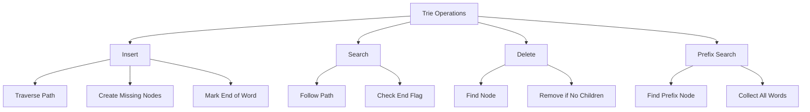

# 🌳 Tries (Prefix Tree) — Complete Professional Guide

<div align="center">


*Master the art of efficient string storage and retrieval with prefix-based operations*

</div>

---

## 📑 Table of Contents

1. [Introduction](#-introduction)
2. [Why Use Tries?](#-why-use-tries)
3. [Trie Structure & Components](#-trie-structure--components)
4. [Implementation](#-implementation)
5. [Core Operations](#-core-operations)
6. [Advanced Concepts](#-advanced-concepts)
7. [Comparison Analysis](#-comparison-analysis)
8. [Applications & Use Cases](#-applications--use-cases)
9. [Binary Trie](#-binary-trie)
10. [Interview Problems](#-interview-problems)
11. [Optimization Techniques](#-optimization-techniques)
12. [Complexity Analysis](#-complexity-analysis)
13. [Best Practices](#-best-practices)

---

## 🎯 Introduction

**Trie** (pronounced "try") is a specialized tree-based data structure designed for efficient storage and retrieval of strings, particularly excelling in prefix-based operations.

### 🔑 Key Characteristics

- **Tree Structure**: Each node represents a character
- **Prefix Sharing**: Common prefixes share the same path
- **End Markers**: Special flags mark complete words
- **Efficient Retrieval**: O(L) operations where L = word length

### 💡 Etymology

The name "Trie" comes from "re**trie**val" - emphasizing its primary purpose of efficient data retrieval.

---

## 🚀 Why Use Tries?

### ✅ Advantages

```
🔥 Prefix Operations     → Extremely efficient prefix matching
⚡ Predictable Performance → O(L) time complexity
🎯 No Collisions        → Unlike hash tables
📊 Lexicographical Order → Natural alphabetical sorting
🔍 Pattern Matching     → Excellent for string algorithms
```

### 🎆 Trie Operations Flow



### 📊 Performance Comparison

| Operation | Trie | Hash Table | Binary Search Tree |
|:----------|:-----|:-----------|:-------------------|
| **Insert** | O(L) | O(1)* | O(log n) |
| **Search** | O(L) | O(1)* | O(log n) |
| **Prefix Search** | O(L) | O(n) | O(n) |
| **Ordered Traversal** | ✅ Yes | ❌ No | ✅ Yes |
| **Memory Usage** | High | Low | Medium |

*Hash table O(1) is average case; worst case can be O(n)

### 🎯 Perfect Use Cases

- **Search Engines**: Query autocompletion
- **Text Editors**: Word suggestions, spell check
- **Phone Books**: Contact search by prefix
- **IP Routing**: Longest prefix matching
- **Bioinformatics**: DNA sequence analysis

---

## 🏗️ Trie Structure & Components

### 📐 Basic Structure

```
        root
        /|\
       c a t
       | | |
       a r e
       | | |
       t* e* a*
       
Words stored: "cat", "care", "tea"
* = End of word marker
```

### 🧩 Node Components

Each Trie node contains:

1. **Children Array/Map**: Pointers to child nodes
2. **End Flag**: Marks complete words
3. **Optional Data**: Additional information (frequency, etc.)

---

## 💻 Implementation

### 🔧 Basic Trie Node (C++)

```cpp
class TrieNode {
public:
    TrieNode* children[26];  // For lowercase a-z
    bool isEndOfWord;
    
    TrieNode() {
        isEndOfWord = false;
        for (int i = 0; i < 26; i++) {
            children[i] = nullptr;
        }
    }
};
```

### 🏛️ Complete Trie Class

```cpp
class Trie {
private:
    TrieNode* root;
    
public:
    Trie() {
        root = new TrieNode();
    }
    
    // Insert, Search, StartsWith methods below...
};
```

### 🌟 Enhanced Node (with frequency)

```cpp
class TrieNode {
public:
    TrieNode* children[26];
    bool isEndOfWord;
    int frequency;           // Count of words ending here
    int prefixCount;         // Count of words with this prefix
    
    TrieNode() {
        isEndOfWord = false;
        frequency = 0;
        prefixCount = 0;
        for (int i = 0; i < 26; i++) {
            children[i] = nullptr;
        }
    }
};
```

---

## ⚙️ Core Operations

### 1️⃣ Insert Operation

```cpp
void insert(string word) {
    TrieNode* current = root;
    
    for (char c : word) {
        int index = c - 'a';
        
        // Create new node if doesn't exist
        if (current->children[index] == nullptr) {
            current->children[index] = new TrieNode();
        }
        
        current = current->children[index];
        current->prefixCount++;  // Optional: track prefix frequency
    }
    
    current->isEndOfWord = true;
    current->frequency++;        // Optional: track word frequency
}
```

**Time**: O(L) | **Space**: O(L) for new nodes

---

### 2️⃣ Search Operation

```cpp
bool search(string word) {
    TrieNode* current = root;
    
    for (char c : word) {
        int index = c - 'a';
        
        if (current->children[index] == nullptr) {
            return false;  // Character not found
        }
        
        current = current->children[index];
    }
    
    return current->isEndOfWord;  // Must be end of a word
}
```

**Time**: O(L) | **Space**: O(1)

---

### 3️⃣ Prefix Search (StartsWith)

```cpp
bool startsWith(string prefix) {
    TrieNode* current = root;
    
    for (char c : prefix) {
        int index = c - 'a';
        
        if (current->children[index] == nullptr) {
            return false;
        }
        
        current = current->children[index];
    }
    
    return true;  // Prefix exists
}
```

**Time**: O(L) | **Space**: O(1)

---

### 4️⃣ Delete Operation

```cpp
bool deleteHelper(TrieNode* node, string word, int index) {
    if (index == word.length()) {
        // End of word reached
        if (!node->isEndOfWord) return false;
        
        node->isEndOfWord = false;
        
        // Delete node if it has no children
        return !hasChildren(node);
    }
    
    int charIndex = word[index] - 'a';
    TrieNode* child = node->children[charIndex];
    
    if (child == nullptr) return false;
    
    bool shouldDeleteChild = deleteHelper(child, word, index + 1);
    
    if (shouldDeleteChild) {
        delete child;
        node->children[charIndex] = nullptr;
        
        // Delete current node if no children and not end of word
        return !node->isEndOfWord && !hasChildren(node);
    }
    
    return false;
}

bool hasChildren(TrieNode* node) {
    for (int i = 0; i < 26; i++) {
        if (node->children[i] != nullptr) return true;
    }
    return false;
}
```

---

### 5️⃣ Get All Words with Prefix

```cpp
vector<string> getWordsWithPrefix(string prefix) {
    vector<string> result;
    TrieNode* prefixNode = findPrefixNode(prefix);
    
    if (prefixNode != nullptr) {
        string currentWord = prefix;
        dfsCollectWords(prefixNode, currentWord, result);
    }
    
    return result;
}

void dfsCollectWords(TrieNode* node, string currentWord, vector<string>& result) {
    if (node->isEndOfWord) {
        result.push_back(currentWord);
    }
    
    for (int i = 0; i < 26; i++) {
        if (node->children[i] != nullptr) {
            char nextChar = 'a' + i;
            dfsCollectWords(node->children[i], currentWord + nextChar, result);
        }
    }
}
```

---

## 🎓 Advanced Concepts

### 🔢 Frequency Tracking

```cpp
class FrequencyTrie {
private:
    struct Node {
        Node* children[26];
        bool isEnd;
        int wordCount;
        int prefixCount;
        
        Node() : isEnd(false), wordCount(0), prefixCount(0) {
            fill(children, children + 26, nullptr);
        }
    };
    
    Node* root;
    
public:
    void insert(string word) {
        Node* curr = root;
        for (char c : word) {
            int idx = c - 'a';
            if (!curr->children[idx]) {
                curr->children[idx] = new Node();
            }
            curr = curr->children[idx];
            curr->prefixCount++;
        }
        curr->isEnd = true;
        curr->wordCount++;
    }
    
    int countWordsStartingWith(string prefix) {
        Node* node = findPrefix(prefix);
        return node ? node->prefixCount : 0;
    }
};
```

---

### 🗑️ Compressed Trie (Radix Tree)

```cpp
class CompressedTrieNode {
public:
    map<string, CompressedTrieNode*> children;
    bool isEndOfWord;
    
    CompressedTrieNode() : isEndOfWord(false) {}
};

// Stores "hello" and "help" more efficiently
// Root -> "hel" -> {"lo": end, "p": end}
```

---

### 🔀 Ternary Search Tree

```cpp
class TSTNode {
public:
    char data;
    bool isEnd;
    TSTNode* left;   // Less than
    TSTNode* equal;  // Equal to
    TSTNode* right;  // Greater than
    
    TSTNode(char c) : data(c), isEnd(false), left(nullptr), equal(nullptr), right(nullptr) {}
};

// More memory efficient than standard trie for sparse data
```

---

## 📊 Comparison Analysis

### 🆚 Trie vs Hash Table vs BST

<table>
<thead>
<tr>
<th>Feature</th>
<th>🌳 Trie</th>
<th>🗂️ Hash Table</th>
<th>🌲 BST</th>
</tr>
</thead>
<tbody>
<tr>
<td><strong>Search Time</strong></td>
<td>O(L) ✅</td>
<td>O(1) avg, O(n) worst</td>
<td>O(log n) ✅</td>
</tr>
<tr>
<td><strong>Prefix Search</strong></td>
<td>O(L) 🔥</td>
<td>O(n) ❌</td>
<td>O(n) ❌</td>
</tr>
<tr>
<td><strong>Ordered Traversal</strong></td>
<td>✅ Natural</td>
<td>❌ No</td>
<td>✅ Yes</td>
</tr>
<tr>
<td><strong>Memory Usage</strong></td>
<td>High ⚠️</td>
<td>Low ✅</td>
<td>Medium</td>
</tr>
<tr>
<td><strong>Cache Performance</strong></td>
<td>Poor</td>
<td>Good ✅</td>
<td>Medium</td>
</tr>
<tr>
<td><strong>Collision Handling</strong></td>
<td>None needed ✅</td>
<td>Required</td>
<td>None needed ✅</td>
</tr>
</tbody>
</table>

---

## 🎯 Applications & Use Cases

### 1️⃣ Autocomplete System

```cpp
class AutoComplete {
private:
    Trie trie;
    
public:
    void addWord(string word) {
        trie.insert(word);
    }
    
    vector<string> getSuggestions(string prefix) {
        return trie.getWordsWithPrefix(prefix);
    }
};

// Usage: Google search suggestions, IDE autocomplete
```

---

### 2️⃣ Spell Checker

```cpp
class SpellChecker {
private:
    Trie dictionary;
    
public:
    bool isValidWord(string word) {
        return dictionary.search(word);
    }
    
    vector<string> getSuggestions(string word) {
        // Generate words with 1 edit distance
        vector<string> suggestions;
        // Implementation for edit distance suggestions
        return suggestions;
    }
};
```

---

### 3️⃣ IP Router (Longest Prefix Match)

```cpp
class IPRouter {
private:
    struct RouteNode {
        RouteNode* children[2];  // 0 and 1 for binary
        string nextHop;
        bool isRoute;
        
        RouteNode() : isRoute(false) {
            children[0] = children[1] = nullptr;
        }
    };
    
    RouteNode* root;
    
public:
    void addRoute(string ipPrefix, string nextHop) {
        // Convert IP to binary and insert into trie
    }
    
    string findRoute(string ip) {
        // Find longest matching prefix
    }
};
```

---

### 4️⃣ Word Break Problem

```cpp
bool wordBreak(string s, vector<string>& wordDict) {
    Trie trie;
    for (string word : wordDict) {
        trie.insert(word);
    }
    
    vector<bool> dp(s.length() + 1, false);
    dp[0] = true;
    
    for (int i = 1; i <= s.length(); i++) {
        for (int j = 0; j < i; j++) {
            if (dp[j] && trie.search(s.substr(j, i - j))) {
                dp[i] = true;
                break;
            }
        }
    }
    
    return dp[s.length()];
}
```

---

## 🔢 Binary Trie

### 🎯 For XOR Problems

```cpp
class BinaryTrie {
private:
    struct Node {
        Node* children[2];  // 0 and 1
        
        Node() {
            children[0] = children[1] = nullptr;
        }
    };
    
    Node* root;
    
public:
    BinaryTrie() {
        root = new Node();
    }
    
    void insert(int num) {
        Node* curr = root;
        for (int i = 31; i >= 0; i--) {
            int bit = (num >> i) & 1;
            if (!curr->children[bit]) {
                curr->children[bit] = new Node();
            }
            curr = curr->children[bit];
        }
    }
    
    int findMaxXOR(int num) {
        Node* curr = root;
        int maxXOR = 0;
        
        for (int i = 31; i >= 0; i--) {
            int bit = (num >> i) & 1;
            int oppositeBit = 1 - bit;
            
            if (curr->children[oppositeBit]) {
                maxXOR |= (1 << i);
                curr = curr->children[oppositeBit];
            } else {
                curr = curr->children[bit];
            }
        }
        
        return maxXOR;
    }
};
```

### 🔥 Maximum XOR Problem

```cpp
int findMaximumXOR(vector<int>& nums) {
    BinaryTrie trie;
    int maxXOR = 0;
    
    for (int num : nums) {
        trie.insert(num);
        maxXOR = max(maxXOR, trie.findMaxXOR(num));
    }
    
    return maxXOR;
}
```

---

## 🏆 Interview Problems

### ✅ Easy Level

1. **Implement Trie (Prefix Tree)** - LeetCode 208
2. **Longest Common Prefix** - LeetCode 14
3. **Design Add and Search Words Data Structure** - LeetCode 211

### ✅ Medium Level

4. **Word Search II** - LeetCode 212
5. **Replace Words** - LeetCode 648
6. **Maximum XOR of Two Numbers** - LeetCode 421
7. **Search Suggestions System** - LeetCode 1268
8. **Word Break** - LeetCode 139

### ✅ Hard Level

9. **Word Break II** - LeetCode 140
10. **Palindrome Pairs** - LeetCode 336
11. **Stream of Characters** - LeetCode 1032

---

## 🎨 Optimization Techniques

### 1️⃣ Memory Optimization

```cpp
// Use map instead of array for sparse data
class OptimizedTrieNode {
public:
    unordered_map<char, OptimizedTrieNode*> children;
    bool isEndOfWord;
    
    OptimizedTrieNode() : isEndOfWord(false) {}
};

// Saves memory when alphabet is large or sparse
```

---

### 2️⃣ Compressed Trie (Radix Tree)

```cpp
class RadixNode {
public:
    string edgeLabel;
    map<char, RadixNode*> children;
    bool isEndOfWord;
    
    RadixNode(string label = "") : edgeLabel(label), isEndOfWord(false) {}
};

// Compresses single-child paths
// "hello" -> Root->"hello"->End instead of Root->h->e->l->l->o->End
```

---

### 3️⃣ Lazy Deletion

```cpp
class LazyTrie {
private:
    struct Node {
        Node* children[26];
        bool isEnd;
        bool isDeleted;  // Lazy deletion flag
        
        Node() : isEnd(false), isDeleted(false) {
            fill(children, children + 26, nullptr);
        }
    };
    
public:
    bool search(string word) {
        Node* node = findNode(word);
        return node && node->isEnd && !node->isDeleted;
    }
    
    void remove(string word) {
        Node* node = findNode(word);
        if (node && node->isEnd) {
            node->isDeleted = true;  // Mark as deleted
        }
    }
};
```

---

## ⏱️ Complexity Analysis

### Time Complexity

| Operation | Best Case | Average Case | Worst Case |
|:----------|:----------|:-------------|:-----------|
| **Insert** | O(L) | O(L) | O(L) |
| **Search** | O(L) | O(L) | O(L) |
| **Delete** | O(L) | O(L) | O(L) |
| **Prefix Search** | O(L) | O(L) | O(L) |
| **Get All Words** | O(N×M) | O(N×M) | O(N×M) |

*L = length of word, N = number of words, M = average word length*

### Space Complexity

| Scenario | Space Complexity |
|:---------|:-----------------|
| **Worst Case** | O(ALPHABET_SIZE × N × M) |
| **Average Case** | O(N × M) |
| **Best Case (Compressed)** | O(N × M) |

---

## 💎 Best Practices

### ✅ Do's

```
✓ Use Tries for prefix-heavy operations
✓ Consider memory usage for large datasets
✓ Implement lazy deletion for frequent removals
✓ Use compressed tries for sparse data
✓ Add frequency tracking when needed
✓ Handle case sensitivity appropriately
```

### ❌ Don'ts

```
✗ Don't use for small datasets (overhead too high)
✗ Avoid for non-string data without good reason
✗ Don't ignore memory constraints
✗ Avoid deep recursion in deletion
✗ Don't forget to handle edge cases (empty strings)
```

---

## 🎯 When to Use Tries

### ✅ Perfect For:
- **Autocomplete systems**
- **Spell checkers**
- **IP routing tables**
- **Phone directories**
- **Dictionary implementations**
- **String matching with prefixes**

### ❌ Avoid When:
- **Small datasets** (hash table better)
- **Memory is critical constraint**
- **No prefix operations needed**
- **Frequent random access** (array/hash better)

---

## 🎓 Key Takeaways

<div align="center">

### 🌟 Master These Concepts

</div>

```
1. 🌳 Trie = Tree + String storage + Prefix operations
2. 🔥 O(L) operations where L = word length
3. ⚡ No collisions unlike hash tables
4. 🎯 Perfect for autocomplete and spell check
5. 💡 Binary trie for XOR problems
6. 🗜️ Compress for memory optimization
7. 📊 Track frequency for advanced features
8. 🔍 Essential for string algorithm interviews
```

---

## 📚 Practice Resources

- **LeetCode**: Trie tag problems
- **GeeksforGeeks**: Trie implementation tutorials
- **InterviewBit**: String and Trie problems
- **HackerRank**: Advanced string challenges

---

## 🎯 Interview Tips

1. **Start Simple**: Implement basic insert/search first
2. **Discuss Trade-offs**: Memory vs time complexity
3. **Handle Edge Cases**: Empty strings, null inputs
4. **Optimize**: Mention compression techniques
5. **Real Applications**: Connect to autocomplete, spell check
6. **Code Clean**: Use clear variable names and comments

---

<div align="center">

### 🔥 One-Line Summary

**Trie = Ultimate string storage structure for lightning-fast prefix operations and elegant string algorithms**

---

**💻 Master Tries, master strings!**

*"In the world of strings, Trie is the king of prefix operations."*

</div>