# 🌲 Tries (Prefix Tree) — Complete Professional <div align="center">Guide</div>

<div align="center">


**Master prefix trees for efficient string operations and autocomplete systems**

</div>

---

## 📑 Table of Contents

1. [Introduction](#introduction)
2. [Core Concepts](#core-concepts)
3. [Basic Operations](#basic-operations)
4. [Advanced Operations](#advanced-operations)
5. [Applications](#applications)
6. [Interview Problems](#interview-problems)
7. [Best Practices](#best-practices)

---

## Introduction

**Tries** (pronounced "try") are tree-like data structures that store strings in a way that allows for fast retrieval. Each node represents a character, and paths from root to leaves represent complete strings. They are particularly efficient for prefix-based operations.

<div align="center">

</div>

### Core Concept

```mermaid
flowchart TD
    A["🌲 Trie (Prefix Tree)"] --> B["String Storage"]
    A --> C["Prefix Operations"]
    A --> D["Character Nodes"]
    A --> E["Applications"]
    
    B --> F["Each path = string"]
    B --> G["Shared prefixes"]
    B --> H["End-of-word markers"]
    
    C --> I["Fast prefix search"]
    C --> J["Autocomplete"]
    C --> K["Word validation"]
    
    D --> L["Character per node"]
    D --> M["Children array/map"]
    D --> N["Boolean flag"]
    
    E --> O["Search engines"]
    E --> P["Spell checkers"]
    E --> Q["IP routing"]
    
    classDef default fill:#f9f9f9,stroke:#333,stroke-width:2px,color:#000
    classDef trie fill:#e3f2fd,stroke:#2196f3,stroke-width:2px,color:#000
    classDef storage fill:#fff3e0,stroke:#ff9800,stroke-width:2px,color:#000
    classDef operations fill:#e8f5e8,stroke:#4caf50,stroke-width:2px,color:#000
    classDef nodes fill:#f3e5f5,stroke:#9c27b0,stroke-width:2px,color:#000
    classDef applications fill:#ffebee,stroke:#f44336,stroke-width:2px,color:#000
    class A trie
    class B,F,G,H storage
    class C,I,J,K operations
    class D,L,M,N nodes
    class E,O,P,Q applications
```



---

## Core Concepts

### Trie Structure


### Trie Node Implementation

```cpp
// Basic Trie Node
class TrieNode {
public:
    unordered_map<char, TrieNode*> children;
    bool isEndOfWord;
    
    TrieNode() : isEndOfWord(false) {}
};

// Array-based Trie Node (for lowercase letters)
class TrieNodeArray {
public:
    TrieNodeArray* children[26];
    bool isEndOfWord;
    
    TrieNodeArray() : isEndOfWord(false) {
        for (int i = 0; i < 26; i++) {
            children[i] = nullptr;
        }
    }
};

// Enhanced Trie Node with count
class TrieNodeWithCount {
public:
    unordered_map<char, TrieNodeWithCount*> children;
    bool isEndOfWord;
    int count;  // Number of words ending at this node
    int prefixCount;  // Number of words with this prefix
    
    TrieNodeWithCount() : isEndOfWord(false), count(0), prefixCount(0) {}
};
```

### Key Properties

| Property | Description | Benefit |
|----------|-------------|---------|
| **Prefix Sharing** | Common prefixes stored once | Space efficient |
| **Fast Lookup** | O(m) where m is string length | Time efficient |
| **Ordered Traversal** | Lexicographic order | Sorted results |
| **Prefix Operations** | Quick prefix matching | Autocomplete |

---

## Basic Operations

### Core Trie Operations


### Basic Trie Implementation

```cpp
class Trie {
private:
    TrieNode* root;
    
public:
    Trie() {
        root = new TrieNode();
    }
    
    // Insert a word into the trie
    void insert(string word) {
        TrieNode* current = root;
        
        for (char c : word) {
            if (current->children.find(c) == current->children.end()) {
                current->children[c] = new TrieNode();
            }
            current = current->children[c];
        }
        
        current->isEndOfWord = true;
    }
    
    // Search for a word in the trie
    bool search(string word) {
        TrieNode* current = root;
        
        for (char c : word) {
            if (current->children.find(c) == current->children.end()) {
                return false;
            }
            current = current->children[c];
        }
        
        return current->isEndOfWord;
    }
    
    // Check if any word starts with the given prefix
    bool startsWith(string prefix) {
        TrieNode* current = root;
        
        for (char c : prefix) {
            if (current->children.find(c) == current->children.end()) {
                return false;
            }
            current = current->children[c];
        }
        
        return true;
    }
    
    // Delete a word from the trie
    void remove(string word) {
        removeHelper(root, word, 0);
    }
    
private:
    bool removeHelper(TrieNode* node, string& word, int index) {
        if (index == word.length()) {
            if (!node->isEndOfWord) return false;
            
            node->isEndOfWord = false;
            return node->children.empty();
        }
        
        char c = word[index];
        if (node->children.find(c) == node->children.end()) {
            return false;
        }
        
        bool shouldDeleteChild = removeHelper(node->children[c], word, index + 1);
        
        if (shouldDeleteChild) {
            delete node->children[c];
            node->children.erase(c);
            return !node->isEndOfWord && node->children.empty();
        }
        
        return false;
    }
};
```

---

## Advanced Operations

### Advanced Trie Features

```cpp
class AdvancedTrie {
private:
    TrieNodeWithCount* root;
    
public:
    AdvancedTrie() {
        root = new TrieNodeWithCount();
    }
    
    // Insert with count tracking
    void insert(string word) {
        TrieNodeWithCount* current = root;
        
        for (char c : word) {
            if (current->children.find(c) == current->children.end()) {
                current->children[c] = new TrieNodeWithCount();
            }
            current = current->children[c];
            current->prefixCount++;
        }
        
        current->isEndOfWord = true;
        current->count++;
    }
    
    // Count words with given prefix
    int countWordsWithPrefix(string prefix) {
        TrieNodeWithCount* current = root;
        
        for (char c : prefix) {
            if (current->children.find(c) == current->children.end()) {
                return 0;
            }
            current = current->children[c];
        }
        
        return current->prefixCount;
    }
    
    // Get all words with given prefix
    vector<string> getWordsWithPrefix(string prefix) {
        vector<string> result;
        TrieNodeWithCount* current = root;
        
        // Navigate to prefix end
        for (char c : prefix) {
            if (current->children.find(c) == current->children.end()) {
                return result;
            }
            current = current->children[c];
        }
        
        // DFS to find all words
        string currentWord = prefix;
        dfs(current, currentWord, result);
        
        return result;
    }
    
    // Find longest common prefix
    string longestCommonPrefix(vector<string>& words) {
        if (words.empty()) return "";
        
        // Build trie with all words
        for (string& word : words) {
            insert(word);
        }
        
        string lcp = "";
        TrieNodeWithCount* current = root;
        
        while (current->children.size() == 1 && !current->isEndOfWord) {
            auto it = current->children.begin();
            lcp += it->first;
            current = it->second;
        }
        
        return lcp;
    }
    
private:
    void dfs(TrieNodeWithCount* node, string& currentWord, vector<string>& result) {
        if (node->isEndOfWord) {
            result.push_back(currentWord);
        }
        
        for (auto& pair : node->children) {
            currentWord.push_back(pair.first);
            dfs(pair.second, currentWord, result);
            currentWord.pop_back();
        }
    }
};
```

### Compressed Trie (Radix Tree)

```cpp
class RadixTreeNode {
public:
    unordered_map<char, RadixTreeNode*> children;
    string edgeLabel;
    bool isEndOfWord;
    
    RadixTreeNode() : isEndOfWord(false) {}
};

class RadixTree {
private:
    RadixTreeNode* root;
    
public:
    RadixTree() {
        root = new RadixTreeNode();
    }
    
    void insert(string word) {
        RadixTreeNode* current = root;
        int i = 0;
        
        while (i < word.length()) {
            char c = word[i];
            
            if (current->children.find(c) == current->children.end()) {
                // Create new node with remaining string
                RadixTreeNode* newNode = new RadixTreeNode();
                newNode->edgeLabel = word.substr(i);
                newNode->isEndOfWord = true;
                current->children[c] = newNode;
                return;
            }
            
            RadixTreeNode* child = current->children[c];
            string& edgeLabel = child->edgeLabel;
            
            // Find common prefix
            int j = 0;
            while (j < edgeLabel.length() && i + j < word.length() && 
                   edgeLabel[j] == word[i + j]) {
                j++;
            }
            
            if (j == edgeLabel.length()) {
                // Full edge match, continue
                current = child;
                i += j;
            } else {
                // Partial match, split edge
                RadixTreeNode* splitNode = new RadixTreeNode();
                splitNode->edgeLabel = edgeLabel.substr(j);
                splitNode->isEndOfWord = child->isEndOfWord;
                splitNode->children = child->children;
                
                child->edgeLabel = edgeLabel.substr(0, j);
                child->isEndOfWord = (i + j == word.length());
                child->children.clear();
                child->children[edgeLabel[j]] = splitNode;
                
                if (i + j < word.length()) {
                    RadixTreeNode* newNode = new RadixTreeNode();
                    newNode->edgeLabel = word.substr(i + j);
                    newNode->isEndOfWord = true;
                    child->children[word[i + j]] = newNode;
                }
                
                return;
            }
        }
        
        current->isEndOfWord = true;
    }
};
```

---

## Applications

### Real-World Use Cases

```cpp
class TrieApplications {
public:
    // Autocomplete System
    class AutocompleteSystem {
    private:
        AdvancedTrie trie;
        
    public:
        AutocompleteSystem(vector<string>& sentences, vector<int>& times) {
            for (int i = 0; i < sentences.size(); i++) {
                for (int j = 0; j < times[i]; j++) {
                    trie.insert(sentences[i]);
                }
            }
        }
        
        vector<string> input(char c) {
            static string currentInput = "";
            
            if (c == '#') {
                trie.insert(currentInput);
                currentInput = "";
                return {};
            }
            
            currentInput += c;
            vector<string> suggestions = trie.getWordsWithPrefix(currentInput);
            
            // Sort by frequency and lexicographically
            sort(suggestions.begin(), suggestions.end());
            
            if (suggestions.size() > 3) {
                suggestions.resize(3);
            }
            
            return suggestions;
        }
    };
    
    // Word Search II (using Trie)
    vector<string> findWords(vector<vector<char>>& board, vector<string>& words) {
        // Build trie with all words
        Trie trie;
        for (string& word : words) {
            trie.insert(word);
        }
        
        vector<string> result;
        int m = board.size(), n = board[0].size();
        
        for (int i = 0; i < m; i++) {
            for (int j = 0; j < n; j++) {
                dfsWordSearch(board, i, j, trie.root, "", result);
            }
        }
        
        return result;
    }
    
    // IP Address Routing (Longest Prefix Match)
    class IPRouter {
    private:
        TrieNode* root;
        
    public:
        IPRouter() {
            root = new TrieNode();
        }
        
        void addRoute(string ipPrefix, int nextHop) {
            TrieNode* current = root;
            
            for (char bit : ipPrefix) {
                if (current->children.find(bit) == current->children.end()) {
                    current->children[bit] = new TrieNode();
                }
                current = current->children[bit];
            }
            
            current->isEndOfWord = true;
            // Store next hop information
        }
        
        int findRoute(string ipAddress) {
            TrieNode* current = root;
            int lastValidRoute = -1;
            
            for (char bit : ipAddress) {
                if (current->isEndOfWord) {
                    lastValidRoute = /* get stored next hop */;
                }
                
                if (current->children.find(bit) == current->children.end()) {
                    break;
                }
                current = current->children[bit];
            }
            
            if (current->isEndOfWord) {
                lastValidRoute = /* get stored next hop */;
            }
            
            return lastValidRoute;
        }
    };
    
private:
    void dfsWordSearch(vector<vector<char>>& board, int i, int j, 
                      TrieNode* node, string word, vector<string>& result) {
        if (i < 0 || i >= board.size() || j < 0 || j >= board[0].size() || 
            board[i][j] == '#') {
            return;
        }
        
        char c = board[i][j];
        if (node->children.find(c) == node->children.end()) {
            return;
        }
        
        node = node->children[c];
        word += c;
        
        if (node->isEndOfWord) {
            result.push_back(word);
            node->isEndOfWord = false; // Avoid duplicates
        }
        
        board[i][j] = '#'; // Mark as visited
        
        // Explore all 4 directions
        dfsWordSearch(board, i+1, j, node, word, result);
        dfsWordSearch(board, i-1, j, node, word, result);
        dfsWordSearch(board, i, j+1, node, word, result);
        dfsWordSearch(board, i, j-1, node, word, result);
        
        board[i][j] = c; // Restore
    }
};
```

### Application Areas


---

## Interview Problems

### Common Trie Problems

```cpp
class TrieInterviewProblems {
public:
    // Replace Words (LeetCode 648)
    string replaceWords(vector<string>& dictionary, string sentence) {
        Trie trie;
        for (string& root : dictionary) {
            trie.insert(root);
        }
        
        stringstream ss(sentence);
        string word, result;
        
        while (ss >> word) {
            if (!result.empty()) result += " ";
            result += findRoot(trie, word);
        }
        
        return result;
    }
    
    // Map Sum Pairs (LeetCode 677)
    class MapSum {
    private:
        TrieNodeWithCount* root;
        unordered_map<string, int> keyValues;
        
    public:
        MapSum() {
            root = new TrieNodeWithCount();
        }
        
        void insert(string key, int val) {
            int delta = val - keyValues[key];
            keyValues[key] = val;
            
            TrieNodeWithCount* current = root;
            for (char c : key) {
                if (current->children.find(c) == current->children.end()) {
                    current->children[c] = new TrieNodeWithCount();
                }
                current = current->children[c];
                current->prefixCount += delta;
            }
        }
        
        int sum(string prefix) {
            TrieNodeWithCount* current = root;
            for (char c : prefix) {
                if (current->children.find(c) == current->children.end()) {
                    return 0;
                }
                current = current->children[c];
            }
            return current->prefixCount;
        }
    };
    
    // Word Search II (LeetCode 212)
    vector<string> findWords(vector<vector<char>>& board, vector<string>& words) {
        Trie trie;
        for (string& word : words) {
            trie.insert(word);
        }
        
        vector<string> result;
        int m = board.size(), n = board[0].size();
        
        for (int i = 0; i < m; i++) {
            for (int j = 0; j < n; j++) {
                dfs(board, i, j, trie.getRoot(), "", result);
            }
        }
        
        return result;
    }
    
private:
    string findRoot(Trie& trie, string& word) {
        TrieNode* current = trie.getRoot();
        string prefix = "";
        
        for (char c : word) {
            if (current->children.find(c) == current->children.end()) {
                return word;
            }
            
            prefix += c;
            current = current->children[c];
            
            if (current->isEndOfWord) {
                return prefix;
            }
        }
        
        return word;
    }
    
    void dfs(vector<vector<char>>& board, int i, int j, 
             TrieNode* node, string word, vector<string>& result) {
        if (i < 0 || i >= board.size() || j < 0 || j >= board[0].size() || 
            board[i][j] == '#') {
            return;
        }
        
        char c = board[i][j];
        if (node->children.find(c) == node->children.end()) {
            return;
        }
        
        node = node->children[c];
        word += c;
        
        if (node->isEndOfWord) {
            result.push_back(word);
            node->isEndOfWord = false;
        }
        
        board[i][j] = '#';
        
        dfs(board, i+1, j, node, word, result);
        dfs(board, i-1, j, node, word, result);
        dfs(board, i, j+1, node, word, result);
        dfs(board, i, j-1, node, word, result);
        
        board[i][j] = c;
    }
};
```

---

## Best Practices

### Algorithm Selection Guidelines


### Common Pitfalls and Solutions

```cpp
class TrieBestPractices {
public:
    // ✅ Proper memory management
    class SafeTrie {
    private:
        TrieNode* root;
        
    public:
        SafeTrie() {
            root = new TrieNode();
        }
        
        ~SafeTrie() {
            deleteTrie(root);
        }
        
    private:
        void deleteTrie(TrieNode* node) {
            if (!node) return;
            
            for (auto& pair : node->children) {
                deleteTrie(pair.second);
            }
            delete node;
        }
    };
    
    // ✅ Handle edge cases
    bool safeSearch(string word) {
        if (word.empty()) return false;
        
        TrieNode* current = root;
        for (char c : word) {
            if (current->children.find(c) == current->children.end()) {
                return false;
            }
            current = current->children[c];
        }
        
        return current && current->isEndOfWord;
    }
    
    // ✅ Optimize for specific character sets
    class OptimizedTrie {
    private:
        struct TrieNode {
            TrieNode* children[26];
            bool isEndOfWord;
            
            TrieNode() : isEndOfWord(false) {
                memset(children, 0, sizeof(children));
            }
        };
        
        TrieNode* root;
        
    public:
        void insert(string word) {
            TrieNode* current = root;
            
            for (char c : word) {
                int index = c - 'a';
                if (!current->children[index]) {
                    current->children[index] = new TrieNode();
                }
                current = current->children[index];
            }
            
            current->isEndOfWord = true;
        }
    };
    
private:
    TrieNode* root;
};
```

### Performance Optimization Tips

| Technique | Description | When to Use |
|-----------|-------------|-------------|
| **Array vs Map** | Use arrays for small character sets | Lowercase letters only |
| **Lazy Deletion** | Mark as deleted instead of removing | Frequent insertions/deletions |
| **Path Compression** | Compress single-child paths | Memory optimization |
| **Bulk Operations** | Batch multiple operations | Large datasets |

---

## Summary

**Tries** are specialized tree structures optimized for string operations and prefix matching. Key insights:

### Essential Concepts
- **Prefix Tree Structure**: Each path from root represents a string prefix
- **Character-based Nodes**: Each node represents a character in the alphabet
- **Shared Prefixes**: Common prefixes stored once for space efficiency
- **End-of-Word Markers**: Boolean flags to mark complete words

### Core Applications
- **Autocomplete Systems**: Fast prefix matching for search suggestions
- **Spell Checkers**: Dictionary lookups and word validation
- **IP Routing**: Longest prefix matching for network routing
- **Text Processing**: Word games, pattern matching, and text analysis

### Best Practices
- Choose appropriate node implementation based on character set size
- Implement proper memory management to prevent leaks
- Use compressed tries for memory-constrained environments
- Consider lazy deletion for frequently modified tries
- Optimize for specific use cases (arrays vs maps)

> **Master's Insight**: Tries excel at prefix-based operations by trading space for time. They transform string matching from O(n×m) comparisons to O(m) character traversals, making them invaluable for text processing applications.

---

<div align="center">

**🌲 Master Trie Structures • Build Prefix Solutions • Process Strings Efficiently**

*From Theory to Practice • Characters to Words • Understanding to Mastery*

</div>