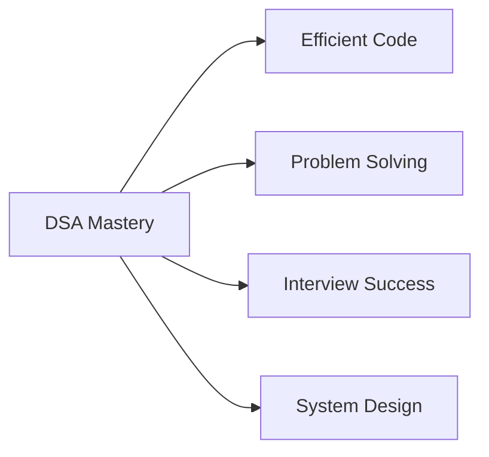

<div align="center">

# 🚀 Day 1: Data Structures & Algorithms Fundamentals

*Building the Foundation for Computational Problem Solving*

---


</div>

---

## 🎯 **Learning Objectives**

> *Master the fundamental concepts that form the backbone of computer science*

- 📚 Understand what Data Structures and Algorithms are
- 🏗️ Learn classification of different data structures
- ⚡ Grasp the importance of algorithmic thinking
- 📊 Introduction to complexity analysis

---

## 📖 **1. Introduction to DSA**

<table>
<tr>
<td width="50%">

### 🗃️ **Data Structures**
*Organized ways to store and manage data efficiently*

**Key Benefits:**
- 🚀 Optimized data access
- 💾 Efficient memory usage
- 🔧 Simplified data manipulation

</td>
<td width="50%">

### ⚙️ **Algorithms**
*Step-by-step procedures to solve computational problems*

**Key Benefits:**
- 🎯 Systematic problem solving
- ⏱️ Time optimization
- 🧠 Logical thinking development

</td>
</tr>
</table>

### 🌟 **Why DSA Matters?**



---

## 🏗️ **2. Data Structure Classification**

### 📊 **Linear Data Structures**
*Elements arranged in sequential order*

<div align="center">

| Structure | Description | Key Operations | Use Cases |
|:----------|:------------|:---------------|:----------|
| **🔢 Array** | Fixed-size, contiguous memory | Access: O(1) | Static data, matrices |
| **🔗 Linked List** | Dynamic nodes with pointers | Insert: O(1) | Dynamic data, undo operations |
| **📚 Stack** | LIFO (Last In, First Out) | Push/Pop: O(1) | Function calls, expression evaluation |
| **🚶 Queue** | FIFO (First In, First Out) | Enqueue/Dequeue: O(1) | Task scheduling, BFS |

</div>

### 🌳 **Non-Linear Data Structures**
*Hierarchical or network-based organization*

<div align="center">

| Structure | Description | Key Feature | Applications |
|:----------|:------------|:------------|:-------------|
| **🌳 Trees** | Hierarchical structure with root | Parent-child relationships | File systems, databases |
| **🕸️ Graphs** | Nodes connected by edges | Complex relationships | Social networks, routing |
| **🗂️ Hash Tables** | Key-value mapping | Fast lookup: O(1) avg | Caching, databases |

</div>

---

## ⚡ **3. Algorithm Categories**

### 🔍 **Problem-Solving Paradigms**

<table>
<tr>
<td width="33%">

#### 🎯 **Searching**
- Linear Search
- Binary Search
- Hash-based Search

*Find specific elements efficiently*

</td>
<td width="33%">

#### 🔄 **Sorting**
- Bubble, Selection, Insertion
- Merge, Quick, Heap Sort
- Radix, Counting Sort

*Organize data systematically*

</td>
<td width="33%">

#### 🧮 **Advanced Techniques**
- Divide & Conquer
- Dynamic Programming
- Greedy Algorithms

*Optimize complex problems*

</td>
</tr>
</table>

---

## 📊 **4. Complexity Analysis (Big-O Notation)**

### ⏱️ **Time Complexity Hierarchy**

```
O(1) < O(log n) < O(n) < O(n log n) < O(n²) < O(2ⁿ)
Best ←                                           → Worst
```

<div align="center">

### 📈 **Common Complexities**

| Notation | Name | Example | Performance |
|:---------|:-----|:--------|:------------|
| **O(1)** | Constant | Array access | 🟢 Excellent |
| **O(log n)** | Logarithmic | Binary search | 🟢 Very Good |
| **O(n)** | Linear | Linear search | 🟡 Good |
| **O(n log n)** | Linearithmic | Merge sort | 🟡 Acceptable |
| **O(n²)** | Quadratic | Bubble sort | 🔴 Poor |
| **O(2ⁿ)** | Exponential | Recursive fibonacci | 🔴 Very Poor |

</div>

---

## 🎯 **5. Key Takeaways**

<div align="center">

### 💡 **Essential Insights**

</div>

> 🏗️ **Foundation First**: Master basic structures before advanced ones  
> ⚡ **Efficiency Matters**: Always consider time and space complexity  
> 🧠 **Pattern Recognition**: Learn to identify problem patterns  
> 🔄 **Practice Regularly**: Consistent practice builds intuition  

---

## 📚 **6. Next Steps**

<table>
<tr>
<td width="50%">

### 🎯 **Immediate Goals**
- [ ] Practice array operations
- [ ] Implement basic sorting
- [ ] Understand recursion
- [ ] Learn two-pointer technique

</td>
<td width="50%">

### 🚀 **Long-term Objectives**
- [ ] Master dynamic programming
- [ ] Understand graph algorithms
- [ ] Practice system design
- [ ] Solve 100+ problems

</td>
</tr>
</table>

---

<div align="center">

### 📊 **Learning Progress**


---

**📅 Session Date**: Day 1 | **🎯 Focus**: DSA Foundation | **⏰ Duration**: Deep Learning Session

*"The journey of a thousand algorithms begins with a single data structure"*

</div>