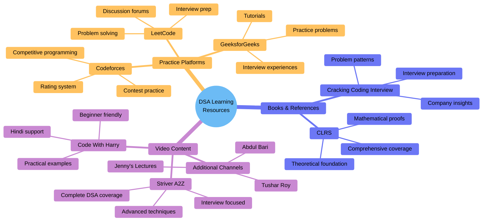
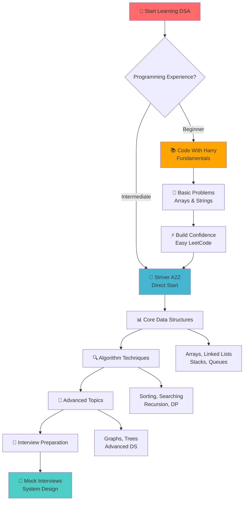
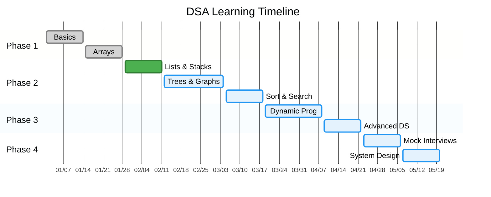
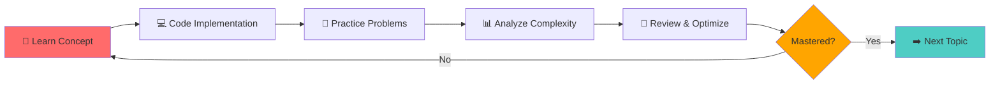
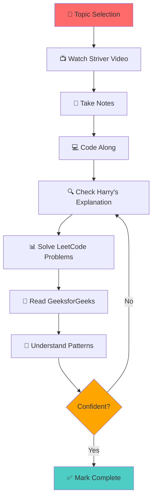
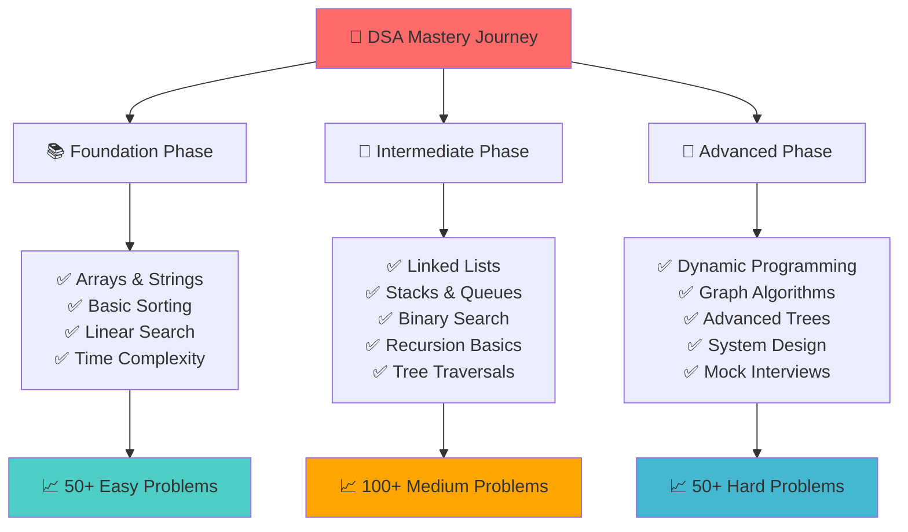

# 📚 Learning Resources & References

*Curated collection of high-quality educational content for mastering Data Structures & Algorithms*

---

## 🎯 **Learning Resource Overview**

---

## 🎯 **Overview**

This directory contains carefully selected learning resources that have been instrumental in building a strong foundation in Data Structures, Algorithms, and Problem-Solving. All resources are free, high-quality, and beginner-friendly.

---

## 🎥 **Video Playlists**

### 📌 **1. Striver's A2Z DSA Course**

<table>
<tr>
<td width="30%">

**Creator:** Raj Vikramaditya (Striver)  
**Platform:** YouTube  
**Level:** Beginner to Advanced  
**Language:** English/Hindi

</td>
<td width="70%">

**🔗 Link:** [Striver's A2Z DSA Course/Sheet](https://youtube.com/playlist?list=PLgUwDviBIf0oF6QL8m22w1hIDC1vJ_BHz&si=gPpr1RIGaKjyKpxp)

**📋 Description:**  
Comprehensive DSA course covering everything from basics to advanced topics. Includes detailed explanations, multiple approaches, and optimization techniques. Perfect for interview preparation and competitive programming.

**✨ Key Features:**
- ✅ Complete A2Z coverage of DSA
- ✅ Step-by-step problem-solving approach
- ✅ Multiple solutions with complexity analysis
- ✅ Interview-focused content
- ✅ Regular updates and new problems

**📚 Topics Covered:**
- Arrays, Strings, Linked Lists
- Stacks, Queues, Trees, Graphs
- Sorting, Searching, Hashing
- Dynamic Programming, Greedy
- Backtracking, Bit Manipulation
- Advanced Data Structures

</td>
</tr>
</table>

---

### 📌 **2. Code With Harry - DSA in One Shot**

<table>
<tr>
<td width="30%">

**Creator:** Haris Khan (CodeWithHarry)  
**Platform:** YouTube  
**Level:** Beginner Friendly  
**Language:** Hindi/English

</td>
<td width="70%">

**🔗 Link:** [Data Structures and Algorithms Course](https://youtube.com/playlist?list=PLu0W_9lII9ahIappRPN0MCAgtOu3lQjQi&si=gc92rZYK_6c2wvLs)

**📋 Description:**  
Beginner-friendly DSA course with clear explanations and practical examples. Focuses on building strong fundamentals with hands-on coding. Great for students starting their DSA journey.

**✨ Key Features:**
- ✅ Easy-to-understand explanations
- ✅ Practical coding examples
- ✅ Hindi language support
- ✅ Beginner-friendly pace
- ✅ Complete code implementations

**📚 Topics Covered:**
- Basic Data Structures
- Algorithm Fundamentals
- Time & Space Complexity
- Problem-Solving Techniques
- C/C++ Implementation
- Practice Problems

</td>
</tr>
</table>

---

## 📖 **How to Use These Resources**

<table>
<tr>
<td width="50%">

### 🎯 **For Beginners**

1. **Start with Code With Harry**
   - Build basic understanding
   - Learn fundamental concepts
   - Practice simple problems

2. **Progress to Striver's Course**
   - Deep dive into topics
   - Learn advanced techniques
   - Solve interview problems

3. **Practice Regularly**
   - Implement concepts
   - Solve LeetCode problems
   - Build projects

</td>
<td width="50%">

### 🚀 **For Interview Prep**

1. **Follow Striver's A2Z Sheet**
   - Systematic topic coverage
   - Interview-focused problems
   - Multiple approaches

2. **Supplement with Harry's Course**
   - Clarify doubts
   - Strengthen basics
   - Alternative explanations

3. **Track Progress**
   - Maintain problem log
   - Review regularly
   - Time yourself

</td>
</tr>
</table>

---

## 🎓 **Learning Path Recommendation**

### 📊 **Complete Learning Journey**

### 🗓️ **Structured Timeline**

  
### 🗓️ **Suggested Timeline**

| Phase | Duration | Focus | Resources |
|:------|:---------|:------|:----------|
| **Phase 1** | 2-3 weeks | Basics & Fundamentals | Code With Harry |
| **Phase 2** | 4-6 weeks | Core DSA Topics | Striver's Course |
| **Phase 3** | 4-6 weeks | Advanced Concepts | Striver's Course |
| **Phase 4** | Ongoing | Interview Prep | Both + LeetCode |

---

## 💡 **Study Strategy & Best Practices**

### 🎯 **Optimal Learning Flow**

### 📚 **Resource Utilization Strategy**

### 🌐 **Online Platforms**

<table>
<tr>
<td width="50%">

**Practice Platforms:**
- 🎯 [LeetCode](https://leetcode.com) - Problem solving
- 🏆 [Codeforces](https://codeforces.com) - Competitive programming
- 💻 [HackerRank](https://hackerrank.com) - Skill assessment
- 🎓 [GeeksforGeeks](https://geeksforgeeks.org) - Tutorials

</td>
<td width="50%">

**Documentation:**
- 📖 [CP Algorithms](https://cp-algorithms.com) - Algorithm reference
- 📚 [Visualgo](https://visualgo.net) - Algorithm visualization
- 🔍 [Big-O Cheat Sheet](https://bigocheatsheet.com) - Complexity reference
- 📝 [Striver's Sheet](https://takeuforward.org/interviews/strivers-sde-sheet-top-coding-interview-problems/) - Problem list

</td>
</tr>
</table>

---

## 🎯 **Study Tips**

### 💡 **Best Practices**

> 📅 **Consistency is Key**: Study daily, even if just 1 hour  
> 🎯 **Focus on Understanding**: Don't just memorize solutions  
> 💻 **Code Everything**: Type out solutions yourself  
> 📝 **Take Notes**: Document learnings and patterns  
> 🔄 **Review Regularly**: Revisit topics periodically  
> 🤝 **Join Communities**: Discuss with peers  

---

## 📊 **Progress Tracking System**

### ✅ **Skill Development Roadmap**

### ✅ **Recommended Checklist**

- [ ] Complete Code With Harry basics (Arrays, Strings, Loops)
- [ ] Finish Striver's Arrays section
- [ ] Solve 50+ Easy problems on LeetCode
- [ ] Complete Striver's Linked Lists section
- [ ] Master Stack and Queue problems
- [ ] Understand Tree traversals
- [ ] Learn Graph algorithms (BFS, DFS)
- [ ] Study Dynamic Programming basics
- [ ] Solve 50+ Medium problems
- [ ] Practice system design basics

---

## 🤝 **Contributing**

Found a great resource? Want to add more playlists or tutorials?

**How to Contribute:**
1. Fork the repository
2. Add your resource with proper description
3. Create a pull request
4. Include why the resource is valuable

---

## 📞 **Community & Support**

### 🌐 **Connect & Learn Together**

<table>
<tr>
<td width="33%" align="center">

**💬 Discord Communities**

• Striver's Discord Server  
• CodeWithHarry Community  
• DSA Study Groups  
• Live Problem Solving

</td>
<td width="33%" align="center">

**🔴 Reddit Communities**

• r/learnprogramming  
• r/cscareerquestions  
• r/leetcode  
• r/algorithms

</td>
<td width="33%" align="center">

**📱 Telegram Groups**

• DSA Learning Groups  
• Interview Preparation  
• Coding Practice  
• Daily Challenges

</td>
</tr>
</table>

### 🤝 **Additional Support**

<table>
<tr>
<td width="50%" align="center">

**📚 Study Groups**
- Local coding meetups
- University study circles
- Online peer learning
- Mentorship programs

</td>
<td width="50%" align="center">

**💼 Professional Networks**
- LinkedIn DSA groups
- GitHub communities
- Stack Overflow
- Developer forums

</td>
</tr>
</table>

---

## ⭐ **Acknowledgments**

Special thanks to:
- **Raj Vikramaditya (Striver)** for creating comprehensive DSA content
- **Haris Khan (CodeWithHarry)** for beginner-friendly tutorials
- **LeetCode Community** for problem discussions
- **Open Source Contributors** for maintaining resources

---

### 📊 **Resource Quality**

---

**📚 Keep Learning | 💪 Stay Consistent | 🚀 Achieve Goals**

*"The only way to learn a new programming language is by writing programs in it." - Dennis Ritchie*

**Last Updated:** December 2025

